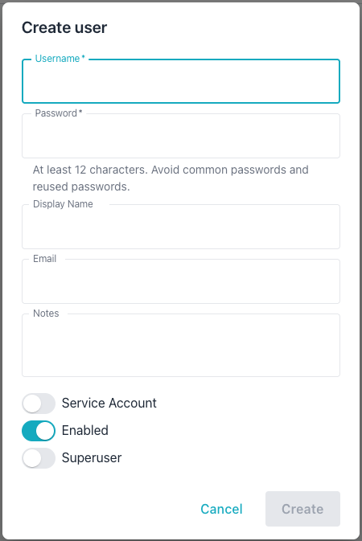
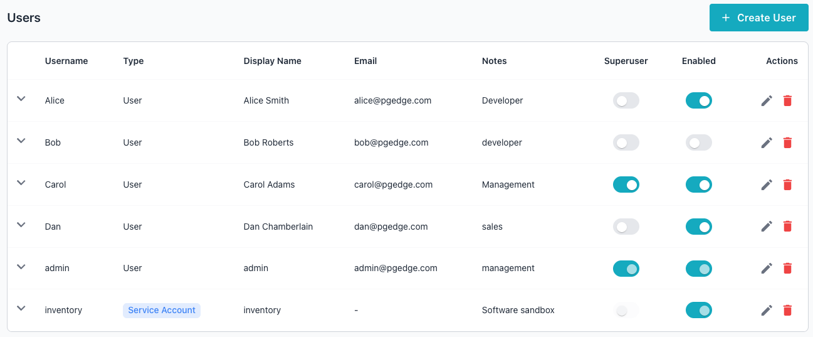
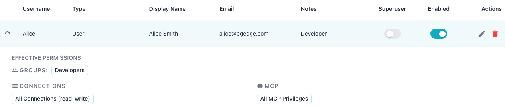
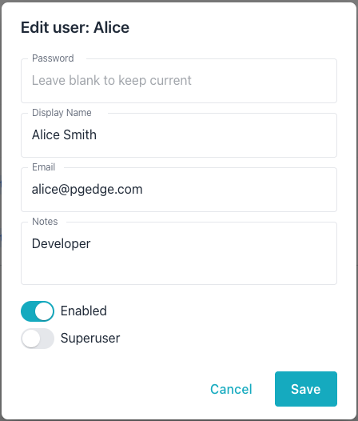
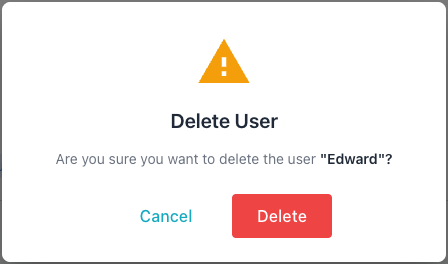

# Creating and Managing Accounts

The Workbench and MCP server support built-in authentication via two methods:

- User accounts provide interactive authentication for users. When a user
  authenticates successfully, the server assigns a session token. The token
  allows the user to remain connected until the session ends.
- Service accounts allow automated, programmatic access to the API via direct
  HTTP/HTTPS connections with authentication managed by API tokens. A service
  account cannot log in with a password. A service account can be a superuser
  or a member of groups, with RBAC privileges managed like login users. The
  server rejects password-based login for service accounts.

Authentication data is stored in a SQLite database (`auth.db`) within the
`data` directory. By default, the database resides at `./data/auth.db`
relative to the server binary.

The following table describes the database tables used to manage account,
permissions, and authentication details:

| Table | Description |
|-------|-------------|
| `users` | Stores usernames, bcrypt password hashes, service account flags, and superuser status. |
| `tokens` | Stores API token hashes, expiry dates, and owner references for all token types. |
| `groups` | Stores named groups for organizing users and assigning permissions. |
| `group_members` | Tracks user and nested group memberships within each group. |
| `token_scope` | Restricts tokens to specific connections, MCP privileges, and admin permissions. |


## Adding a User or Service Account

A *User account* authenticates with a username and password to receive a
24-hour session token. A *Service account* provides programmatic access
authenticated via an API token; it is intended for use by computer programs
and client applications.

You can add either account type with the Workbench's graphical interface, or
at the command line.

To use the Workbench GUI to add an account, select the `Settings` icon in the
upper-right corner of the Workbench console.



Use the fields on the `Create user` dialog to define the user; provide:

- the login name for the account in the `Username` field.
- the password associated with the user in the `Password` field.
- the name that will be displayed for the user in the `Display Name` field.
- the email account associated with the user in the `Email` field.
- any notes relevant to the user account in the `Notes` field.

Toggles at the bottom of the dialog allow you to:

- indicate that the account is intended for programmatic access *only* by
  setting the `Service Account` toggle to `on`.
- `Enable` or `Disable` the account; when disabled, the user cannot log in.
- create a `Superuser` account; setting the `Superuser` toggle to `on`
  conveys privileges to add managed servers or users.

You can also use the command line to add a user. In the following example,
the `-add-user` flag starts interactive mode, prompting you for user details:

```bash
./bin/ai-dba-server -add-user
```

In interactive mode, provide the following:

- Username (required)
- Password (hidden input, with confirmation)
- User Email (optional)
- Annotation or note (optional)

Similarly, the `-add-service-account` flag creates a new service account in
interactive mode:

```bash
./bin/ai-dba-server -add-service-account
```

In interactive mode, provide the following:

- Username (required)
- Full account name (optional)
- Email address for the account (optional)
- Annotation or note (optional)

You can also provide required fields when you use the `-add-user` flag to
create a user in non-interactive mode:

```bash
./bin/ai-dba-server -add-user \
  -username alice \
  -password "SecurePassword123!" \
  -user-note "Alice Smith - Developer"
```

### Reviewing a List of Accounts

The Workbench console and command line both provide ways to review existing
user and service accounts.

You can review a list of user and service accounts in either the Workbench
console or at the command line. To review the list in the console, select the
`Settings` icon in the upper-right corner:



Use the arrow to the left of a Username to review detailed information about
the privileges assigned to the user:



You can also include the `-list-users` flag when invoking the `ai-dba-server`
command to display a list of user accounts on the command line:

```bash
./bin/ai-dba-server -list-user
```

The user list includes all currently defined user and service accounts:

```console
./bin/ai-dba-server -list-users
Auth store: /var/lib/ai-workbench/data/auth.db

Users:
=========================================================================================
Username             Created                   Last Login           Status     Notes
-----------------------------------------------------------------------------------------
Alice                2026-06-10 13:24          Never                Enabled    Developer
Bob                  2026-06-10 13:31          Never                DISABLED   developer
Carol                2026-06-10 13:32          Never                Enabled    Management
Dan                  2026-06-10 13:37          Never                Enabled    sales
admin                2026-06-09 11:59          2026-06-10 12:27     Enabled    management
inventory            2026-06-10 13:31          Never                Enabled    Software
=========================================================================================
```

### Modifying an Account

The Workbench console and command line both support modifying account
properties.

To update the details associated with an account in the console, navigate to
the `Users` tab and select the edit icon (the pencil) at the far-right of the
account you wish to modify. The `Edit user` dialog opens, allowing you to
modify:

- the `Password` associated with the account.
- the `Display Name`.
- the `Email` associated with the account.
- the `Notes` associated with the account.
- if the account is `Enabled`.
- if the account has `Superuser` privileges.



You can also modify these properties at the command line. In the following
example, the `-update-user` flag starts an interactive session to modify an
existing user account:

```bash
# Interactive update
./bin/ai-dba-server -update-user -username alice
```

To update an account programmatically, pass the `-update-user` flag along
with keywords and the new information on the command line; for example:

```bash
# Update password from command line (less secure)
./bin/ai-dba-server -update-user \
  -username alice \
  -password "NewPassword456!"

# Update annotation only
./bin/ai-dba-server -update-user \
  -username alice \
  -user-note "Alice Smith - Senior Developer"
```

Similarly, pass the `-disable-user` and `-enable-user` flags to control
whether an account is enabled or disabled:

```bash
# Disable a user account (prevents login)
./bin/ai-dba-server -disable-user -username charlie

# Re-enable a user account (also resets failed attempts)
./bin/ai-dba-server -enable-user -username charlie
```

### Deleting an Account

Use the Workbench console or the command line to delete a user or service
account.

To use the Workbench console to delete a user account, select the `Delete`
icon (the garbage can) at the far right of an account name. When the popup
opens, confirm that you wish to delete the account by selecting `Delete`:



You can also delete a user or service account at the command line. In the
following example, the `-delete-user` flag removes a user account:

```bash
# Delete user (with confirmation prompt)
./bin/ai-dba-server -delete-user -username charlie
```

## Managing Rate Limiting and Account Lockout

Rate limiting and account lockout behavior are controlled by authentication
settings in the server configuration file
([`/etc/pgedge/ai-dba-server.yaml`](../getting-started/configuration/server.md)).

The configuration file manages the following authentication options:

```yaml
http:
  auth:
    enabled: true
    # Rate limiting settings
    rate_limit_window_minutes: 15
    rate_limit_max_attempts: 10
    # Account lockout settings
    max_failed_attempts_before_lockout: 5  # 0 = disabled
    # API token restrictions
    # Superuser-owned tokens are exempt from this limit
    max_user_token_days: 90  # 0 = unlimited
```

When a valid user name is provided, the server tracks failed login attempts.

The following settings control lockout behavior:

- The default disables lockout; a value of 0 means no lockout applies.
- The `max_failed_attempts_before_lockout` setting controls the threshold for
  locking out an account.
- An administrator must re-enable locked accounts until the number of minutes
  specified in `rate_limit_window_minutes` passes.

You can use the following command to re-enable a locked account and reset the
number of failed login attempts:

```bash
# Re-enable a locked account (also resets failed attempts)
./bin/ai-dba-server -enable-user -username alice
```
