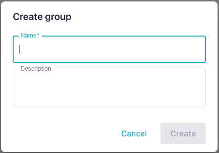
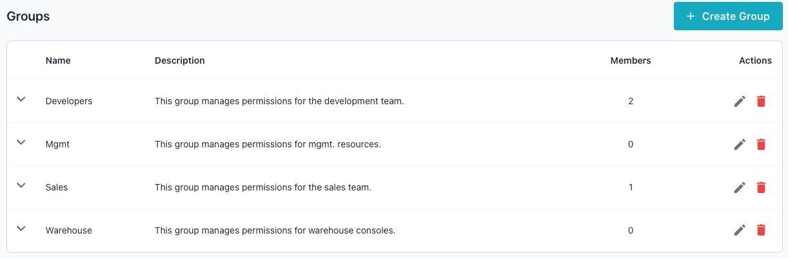
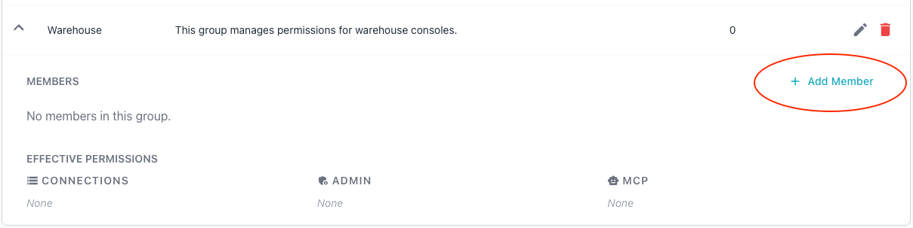
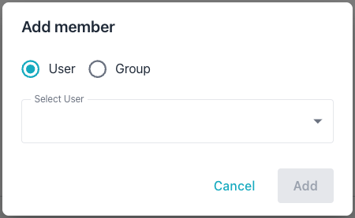
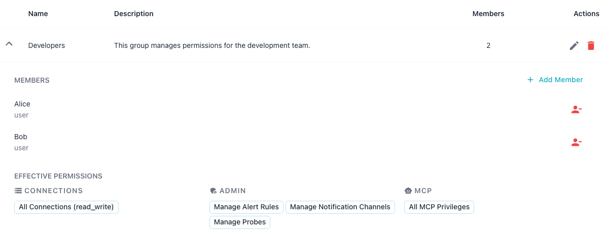
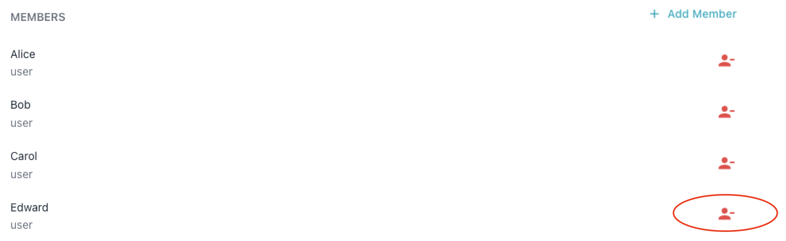

# Group Management

A group is a named collection of users and service accounts that share
access to a set of permissions assigned by the group manager (an
administrative user). This keeps permission management consistent and
auditable; for a full description of how groups fit into the Workbench
access model, see
[Understanding the Workbench Permission Model](permission_model.md).

## Creating a Group

You can create a group in the Workbench console or at the command line.

To create a group in the `Administration` page of the Workbench console,
select the `Settings` icon, choose the `Groups` tab, and then select
`+ Create Group`.



Provide the following details for the new group:

- Enter a group name in the `Name` field.
- Enter a user-friendly description in the `Description` field.

Then, select `Create` to add the new group to the list on the `Groups` page.



You can also create a group at the command line. In the following
example, the `-add-group` command creates a group named `dba-team`; the
`-group` flag supplies the group name:

```bash
./bin/ai-dba-server -add-group -group dba-team
```

The response confirms the new group and reports its assigned identifier:

```console
Group 'dba-team' created successfully (ID: 3)
```

## Adding Members

You can add a member to a group in the Workbench console or at the
command line.

To add a member to a group, use the down-arrow to the left of the
group name to expand the group description. Then, select the
`+ Add Member` icon at the far right of the entry:



When the `Add member` popup opens, the Workbench prompts you for the new
member:



Complete the popup to add a user to the group:

- Select either the `User` or `Group` radio button to indicate whether
  the new group member is an individual member or a sub-group.
- Use the `Select User` drop-down to select the user account or group
  that the Workbench adds to the group.

Then, select `Add` to add the member and close the popup.

You can also add members at the command line with the `-add-member` command:

- Include the `-username` flag to add a user or service account. 
- Include the `-member-group` flag to add a nested group. 

You must specify only one of these flags; the command rejects both flags if
used together.

In the following example, the `-add-group` command creates the
`dba-team` group; then, the `-add-member` command then adds the user `alice`
to it:

```bash
./bin/ai-dba-server -add-group -group dba-team
./bin/ai-dba-server -add-member -group dba-team -username alice
```

The response confirms the membership:

```console
User 'alice' added to group 'dba-team'
```

In the following example, the `-add-group` command creates the
`readonly` group; the `-add-member` command then nests it inside
`dba-team`:

```bash
./bin/ai-dba-server -add-group -group readonly
./bin/ai-dba-server -add-member -group dba-team -member-group readonly
```

The response confirms the nested membership:

```console
Group 'readonly' added to group 'dba-team'
```

## Managing Group Membership

You can review the configured groups in the Workbench console or at the
command line.

To review a list of groups in the `Administration` page of the
Workbench console, select the `Settings` icon and then choose `Groups`
from the navigation pane.


Select the arrow to the left of a group name to view details about the
group.



The expanded view displays: 

- The group's members and their account types in the `MEMBERS`
  section.
- The connections and corresponding access levels in the
  `CONNECTIONS` section.
- The administrative permissions granted to the group in the
  `ADMIN` section.
- The MCP permissions the group holds in the `MCP` section.

These sections reflect the group's current grants; to modify them, use the
`Permissions` dialog described in [Permission Management](permission_mgmt.md).

To add a member from this view, select `+ Add Member` in the `MEMBERS`
section; see [Adding Members](#adding-members).

You can also list groups at the command line. In the following example,
the `-list-groups` command displays every group with its identifier,
group name, creation time, and description:

```bash
./bin/ai-dba-server -list-groups
```

The command prints the groups in a table:

```console
Groups:
================================================================================
ID     Name                 Created              Description
--------------------------------------------------------------------------------
3      dba-team             2026-06-17 09:42     Database administrators
4      readonly             2026-06-17 10:05     Read-only analysts
================================================================================
```

To review the privileges assigned directly to a group at the command
line, use the `-show-group-privileges` command. In the following
example, the `-show-group-privileges` command lists the privileges for
the `dba-team` group; the `-group` flag names the group:

```bash
./bin/ai-dba-server -show-group-privileges -group Mgmt
```

The command displays the MCP and connection privileges for the group:

```console
Auth store: /var/lib/ai-workbench/data/auth.db

Privileges for group 'Mgmt':
======================================================================

MCP Privileges:
  - [resource] pg://connection_info
  - [tool] describe_probe
  - [tool] execute_explain
  - [tool] get_metric_baselines

Connection Privileges:
  - Connection 3: read_write
  - Connection 4: read
======================================================================
```

When the group has no privileges in a category, the command shows `None`
for that category:

```console
Privileges for group 'dba-team':
======================================================================
MCP Privileges: None

Connection Privileges: None
======================================================================
```

## Removing Members

You can remove a member from a group in the Workbench console or at
the command line.

To remove a member in the console, expand the group row and locate the
member in the `MEMBERS` section. Select the red remove icon to the
right of the member's name:



The Workbench removes the member from the group immediately.

You can remove a member from a group at the command line with the
`-remove-member` command. Use the `-username` flag to remove a user or
service account; use the `-member-group` flag to remove a nested group.
You must specify exactly one of these flags.

In the following example, the `-remove-member` command removes the user
`Edward` from the `Mgmt` group:

```bash
./bin/ai-dba-server -remove-member -group Mgmt -username Edward
```

The command confirms the change:

```console
User 'Edward' removed from group 'Mgmt'
```

In the following example, the `-remove-member` command removes the
nested `readonly` group from the `dba-team` group:

```bash
./bin/ai-dba-server -remove-member -group dba-team -member-group readonly
```

The command confirms the change:

```console
Group 'readonly' removed from group 'dba-team'
```

## Deleting a Group

You can delete a group in the Workbench console or at the command line.

To delete a group in the console, open the `Groups` tab, and then select
the `Delete` icon (the garbage can) for the group you wish to remove. Confirm
the deletion when prompted:


You can also delete a group at the command line. In the following
example, the `-delete-group` command removes the `dba-team` group; the
`-group` flag names the group to delete:

```bash
./bin/ai-dba-server -delete-group -group dba-team
```

Deleting a group removes all of its memberships and privilege
assignments; the system cannot recover these once the group is gone. The
command confirms the deletion:

```console
Group 'dba-team' deleted successfully
```
