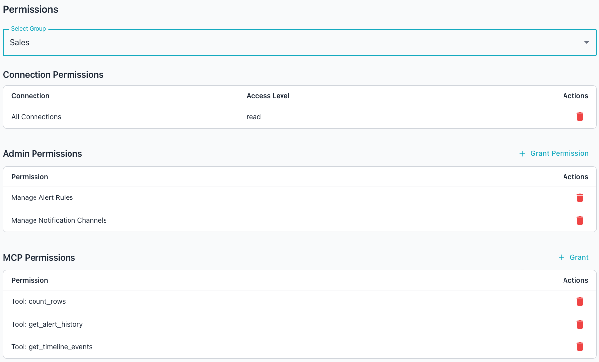
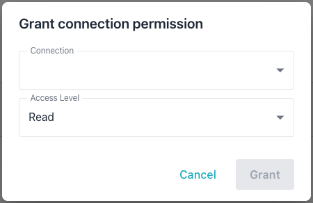
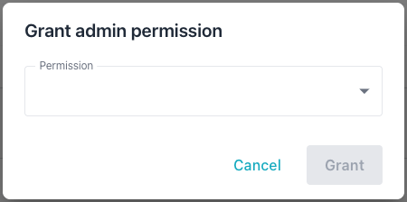
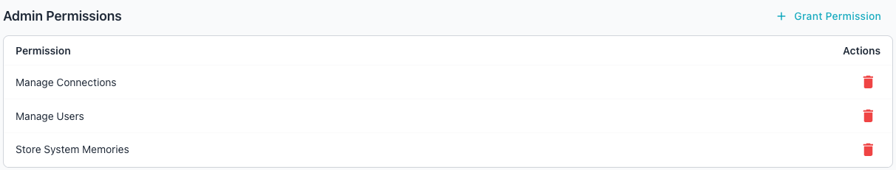
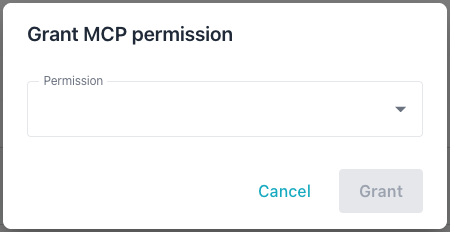
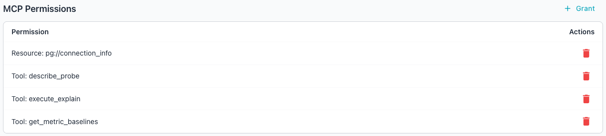

# Permission Management

The `Permissions` page of the Workbench console allows an administrator to
view and manage the privileges assigned to a group.

!!! hint

    The Workbench assigns privileges to groups rather than to individual
    accounts; an account gains a privilege by joining a group that holds
    the privilege. For instructions on creating groups and managing their
    membership, see [Group Management](group.md).

To open the `Permissions` page, navigate through the `Settings` icon to the
`Administration` console, and select `Permissions` from the navigation pane.
The page organizes a group's permissions in three sections:

- The `Connection Permissions` section specifies whether the group has `Read`
  or `Read/Write` permissions when it connects to a database connection (a
  *DATABASE SERVER*, added on the main Workbench console landing page).
- The `Admin Permissions` section lists the administrative operations the
  selected group can perform.
- The `MCP Permissions` section lists the MCP tools and resources the selected
  group can access.



## Assigning or Revoking Permissions

Use the `Select Group` drop-down at the top of the page to select the group
whose permissions you wish to review or edit; once selected, the console loads
the selected group's current grants into each table below the drop-down.
Choose a different group at any time to switch the displayed permissions; the
tables refresh to match the new selection.

### Connection Permissions

You can manage connection permissions in the Workbench console or at the
command line.

The `Connection Permissions` section shows each connection the selected group
can authenticate with, and the access level the group holds for that
connection. Each connection in the table corresponds to a server defined in
the `DATABASE SERVERS` section of the Workbench; for information about adding
server definitions, see [Using the Workbench](../../user-guide/index.md).

The following table lists the access levels available for each connection:

| Access Level | Description |
|---|---|
| `read` | Allows read-only operations; the group inspects data and metadata without changing them. |
| `read_write&nbsp;` | Allows both read and write operations against the connection. |

To add a connection/access level pair, select the `+ Grant` icon across from
the `Connection Permissions` heading.



Select:

- the name of a monitored database with the `Connection` drop-down. Select
  `All Connections` to give the group access to all monitored connections at
  the specified access level.
- the `Access Level` to apply to the selected connections; choose `Read` or
  `Read/Write`.

Once access is granted, the new connection appears on a new row in the
`Connection Permissions` section.

To modify the access level for a connection, delete the connection permission
and reassign the connection to the group with the new level.

To revoke a connection grant, select the red `Delete` icon (the garbage can)
in the `Actions` column for that row. The console removes the connection access
immediately, and the group loses the listed access to the connection.

You can also grant a connection at the command line with the
`-grant-connection` command:

- Include the `-group` flag to name the group that receives the access.
- Include the `-connection` flag to identify the connection by its ID.
- Include the `-access-level` flag to set the level to `read` or
  `read_write`; the command defaults to `read` if you omit the flag.

In the following example, the `-grant-connection` command grants the
`dba-team` group `read_write` access to connection `3`:

```bash
./bin/ai-dba-server -grant-connection -group dba-team -connection 3 \
    -access-level read_write
```

The command confirms the grant:

```console
Granted read_write access to connection 3 for group 'dba-team'
```

You can revoke a connection at the command line with the
`-revoke-connection` command:

- Include the `-group` flag to name the group that loses the access.
- Include the `-connection` flag to identify the connection by its ID.

In the following example, the `-revoke-connection` command revokes the
`dba-team` group's access to connection `3`:

```bash
./bin/ai-dba-server -revoke-connection -group dba-team -connection 3
```

The command confirms the revocation:

```console
Revoked access to connection 3 from group 'dba-team'
```

### Admin Permissions

The `Admin Permissions` section shows the administrative permissions granted
to the selected group. The following table lists the administrative
permissions available:

| Permission | Description |
|---|---|
| `manage_connections` | Allows creating, editing, and deleting monitored database connections. |
| `manage_groups` | Allows creating, editing, and deleting groups and their memberships. |
| `manage_permissions` | Allows granting and revoking privileges on groups. |
| `manage_users` | Allows creating, editing, and deleting user accounts and service accounts. |
| `manage_token_scopes` | Allows viewing and modifying token scope restrictions. |
| `manage_blackouts` | Allows creating, editing, and deleting maintenance blackout windows. |
| `manage_probes` | Allows configuring probe frequency, retention, and enabled state. |
| `manage_alert_rules` | Allows configuring alert rule defaults and per-connection overrides. |
| `manage_notification_channels` | Allows creating, editing, and deleting alert notification channels. |
| `store_system_memory` | Allows storing and deleting system-scoped chat memories visible to all users. |

To grant an administrative permission, select the `+ Grant Permission` icon
across from the `Admin Permissions` heading. When the `Grant admin permission`
popup opens:



Use the `Permission` drop-down to select the permission you wish to grant to
the group. Once granted, the new permission is displayed on a new row in the
`Admin Permissions` section.



To revoke a permission, select the `Delete` icon across from the permission
name. The console revokes the permission from the group immediately.


### MCP Permissions

You can manage MCP permissions in the Workbench console or at the command
line.

The `MCP Permissions` section displays the MCP tools and resources that can be
accessed by the selected group.

The following table lists the MCP tools and resources available for a group,
organized by category; the `All MCP Privileges` wildcard grants access to 
every tool in the table:

| Group | Tool | Description |
|---|---|---|
| Monitored Database | `query_database` | Executes SQL queries against a monitored database. |
| Monitored Database | `get_schema_info` | Retrieves table and column information from a database. |
| Monitored Database | `execute_explain` | Runs EXPLAIN or EXPLAIN ANALYZE on a query. |
| Monitored Database | `similarity_search` | Performs vector similarity search using pgvector. |
| Monitored Database | `count_rows` | Counts rows in a specified table. |
| Monitored Database | `test_query` | Validates SQL query correctness without executing the query. |
| Datastore | `list_probes` | Lists available metrics probes in the datastore. |
| Datastore | `describe_probe` | Retrieves column details for a specific metrics probe. |
| Datastore | `query_metrics` | Queries historical metrics with time-based aggregation. |
| Datastore | `list_connections` | Lists available monitored database connections. |
| Datastore | `query_datastore` | Executes read-only SQL queries against the datastore. |
| Alert | `get_alert_history` | Queries alerts for monitored connections. |
| Alert | `get_alert_rules` | Queries alert rules and their effective thresholds. |
| Alert | `get_metric_baselines` | Queries statistical baselines for anomaly detection. |
| Alert | `get_blackouts` | Queries blackout periods and recurring schedules for monitored connections. |
| Alert | `get_timeline_events` | Queries the unified incident-investigation timeline of configuration changes, restarts, extension changes, alerts, and blackouts. |
| Memory | `store_memory` | Stores a persistent memory with a category, scope, and optional pinned flag. |
| Memory | `recall_memories` | Searches stored memories using semantic similarity; pinned memories are always included. |
| Memory | `delete_memory` | Deletes a stored memory by its ID; only the owning user can delete a memory. |
| Utility | `generate_embedding` | Generates text embeddings from input text. |
| Utility | `search_knowledgebase` | Searches the pgEdge documentation knowledge base. |
| Utility | `read_resource` | Reads MCP resources via the tool interface for backward compatibility with older clients. |

To grant an MCP permission, select the `+ Grant` icon across from the `MCP
Permissions` heading. When the `Grant MCP permission` popup opens:



Use the `Permission` drop-down to select the resource or tool you wish to
allow the group to access. Once granted, the selected tool or resource appears
on a new row in the `MCP Permissions` section.



To revoke an MCP privilege, select the `Delete` icon (the garbage can) across
from the tool or resource name. The console removes the privilege from the
group immediately, and the group loses access to the listed tool.

!!! note

    Granting access to `All MCP Privileges` overrides line item tool and
    resource grants.

You can also grant an MCP privilege at the command line with the
`-grant-privilege` command:

- Include the `-group` flag to name the group that receives the privilege.
- Include the `-privilege` flag to name the privilege by its identifier.

In the following example, the `-grant-privilege` command grants the
`query_database` privilege to the `dba-team` group:

```bash
./bin/ai-dba-server -grant-privilege -group dba-team -privilege query_database
```

The command confirms the grant:

```console
Granted privilege 'query_database' to group 'dba-team'
```

You can revoke an MCP privilege at the command line with the
`-revoke-privilege` command:

- Include the `-group` flag to name the group that loses the privilege.
- Include the `-privilege` flag to name the privilege by its identifier.

In the following example, the `-revoke-privilege` command revokes the
`query_database` privilege from the `dba-team` group:

```bash
./bin/ai-dba-server -revoke-privilege -group dba-team -privilege query_database
```

The command confirms the revocation:

```console
Revoked privilege 'query_database' from group 'dba-team'
```

To review the privileges available to grant, use the `-list-privileges`
command. In the following example, the `-list-privileges` command lists
every registered MCP privilege:

```bash
./bin/ai-dba-server -list-privileges
```

The command prints each privilege with its ID, type, identifier, and
description:

```console
MCP Privileges:
==========================================================================================
ID     Type       Identifier                     Description
------------------------------------------------------------------------------------------
1      tool       query_database                 Execute read-only SQL queries against ...
2      tool       get_schema_info                Retrieve database schema information (...
3      resource   pg://connection_info           Current database connection information...
==========================================================================================
```

To review the privileges already assigned to a group, use the
`-show-group-privileges` command described in
[Group Management](group.md#managing-group-membership).

