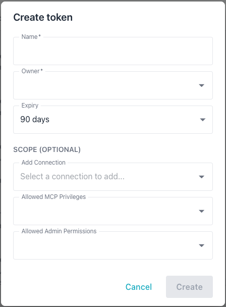
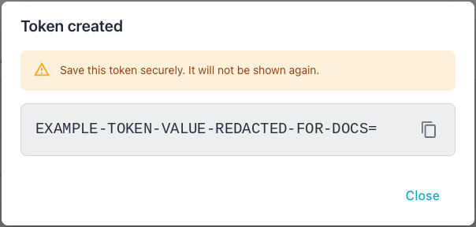
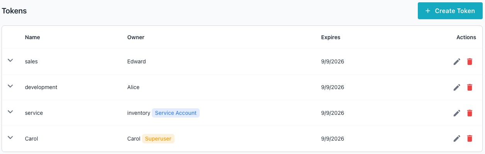
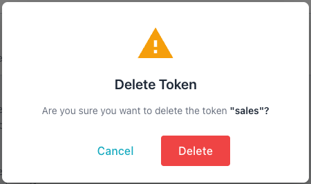

# Token Management

The Workbench uses two kinds of tokens:

- A *session token* is automatically issued when a user successfully
  authenticates with a username and password; session tokens are short-lived
  (24 hours) and are used by interactive users.
- An *API token* is a long-lived credential created explicitly via the CLI or
  the Workbench console; used for machine-to-machine access by service accounts
  or regular users. A service account may only authenticate with a token.

A token's scope restricts it to a subset of the owning user's permissions. A
token without scope restrictions inherits the full access of the owner. A
token that a superuser owns is restricted by its scope in the same way as
any other token. The system supports three scope types:

- *Connection scope* limits the token to specific database connections with a
  per-connection access level of `read` or `read_write`. A token scope can
  further restrict access to `read` even when the owning user has `read_write`
  access through group membership. The system always enforces the more
  restrictive level.
- *MCP privilege scope* limits the token to specific MCP tools.
- *Admin permission scope* limits the token to specific administrative
  operations.

Each scope type supports a wildcard option that grants access to all items of
that type:

- `All Connections` uses `connection_id=0` to match every connection the owner
  can access.
- `All MCP Privileges` uses `privilege_identifier_id=0` to match every MCP
  privilege the owner holds.
- `All Admin Permissions` uses `*` to match every ADMIN permission the owner
  holds.

The effective access for a scoped token equals the intersection of the owner's
access and the token scope. A superuser holds every privilege, so the
intersection for a superuser's token is the token scope itself.

A scope type left empty places no restriction on that type. To lift the
restriction on one type, set that type to its wildcard; to lift every
restriction, clear the token's scope. The `PUT /api/v1/rbac/tokens/{id}/scope`
endpoint refuses an empty list for any scope type with `400 Bad Request`, and
leaves a scope type that the request omits unchanged. The Workbench console
follows the same rule: saving a token with every scope type empty clears the
scope, but emptying one restricted type whilst another stays restricted is
refused.

The connection scope also governs changes to blackouts, blackout schedules,
alert, probe and channel overrides, alert rules, probe configurations,
notification channels and clusters, even though those endpoints are gated on an
admin permission. A token may change an override, a probe configuration or a
cluster membership on a single server only when that connection is in its scope
with `read_write` access; a change that applies to a cluster, a group or the
whole estate, that alters an alert rule, a global probe configuration or a
notification channel, that creates a cluster, or that alters a cluster's
definition or relationships, needs a connection scope that covers every
connection at `read_write`. A cluster group can be created only from a browser
session, so the server refuses an API token that tries, whatever its scope.

A `read` entry in the connection scope means read-only access to the monitored
server itself, so it still lets a token make changes that only record Workbench
metadata about that server. A token holding a `read` entry for a connection can
acknowledge or unacknowledge an alert on it, save an analysis of the alert,
and create, change, stop or delete a blackout or blackout schedule on that
server; a blackout that covers a cluster, a group or the whole estate needs the
`All Connections` entry at either access level. This is intended behaviour.
Alert acknowledgement and analysis need only `read` access for a user too;
blackout changes also need the `manage_blackouts` admin permission, for a user
and a token alike.

Administrative grants and account changes are bounded by the whole token
scope, so that a token can never give a user, a group or another token access
beyond its own connection, MCP or admin scope, and can never take over an
account that reaches further than the token does. A token restricted in any of
the three scope types is refused with `403 Forbidden` when it tries to:

- grant a group access to a connection outside its scope, to every
  connection, or at `read_write` where its own entry is `read`;
- grant a group an MCP privilege outside its MCP scope, or the `*` wildcard
  when its MCP scope names specific items;
- revoke a group's access to a connection outside its scope, or delete a group
  that holds a grant on one, because a connection left with no group grant
  becomes open to every user;
- grant a group any admin permission, since admin permissions act across the
  whole estate;
- add a user or a group to, or remove one from, a group whose connections,
  MCP privileges or admin permissions, including anything inherited from its
  parent groups, reach beyond the token's scope;
- rename a group whose grants reach beyond the token's scope, or rename any
  group from or to a Workbench group name that the OIDC `group_map` uses,
  because federated sign-in matches groups by name and a rename would move
  federated users into a different group;
- create a user who would reach beyond the token's scope, which includes
  creating any superuser and, for a token whose connection scope is
  restricted, any user at all whilst a shared connection that no group
  restricts lies outside that scope, since every user can reach such a
  connection;
- make an existing user a superuser;
- set the password of, re-enable or delete a user whose access reaches beyond
  the token's scope; the first two hand the token's holder that account, and
  deleting one frees the username, and with it the connections it owns, for
  whoever recreates it;
- create a token for an owner whose access reaches beyond the token's scope;
- set or clear another token's scope so that the other token ends up reaching
  beyond the acting token's scope in any of the three scope types.

A user's access, for these checks, counts the user's group grants, every
public MCP item, every shared connection that no group restricts, every
connection that the user's name owns, and every member connection of each
cluster group the user's name owns, all at `read_write`, whether or not a
connection is shared and whether or not a group restricts it, since an owner
can always edit or delete what they own. A user or group holding the
`manage_users`, `manage_groups`, `manage_permissions` or
`manage_token_scopes` admin permission counts as reaching every MCP item and
every admin permission, because each of those lets its holder acquire the
rest, so only a token with no MCP or admin restriction can add a member to
such a group or take over such a user. A token whose MCP scope lists only
items that have since been deleted is treated as restricted to no MCP items
at all.
Sessions, and tokens with no restriction in any of the three scope types, are
not affected by these bounds.

One MCP tool still reaches beyond a token's connection scope, so a token that
must stay within its connections should not be granted it. The
`query_datastore` tool runs read-only SQL over the whole datastore, including
the `connections` table, so it can read every connection's host, username and
encrypted credentials as well as every connection's metrics; issue #566 tracks
limiting it to the connections the caller can read.

The MCP privilege scope applies to public MCP tools as well, so a token whose
MCP scope names specific tools can call only those tools, apart from
`test_query`, which validates a query without running it and is available to
every token. The server refuses an MCP scope that names an identifier it does
not recognise.

!!! note

    A token cannot exceed the access level of the owner.

## Creating a Token

You can create a token with the Workbench console or at the command line.

To use the console to create a token, navigate to the `Administration` page,
and select `Tokens` from the left navigation pane. When the Tokens page opens,
select the `+ Create Token` icon to open the `Create token` dialog:



Provide the following information in the `Create token` dialog:

- The `Name` field sets the token annotation; use up to 255 characters.
- Use the `Owner` drop-down to select the user who owns the token; the token's
  effective access cannot exceed the owner's access.
- The `Expiry` drop-down sets the token lifetime; the choices are 30 days,
  90 days, 1 year, or Never, defaulting to 90 days.
- The `Add Connection` drop-down adds a database connection to the token's
  scope; repeat this step to add multiple connections. The drop-down shows
  only connections the selected owner can access, and displays `No options`
  when the owner has no connections assigned. After adding a connection, the
  access level defaults to the owner's maximum level for that connection; you
  can lower it to `read`.
- The `Allowed MCP Privileges` drop-down restricts the token to specific MCP
  tools; the `All MCP Privileges` wildcard grants every MCP privilege the owner
  holds.
- The `Allowed Admin Permissions` drop-down restricts the token to specific
  admin operations; the `All Admin Permissions` wildcard grants every admin
  permission the owner holds.

The `Create` button is disabled until both the `Name` and `Owner` fields are
completed; select `Create` to create the described token.



You can also create a token at the command line. In the following example, the
`-add-token` flag starts token creation in interactive mode, prompting you for
token details:

```bash
./bin/ai-dba-server -add-token
```

When prompted, provide the following:

- Owner username (required)
- Annotation or note (optional)
- Expiry duration (e.g., `30d`, `1y`, `never`)

The syntax used to create a token in non-interactive is the same for a user
account or a service account; specify token properties in key/value pairs when
invoking the `-add-token` command:

```bash
# Create token for a user
./bin/ai-dba-server -add-token \
  -user alice \
  -token-note "CI/CD Pipeline" \
  -token-expiry "90d"

# Create token for a service account
./bin/ai-dba-server -add-token \
  -user svc-bot \
  -token-note "Automation" \
  -token-expiry "never"
```

The `-add-token` command accepts the following expiry format strings:

- `30d` specifies 30 days.
- `1y` specifies 1 year.
- `2w` specifies 2 weeks.
- `12h` specifies 12 hours.
- `1m` specifies 1 month (30 days).
- `never` specifies that the token never expires.

The command displays the token upon creation:

```console
===========================================================
Token created successfully!
===========================================================

Token: <generated-token-value>
Hash:  <token-hash>
ID:    1
Owner: alice
Note:  CI/CD Pipeline
Expires: 2025-01-28T10:15:30-05:00
===========================================================

IMPORTANT: Save this token securely - it will not be
shown again! Use it in API requests with:
Authorization: Bearer <token>
===========================================================
```

### Listing Tokens

You can review a list of tokens in either the Workbench console or at the
command line.

Tokens appear on the `Tokens` tab in the Administration console:



You can also display a list of tokens at the command line. In the following
example, the `-list-tokens` command displays a list of tokens:

```bash
./bin/ai-dba-server -list-tokens
```

The information displayed includes the token's ID, the hash prefix, the token
owner, if the account is a superuser, if the account is a service account, the
token expiration details, and current status:

```console
Tokens:
======================================================================
ID   Hash Prefix        Owner     Super  Svc    Expires          Status
----------------------------------------------------------------------
1    <hash-prefix-1>    alice     No     No     2025-01-28 10:15 Active
2    <hash-prefix-2>    svc-bot   No     Yes    Never            Active
3    <hash-prefix-3>    bob       No     No     2024-10-15 14:20 EXPIRED
======================================================================
```

### Removing Tokens

You can delete a token in the Workbench console's `Tokens` table or at the
command line. To delete a token in the console, select the `Delete` icon
(the garbage can) at the far-right of a token entry. A popup opens, asking
you to confirm that you wish to delete the token:



Select `Delete` to permanently delete the specified token.

You can also delete a token at the command line with the `-remove-token`
command and the token ID or hash prefix; in the following examples,
`-remove-token` deletes an API token by its ID and hash prefix:

```bash
# Remove by token ID
./bin/ai-dba-server -remove-token 1

# Remove by hash prefix (minimum 8 characters)
./bin/ai-dba-server -remove-token <hash-prefix>
```

The server records every token creation, deletion and scope change in
the audit log, naming the user, token or command-line operator that made
it; for details, see [Audit Log](audit-log.md).
