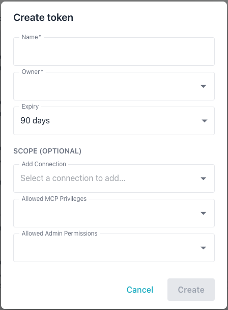
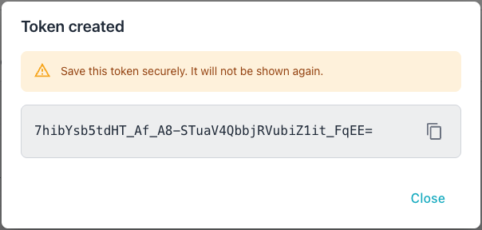
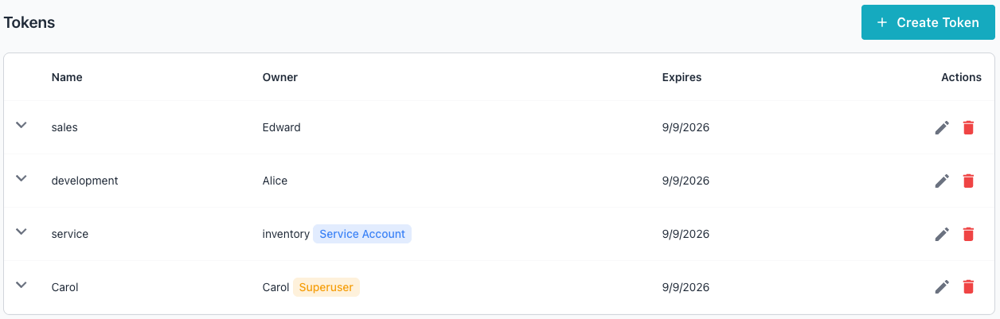

# Token Management

The Workbench uses two kinds of tokens:

- A *session token* is automatically issued when a user successfully
  authenticates with a username and password; session tokens are short-lived
  (24 hours) and are used by interactive users.
- An *API token* is a long-lived credential created explicitly via the CLI or
  the Workbench console; used for machine-to-machine access by service accounts
  or regular users. A service account may only authenticate with a token.

A token's scope restricts it to a subset of the owning user's permissions. A
token without scope restrictions inherits the full access of the owner. The
system supports three scope types:

- Connection scope limits the token to specific database connections with a
  per-connection access level of `read` or `read_write`. A token scope can
  further restrict access to `read` even when the owning user has `read_write`
  access through group membership. The system always enforces the more
  restrictive level.
- MCP privilege scope limits the token to specific MCP tools.
- Admin permission scope limits the token to specific administrative operations.

Each scope type supports a wildcard option that grants access to all items of
that type:

- "All Connections" uses `connection_id=0` to match every connection the owner
  can access.
- "All MCP Privileges" uses `id=0` to match every MCP privilege the owner
  holds.
- "All Admin Permissions" uses `*` to match every admin permission the owner
  holds.

The effective access for a scoped token equals the intersection of the owner's
group-level access and the token scope. A token cannot exceed the access level
of the owner.


## Creating a Token

You can create a token with the Workbench console or at the command line.

To use the console to create a token, select the `Settings` icon, and then
select the `Tokens` tab from the left navigation pane. When the Tokens page
opens, select the `+ Create Token` icon to open the `Create token` dialog:



Provide the following information in the `Create token` dialog:

- The `Name` field sets the token annotation; use up to 255 characters.
- The `Owner` autocomplete selects the user who owns the token; the token's
  effective access cannot exceed the owner's access.
- The `Expiry` drop-down sets the token lifetime; the choices are 30 days,
  90 days, 1 year, or Never, defaulting to 90 days.
- The `Add Connection` autocomplete adds a database connection to the token's
  scope; repeat this step to add multiple connections. The drop-down shows only
  connections the selected owner can access, and displays `No options` when the
  owner has no connections assigned. After adding a connection, the access level
  defaults to the owner's maximum level for that connection; you can lower it
  to `read`.
- The `Allowed MCP Privileges` drop-down restricts the token to specific MCP
  tools; the `All MCP Privileges` wildcard grants every MCP privilege the owner
  holds.
- The `Allowed Admin Permissions` drop-down restricts the token to specific
  admin operations; the `All Admin Permissions` wildcard grants every admin
  permission the owner holds.
- The `Create` button stays disabled until both the `Name` and `Owner` fields
  are filled in.



You can also create a token at the command line. In the following example, the
`-add-token` flag starts token creation in interactive mode, prompting you for
token details:

```bash
./bin/ai-dba-server -add-token
```

In interactive mode, provide the following:

- Owner username (required)
- Annotation or note (optional)
- Expiry duration (e.g., `30d`, `1y`, `never`)

To create a token in non-interactive mode, specify token properties when
invoking the `-add-token` command:

```bash
# Create token for a user
./bin/ai-dba-server -add-token \
  -user alice \
  -token-note "CI/CD Pipeline" \
  -token-expiry "90d"

# Create token for a service account
./bin/ai-dba-server -add-token \
  -user svc-bot \
  -token-note "Automation" \
  -token-expiry "never"
```

The `-add-token` command accepts the following expiry format strings:

- `30d` specifies 30 days.
- `1y` specifies 1 year.
- `2w` specifies 2 weeks.
- `12h` specifies 12 hours.
- `1m` specifies 1 month (30 days).
- `never` specifies that the token never expires.

The command displays the token upon creation:

```console
===========================================================
Token created successfully!
===========================================================

Token: O9ms9jqTfUdy-DIjvpFWeqd_yH_NEj7me0mgOnOjGdQ=
Hash:  b3f805a4c2e7d9f1...
ID:    1
Owner: alice
Note:  CI/CD Pipeline
Expires: 2025-01-28T10:15:30-05:00
===========================================================

IMPORTANT: Save this token securely - it will not be
shown again! Use it in API requests with:
Authorization: Bearer <token>
===========================================================
```

### Listing Tokens

The Workbench console and command line both display the list of API tokens.

Tokens appear on the `Tokens` tab in the Administration console:



You can also list tokens at the command line. In the following example, the
`-list-tokens` flag displays all API tokens:

```bash
./bin/ai-dba-server -list-tokens
```

The command displays each token's ID, hash prefix, owner, and expiry status:

```console
Tokens:
======================================================================
ID   Hash Prefix        Owner     Super  Svc    Expires          Status
----------------------------------------------------------------------
1    b3f805a4c2e7d9f1   alice     No     No     2025-01-28 10:15 Active
2    7a2f19d8e1c4b5a3   svc-bot   No     Yes    Never            Active
3    9c8d7e6f5a4b3c2d   bob       No     No     2024-10-15 14:20 EXPIRED
======================================================================
```

### Removing Tokens

Tokens can be removed by ID or by hash prefix using the `-remove-token` flag.

In the following examples, the `-remove-token` flag deletes an API token by
its ID or hash prefix:

```bash
# Remove by token ID
./bin/ai-dba-server -remove-token 1

# Remove by hash prefix (minimum 8 characters)
./bin/ai-dba-server -remove-token b3f805a4
```
