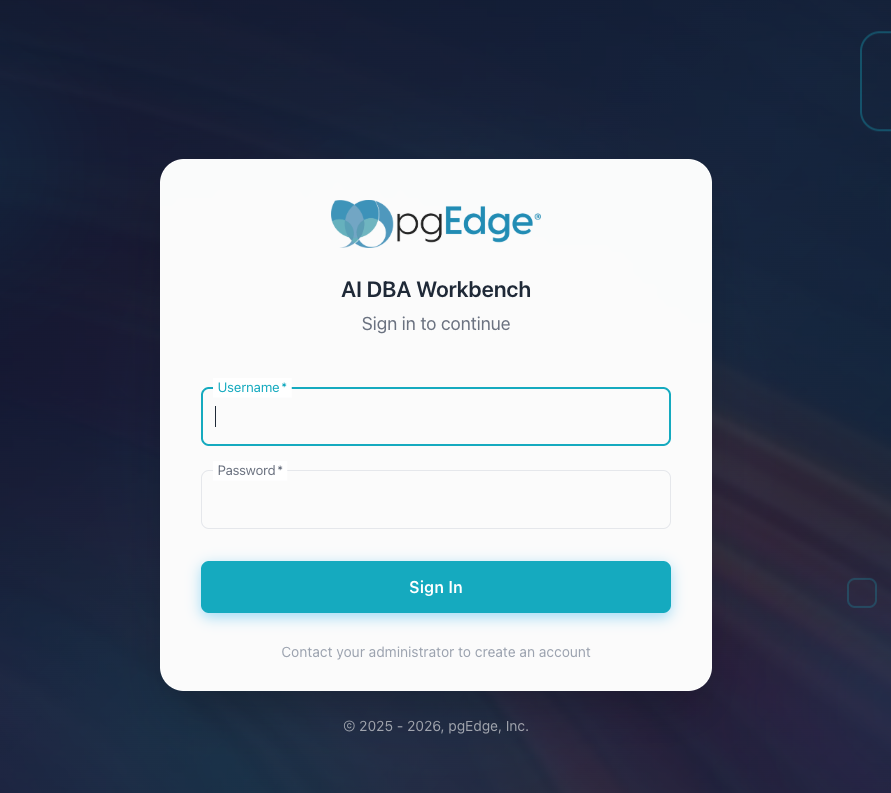

# Quick Start - Installing the Workbench with Binary Files

The AI DBA Workbench collects metrics from PostgreSQL servers, evaluates
alert rules, and displays results in a web interface. This guide covers
setting up the complete pgEdge AI DBA Workbench using pre-built binaries
available from the
[pgEdge GitHub repository](https://github.com/pgEdge/ai-dba-workbench/releases).

Before you deploy the Workbench, confirm the following prerequisites are in
place on a supported operating system and platform:

- [PostgreSQL 14](https://www.postgresql.org/download/) or later is installed
  for the Workbench datastore.
- The database credentials for the datastore database are available.
- Network access exists between each monitored PostgreSQL server and the
  system hosting the Workbench.

## Installing the Binaries

Download the latest release from the
[GitHub releases page](https://github.com/pgEdge/ai-dba-workbench/releases).
The release archive includes the collector, server, and alerter binaries
and pre-built web client files:

* ai-dba-collector-linux-arm64.tar.gz
* ai-dba-server-linux-arm64.tar.gz
* ai-dba-alerter-linux-arm64.tar.gz
* ai-dba-client.tar.gz

After downloading the files, move into your `Downloads` folder, and extract
the archives and copy the files into a deployment directory. In the following
example, the `tar` and `cp` commands install the binary and client files
to the `/opt/ai-workbench` directory:

```bash
tar xzf ai-dba-collector-linux-arm64.tar.gz
tar xzf ai-dba-server-linux-arm64.tar.gz
tar xzf ai-dba-alerter-linux-arm64.tar.gz
sudo mkdir -p /opt/ai-workbench
sudo cp ai-dba-collector /opt/ai-workbench/
sudo cp ai-dba-server /opt/ai-workbench/
sudo cp ai-dba-alerter /opt/ai-workbench/
sudo chmod +x /opt/ai-workbench/ai-dba-*
sudo mkdir -p /opt/ai-workbench/client
sudo tar xzf ai-dba-client.tar.gz -C /opt/ai-workbench/client
```

!!! note
    See the [installation paths table](installation_overview.md)
    for a comparison of installation paths used in different deployment
    methods.


## Creating the Datastore Database

Use a PostgreSQL client to create a database for the datastore; the
collector, server, and alerter share this database. Use the
[`psql`](https://www.postgresql.org/docs/18/app-psql.html) client
to connect to the PostgreSQL server:

```bash
sudo -u postgres psql
```

Alter the `postgres` role to make it a login role with a password:

```sql
ALTER ROLE postgres LOGIN PASSWORD '1safepassword';
```

Then, create the datastore database. In the following example, the
`CREATE DATABASE`, `CREATE USER`, and `GRANT` statements create the
`ai_workbench` database and the `ai_workbench` user:

```sql
CREATE DATABASE ai_workbench;
CREATE USER ai_workbench WITH PASSWORD '1safepassword';
GRANT ALL PRIVILEGES ON DATABASE ai_workbench TO ai_workbench;
```

The collector creates the required schema tables automatically on the
first startup.

!!! hint

    You can use `\q` to exit the `psql` client session and return to the 
    terminal window.


## Creating a Server Secret and a Password File

The Workbench components use the server secret file and password file when
they connect and authenticate with other components and the datastore
database. The Workbench stores both files in the `/etc/pgedge` directory;
the complete paths are:

- The shared secret resides at `/etc/pgedge/server.secret`.

- The datastore password resides at `/etc/pgedge/password.txt`.

In the following example, the `mkdir` command creates the `/etc/pgedge`
directory; the directory may already exist for configuration files, so
`mkdir -p` is safe:

```bash
sudo mkdir -p /etc/pgedge
```

Then, use the `openssl` command to write a secret to the
`server.secret` file in the `/etc/pgedge` directory:

```bash
sudo openssl rand -base64 32 \
    | sudo tee /etc/pgedge/server.secret \
    > /dev/null
sudo chmod 600 /etc/pgedge/server.secret
```

Then, use the `echo` and `chmod` commands to create the `password.txt`
file in the `/etc/pgedge` directory and set the file permissions:

```bash
sudo sh -c 'echo "1safepassword" > /etc/pgedge/password.txt'
sudo chmod 600 /etc/pgedge/password.txt
```

!!! hint

    When you configure your installation, ensure that the locations of
    the `server.secret` and `password.txt` files match the
    absolute file paths in each YAML configuration files.


## Creating the admin User and SQLite Database

The Workbench uses a SQLite database to store authentication and management
details. Create the database and add an `admin` user account (this account
will be used when connecting to the Workbench client) before editing the
configuration files. 

In the following example, the `mkdir`, `chown`, and `ai-dba-server` commands
create the directory and add a user; the `-data-dir` flag places the `auth.db`
authentication database in `/var/lib/ai-workbench/data`:

```bash
sudo mkdir -p /var/lib/ai-workbench/data
sudo chown -R $USER:$USER /var/lib/ai-workbench/data
/opt/ai-workbench/ai-dba-server \
    -add-user -username admin \
    -data-dir /var/lib/ai-workbench/data
```

The command prompts for a password and optional user details; this password
will be used when connecting to the Workbench client, and must include at
least one capital letter, one digit, and one special character:

```bash
/opt/ai-workbench/ai-dba-server -add-user -username admin -data-dir /var/lib/ai-workbench/data
Auth store: /var/lib/ai-workbench/data/auth.db
Enter password:
Confirm password:
Enter full name (optional): admin
Enter email address (optional): admin@pgedge.com
Enter notes for this user (optional):

======================================================================
User created successfully!
======================================================================

Username:  admin
Full Name: admin
Email:    admin@pgedge.com
Status:   Enabled
======================================================================
```

Then, grant superuser status to the admin account. In the following
example, the `-set-superuser` flag promotes the `admin` user to
superuser:

```bash
/opt/ai-workbench/ai-dba-server \
    -set-superuser -username admin \
    -data-dir /var/lib/ai-workbench/data
```

The command confirms the change; for example:

```bash
User 'admin' is now a superuser
```

!!! note

    Without superuser privileges, you are allowed to connect to the Workbench,
    but you will not be able to add servers for monitoring.


## Configuring and Starting the Collector

Sample configuration files are available for download from the [GitHub
repository](https://github.com/pgEdge/ai-dba-workbench/tree/main/examples).
The following command downloads the sample Collector configuration file:

```bash
curl -L -o ~/Downloads/ai-dba-collector.yaml https://raw.githubusercontent.com/pgEdge/ai-dba-workbench/main/examples/ai-dba-collector.yaml
```

Then, copy the sample Collector configuration file from `Downloads` to 
`/etc/pgedge`:

```bash
sudo cp ~/Downloads/ai-dba-collector.yaml /etc/pgedge/ai-dba-collector.yaml
```

Use your choice of editor to modify the `/etc/pgedge/ai-dba-collector.yaml`
file to describe the deployment. The following changes are the minimum settings
required for our installation walkthrough:

```yaml
datastore:
  host: localhost
  database: ai_workbench
  username: postgres
  password_file: /etc/pgedge/password.txt
  port: 5432
  sslmode: disable
```

The `SECURITY SETTINGS` section stores the location of the secret file:

```yaml
secret_file: /etc/pgedge/server.secret
```

After updating the configuration file, start the collector. In the following
example, the `ai-dba-collector` command starts the collector with the
configuration file:

```bash
/opt/ai-workbench/ai-dba-collector -config /etc/pgedge/ai-dba-collector.yaml &
```

The collector displays startup messages to confirm successful
initialization; for example:

```bash
/opt/ai-workbench/ai-dba-collector -config /etc/pgedge/ai-dba-collector.yaml
2026/05/19 13:22:00 pgEdge AI DBA Workbench Collector v1.0.0-beta1 starting...
2026/05/19 13:22:00 Configuration loaded from: /etc/pgedge/ai-dba-collector.yaml
2026/05/19 13:22:00 Datastore connection established
2026/05/19 13:22:00 Probe scheduler started
2026/05/19 13:22:00 Collector is running. Press Ctrl+C to stop.
```

The collector runs as a background service; press `Enter` to view your
prompt.


## Configuring and Starting the Server

Sample configuration files are available for download from the 
[GitHub repository](https://github.com/pgEdge/ai-dba-workbench/tree/main/examples).
The following command downloads the file to your `Downloads` directory:

```bash
curl -L -o ~/Downloads/ai-dba-server.yaml \
    https://raw.githubusercontent.com/pgEdge/ai-dba-workbench/main/examples/ai-dba-server.yaml
```

After downloading the sample file, copy the file from `Downloads` to
`/etc/pgedge`:

```bash
sudo cp ~/Downloads/ai-dba-server.yaml /etc/pgedge/ai-dba-server.yaml
```

Use your choice of editor to modify the `/etc/pgedge/ai-dba-server.yaml`
file to describe the deployment. The following changes are the minimum settings
required for our installation walkthrough:

```yaml
datastore:
  host: localhost
  database: ai_workbench
  username: postgres
  # Use either password or password_file (see the note below).
  password: ""
  # password_file: /etc/pgedge/password.txt
  port: 5432
  sslmode: disable
```

!!! note

    You can use either the `password` property or the `password_file`
    property to specify the password.

By default, the server blocks connections to internal and private IP
addresses. To monitor a PostgreSQL instance on the same host or local
network, set the `allow_internal_networks` property to `true` in the
server configuration file:

```yaml
connection_security:
  # Allow connections to RFC 1918 private addresses (10.x.x.x,
  # 172.16.x.x, 192.168.x.x), localhost, link-local, and other
  # internal network ranges.
  # Default: false
  allow_internal_networks: true
```

The `PATHS and DATA DIRECTORIES` section contains two properties that must be
updated. First, update the `secret_file` property to include the full path to
the `server.secret` file:

```yaml
# Path to server secret file (for encryption)
# Default: /etc/pgedge/ai-dba-server.secret or ./ai-dba-server.secret
secret_file: "/etc/pgedge/server.secret"
```

Then, update the data_dir property to specify the full path to the SQLite
database created earlier:

```yaml
# Data directory for conversation history and other persistent data
data_dir: "/var/lib/ai-workbench/data"
```

Then, save the file and start the server; for example:

```bash
/opt/ai-workbench/ai-dba-server -config /etc/pgedge/ai-dba-server.yaml &
```

The server displays status messages during startup; for example:

```bash
Auth store: /var/lib/ai-workbench/data/auth.db (1 user(s), 0 token(s))
RBAC: 21 MCP privileges registered
Rate limiting enabled: 10 attempts per 15 minutes per IP
Account lockout enabled: 10 failed attempts before lockout
Server secret: loaded from /etc/pgedge/server.secret
Datastore: connected to postgres@localhost:5432/ai_workbench
Database configured: postgres@localhost:5432/ai_workbench (per-session connections)
Conversation store: PostgreSQL datastore
LLM HTTP client: timeout=2m0s
AI Overview: DISABLED (requires datastore and LLM configuration)
Starting MCP server in HTTP mode on :8080
LLM Proxy: ENABLED (provider: anthropic, model: claude-sonnet-4-5)
Knowledgebase: DISABLED
MCP tool REST bridge: ENABLED
Conversation history: ENABLED
Connection management: ENABLED
Cluster management: ENABLED
Alert management: ENABLED
Blackout management: ENABLED
Probe configuration: ENABLED
Alert rule configuration: ENABLED
Alert override configuration: ENABLED
Probe override configuration: ENABLED
Notification channel management: ENABLED
Channel override configuration: ENABLED
Server info: ENABLED
Timeline events: ENABLED
Performance summary: ENABLED
Metrics query: ENABLED
Latest snapshot: ENABLED
Memory management: ENABLED
RBAC management: ENABLED
```

The server runs as a background process; press `Enter` to view your
prompt.


## Configuring and Starting the Alerter

Sample configuration files are available for download from the 
[GitHub repository](https://github.com/pgEdge/ai-dba-workbench/tree/main/examples).
The following command downloads the sample file to your `Downloads` directory:

```bash
curl -L -o ~/Downloads/ai-dba-alerter.yaml \
    https://raw.githubusercontent.com/pgEdge/ai-dba-workbench/main/examples/ai-dba-alerter.yaml
```

Then, copy the Alerter configuration file from the `Downloads` folder to 
`/etc/pgedge`:

```bash
sudo cp ~/Downloads/ai-dba-alerter.yaml /etc/pgedge/ai-dba-alerter.yaml
```

Use your choice of editor to modify the `/etc/pgedge/ai-dba-alerter.yaml`
file to describe the deployment. The following changes are the minimum settings
required for our installation walkthrough:

```yaml
datastore:
  host: localhost
  database: ai_workbench
  username: postgres
  password_file: /etc/pgedge/password.txt
  port: 5432
  sslmode: disable
```

The `SECURITY SETTINGS` section stores the location of the secret file:

```yaml
secret_file: /etc/pgedge/server.secret
```

After updating the configuration file, start the alerter; for example:


In the following example, the `ai-dba-alerter` command starts the
alerter with the configuration file:

```bash
/opt/ai-workbench/ai-dba-alerter -config /etc/pgedge/ai-dba-alerter.yaml &
```

The alerter displays status messages during startup; for example:

```bash
pgEdge AI DBA Workbench Alerter v1.0.0-beta1 starting...
Configuration loaded from /etc/pgedge/ai-dba-alerter.yaml
Datastore: connected to postgres@localhost:5432/ai_workbench
[alerter] Initialized embedding provider: nomic-embed-text
[alerter] Initialized reasoning provider: qwen2.5:7b-instruct
Starting alerter engine...
[alerter] Engine starting...
[alerter] All workers started
[alerter] Retention manager started
[alerter] Blackout scheduler started
[alerter] Re-evaluation worker started (interval: 5m0s)
[alerter] Anomaly detector started (interval: 1m0s)
[alerter] Alert cleaner started
[alerter] Threshold evaluator started (interval: 1m0s)
[alerter] Baseline calculator started (interval: 1h0m0s)
[alerter] Connection error evaluator started (interval: 30s)
[alerter] Calculating baselines for 0 connections, 28 rules (lookback: 7 days)
[alerter] Baseline calculation complete
```

The alerter runs as a background process; press `Enter` to view your
prompt.


## Running the Workbench

The server does not include a static file service; install and configure
[nginx](https://nginx.org/en/docs/) to serve the client files and proxy
API requests to the server before running the Workbench. Use your choice
of package manager to install nginx.

!!! warning "TLS is required"
    Any network-accessible deployment must terminate TLS in the
    reverse proxy that fronts the server. The reverse proxy is
    responsible for TLS termination, HTTP-to-HTTPS redirection, and
    HSTS. See the [TLS and reverse proxy requirements](../admin-guide/tls-and-reverse-proxy.md)
    for the full operator checklist.

In the following example, the `apt install` command installs nginx:

```bash
sudo apt install nginx
```

Then, create and open the nginx configuration file; this example uses the
`vi` command to open the nginx configuration file:

```bash
sudo vi /etc/nginx/sites-available/ai-dba-workbench
```

Update the nginx configuration file to set the proxy rules and file root
for your installation:

```nginx
server {
    listen 80;
    server_name your_server_hostname_or_ip;

    root /opt/ai-workbench/client;
    index index.html;

    location /api/ {
        proxy_pass http://localhost:8080;
        proxy_set_header Host $host;
        proxy_set_header X-Real-IP $remote_addr;
        proxy_set_header X-Forwarded-For $proxy_add_x_forwarded_for;
        proxy_set_header X-Forwarded-Proto $scheme;
    }

    location /mcp/ {
        proxy_pass http://localhost:8080;
        proxy_set_header Host $host;
        proxy_set_header X-Real-IP $remote_addr;
        proxy_set_header X-Forwarded-For $proxy_add_x_forwarded_for;
        proxy_set_header X-Forwarded-Proto $scheme;
        proxy_buffering off;
        proxy_cache off;
        proxy_read_timeout 300s;
    }

    location = /health {
        proxy_pass http://localhost:8080;
    }

    location / {
        try_files $uri $uri/ /index.html;
    }
}
```

Then, use the `ln`, `nginx`, and `systemctl` commands to enable the
configuration and restart nginx:

```bash
sudo ln -s /etc/nginx/sites-available/ai-dba-workbench \
    /etc/nginx/sites-enabled/ai-dba-workbench
sudo rm /etc/nginx/sites-enabled/default
sudo nginx -t
sudo systemctl restart nginx
```

Open a browser and navigate to `http://<server-ip>`; provide
authentication details when the Workbench opens.



After logging in, select the `+` next to the DATABASE SERVERS heading
in the left navigation panel. The Workbench adds a new server definition
entry.


For detailed information about using the Workbench, see the
[Using the Workbench](../user-guide/index.md) guide.


### Customizing your Configuration

Consult the following guides for additional configuration information:

- The [systemd configuration](../configuration/configure_systemd.md) guide
  provides details about setting up systemd service management for users
  who did not use pgEdge packages when installing.

- The [collector](../configuration/collector.md) guide covers tuned
  connection pools and SSL.

- The [server](../configuration/server.md) guide covers TLS, authentication,
  and LLM integration.

- The [alerter](../configuration/alerter.md) guide covers anomaly detection
  and notification channels.

- The [web client](../configuration/client.md) guide covers proxy settings
  and build options.
