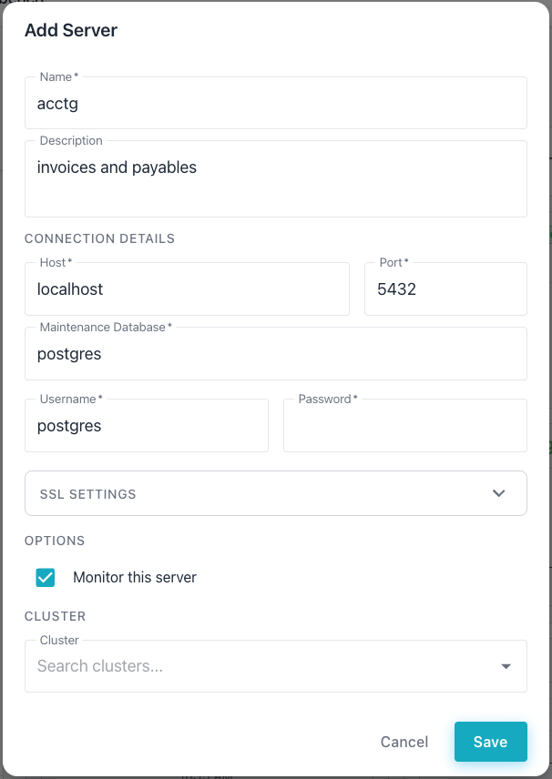
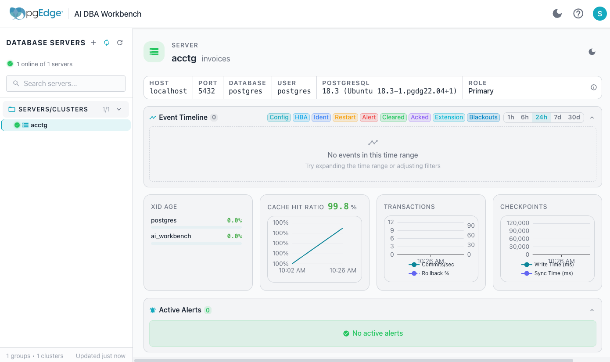

# Building AI DBA Workbench from Source Code

You can find the AI DBA Workbench source code and configuration examples in
the [Github repository](https://github.com/pgEdge/ai-dba-workbench). The 
project uses Makefiles for building and testing; you can build all of the 
components from the top-level directory.

Use the following `make` command to build all of the components:

```bash
make all
```

Or, specify a component name with the `make` command to build a component
individually.  For example, the following command builds the collector:

```bash
cd collector && make build
```

After completing the installation, create configuration files and
configure each component for your environment. You can copy sample
configuration files from the
[GitHub repository](https://github.com/pgEdge/ai-dba-workbench/tree/main/examples):

- The [Collector Configuration](configuration/collector.md) file
  describes datastore and connection pool settings. The `collector.yaml`
  file must include the location of:

    * [The secret_file](configuration/collector.md#security-options)
    * [The password_file](configuration/collector.md#datastorepassword_file)

- The [Server Configuration](configuration/server.md) file describes
  authentication, TLS, and LLM settings. The `server.yaml` file must
  include:

    * [The secret_file](configuration/collector.md#security-options)
    * The password associated with the user that owns the
      `/opt/ai-workbench/data` directory (under the `database:` section).

- The [Alerter Configuration](configuration/alerter.md) file describes
  threshold and anomaly detection settings. The `alerter.yaml` file
  must include:

    * [The secret_file](configuration/collector.md#security-options)
    * [The password_file](configuration/collector.md#datastorepassword_file)

- The [Client Configuration](configuration/client.md) file describes
  proxy and build settings.


## Configuring systemd Services

The following sections provide details about creating systemd service
files to run each component as a background service.

### Configuring the Collector Service

The collector service file configures the collector to start
automatically and restart on failure.

Create the service file at
`/etc/systemd/system/pgedge-ai-dba-collector.service`; replace the
`user_name` placeholder with the name of the operating system user
account that owns the `/opt/ai-workbench/data` directory:

```ini
[Unit]
Description=pgEdge AI DBA Workbench Collector
After=network.target postgresql.service

[Service]
Type=simple
User=user_name
WorkingDirectory=/opt/ai-workbench
ExecStart=/opt/ai-workbench/ai-dba-collector \
    -config /etc/pgedge/ai-dba-collector.yaml
Restart=on-failure
RestartSec=10

[Install]
WantedBy=multi-user.target
```

### Configuring the Server Service

The server service file configures the server to start automatically
and restart on failure.

Create the service file at
`/etc/systemd/system/pgedge-ai-dba-server.service`; replace the `user_name`
placeholder with the name of the operating system user account that owns the
`/opt/ai-workbench/data` directory:

```ini
[Unit]
Description=pgEdge AI DBA Workbench Server
After=network.target postgresql.service

[Service]
Type=simple
User=user_name
WorkingDirectory=/opt/ai-workbench
ExecStart=/opt/ai-workbench/ai-dba-server \
    -config /etc/pgedge/ai-dba-server.yaml
Restart=on-failure
RestartSec=10

[Install]
WantedBy=multi-user.target
```

### Configuring the Alerter Service

The alerter service file configures the alerter to start automatically
and restart if the process exits.

Create the service file at
`/etc/systemd/system/pgedge-ai-dba-alerter.service`; replace the `user_name`
placeholder with the name of the operating system user account that owns the 
`/opt/ai-workbench/data` directory:

```ini
[Unit]
Description=pgEdge AI DBA Workbench Alerter
After=network.target postgresql.service

[Service]
Type=simple
User=user_name
WorkingDirectory=/opt/ai-workbench
ExecStart=/opt/ai-workbench/ai-dba-alerter \
    -config /etc/pgedge/ai-dba-alerter.yaml
Restart=always
RestartSec=10

[Install]
WantedBy=multi-user.target
```

### Enable and Start the Services

Use `systemctl` to reload the daemon and enable each service.

In the following example, the `systemctl` commands reload the daemon,
enable all services, and start each one:

```bash
sudo systemctl daemon-reload
sudo systemctl enable pgedge-ai-dba-collector
sudo systemctl enable pgedge-ai-dba-server
sudo systemctl enable pgedge-ai-dba-alerter
sudo systemctl start pgedge-ai-dba-collector
sudo systemctl start pgedge-ai-dba-server
sudo systemctl start pgedge-ai-dba-alerter
```

In the following example, the `systemctl status` command checks the
status of each service:

```bash
sudo systemctl status pgedge-ai-dba-collector
sudo systemctl status pgedge-ai-dba-server
sudo systemctl status pgedge-ai-dba-alerter
```

## Running the Workbench

Before running the Workbench, add a user to the `auth.db` file. The
`auth.db` file is the server's own database for user credentials; the
file stores authentication details only for the AI Workbench.

In the following example, the `ai-dba-server` command adds a new user
account to the Workbench:

```bash
/opt/ai-workbench/ai-dba-server -add-user -username user_name
```

The command prompts for a Workbench password and optional user details.
In the following example, the command creates a login for the AI DBA
Workbench server:

```bash
/opt/ai-workbench/ai-dba-server -add-user -username susan
Enter password: 
Confirm password: 
Enter full name (optional): Susan
Enter email address (optional): susan@pgedge.com
Enter notes for this user (optional): 

======================================================================
User created successfully!
======================================================================

Username:  susan
Full Name: Susan
Email:    susan@pgedge.com
Status:   Enabled
======================================================================
```

Copy the client files to the appropriate directory.

In the following example, the `cp` command copies the client files to
the installation directory:

```bash
sudo mkdir -p /opt/ai-workbench/client
sudo cp -r assets index.html favicon.ico /opt/ai-workbench/client/
```

Install and configure nginx to serve the client files and proxy API
requests to the server.

In the following example, the `apt` command installs nginx:

```bash
sudo apt install nginx
```

Create the nginx configuration file at
`/etc/nginx/sites-available/ai-dba-workbench`:

```nginx
server {
    listen 80;
    server_name your_server_hostname_or_ip;

    root /opt/ai-workbench/client;
    index index.html;

    location /api/ {
        proxy_pass http://localhost:8080;
        proxy_set_header Host $host;
        proxy_set_header X-Real-IP $remote_addr;
        proxy_set_header X-Forwarded-For $proxy_add_x_forwarded_for;
        proxy_set_header X-Forwarded-Proto $scheme;
    }

    location /mcp/ {
        proxy_pass http://localhost:8080;
        proxy_set_header Host $host;
        proxy_set_header X-Real-IP $remote_addr;
        proxy_set_header X-Forwarded-For $proxy_add_x_forwarded_for;
        proxy_set_header X-Forwarded-Proto $scheme;
        proxy_buffering off;
        proxy_cache off;
        proxy_read_timeout 300s;
    }

    location = /health {
        proxy_pass http://localhost:8080;
    }

    location / {
        try_files $uri $uri/ /index.html;
    }
}
```

In the following example, the `ln` and `systemctl` commands enable the
configuration and restart nginx:

```bash
sudo ln -s /etc/nginx/sites-available/ai-dba-workbench /etc/nginx/sites-enabled/ai-dba-workbench
sudo rm /etc/nginx/sites-enabled/default
sudo nginx -t
sudo systemctl restart nginx
```

Open a browser and navigate to `http://<server-ip>`; provide
authentication details when the Workbench opens.


After logging in, select the `+` next to the DATABASE SERVERS heading
in the left navigation panel to add a server definition.



### Connecting to a Local PostgreSQL Server

By default, the server blocks connections to internal and private IP
addresses. To monitor a PostgreSQL instance on the same host or local
network, enable internal network connections in the server configuration
file.

In the following example, the `vi` command opens the server
configuration file for editing:

```bash
sudo vi /etc/pgedge/ai-dba-server.yaml
```

Locate the `connection_security` section and set `allow_internal_networks`
to `true`:

```yaml
connection_security:
  allow_internal_networks: true
```

In the following example, the `systemctl` command restarts the server
to apply the change:

```bash
sudo systemctl restart pgedge-ai-dba-server
```

When adding a server definition, provide the connection details and
specify `localhost` in the host name field before selecting `Save`.




