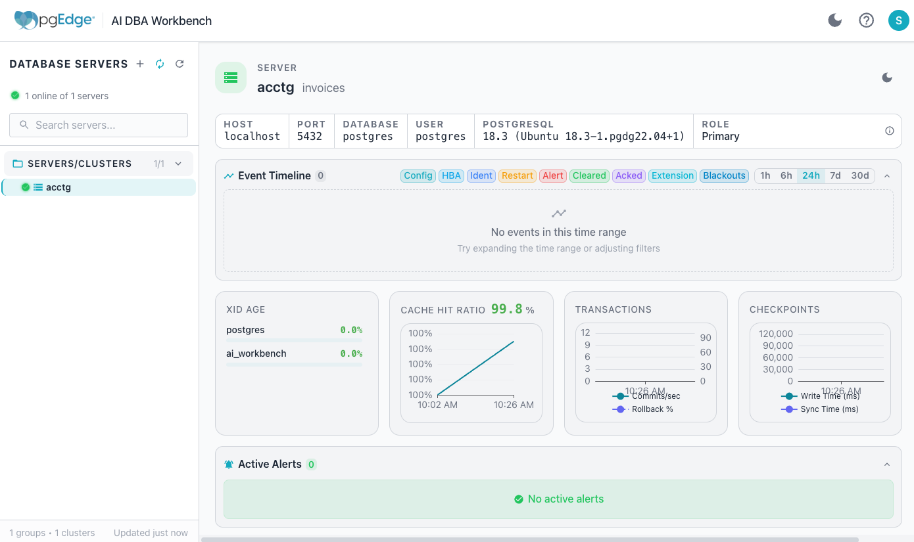

# Building the Workbench from Source Code

The AI DBA Workbench collects metrics from PostgreSQL servers, evaluates
alert rules, and displays results in a web interface. You can find the
source code and configuration examples in the
[GitHub repository](https://github.com/pgEdge/ai-dba-workbench). This guide
walks you through building, installing, and starting the Workbench on a
single host.

## Prerequisites

Before you build the Workbench, confirm that the following prerequisites
are in place on a supported operating system and platform:

- [Go 1.26](https://go.dev/dl/) or later is required to build the
  server-side components.

- [Node.js 18](https://nodejs.org/en/download) or later is required to
  build the web client.

- [Make](https://www.gnu.org/software/make/) is required to execute the
  Makefile.

- You must have a [PostgreSQL 14](https://www.postgresql.org/download/)
  or later database for the Workbench datastore; you must also have the
  credentials for that database.

- Network access must exist between each monitored PostgreSQL server and
  the system that hosts the Workbench.

## Cloning the Repository

The project uses Makefiles for building and testing; when you clone the
[GitHub repository](https://github.com/pgEdge/ai-dba-workbench), you get
the files you need to build. In the following example, the `git clone`
command clones the repository:

```bash
git clone https://github.com/pgEdge/ai-dba-workbench.git
```

After cloning the repository, move into the top-level directory before you
build the components:

```bash
cd ai-dba-workbench
```

## Building the Binaries

The Makefile builds all of the server-side components and the web client.
In the following example, the `make all` command builds the Workbench:

```bash
make all
```

You can optionally build components individually. In the following
example, the `make build` command builds just the collector component:

```bash
cd collector && make build
```

The `make all` command produces three binaries in the `bin/` directory of
the repository:

- The `bin/ai-dba-collector` binary collects metrics from monitored
  PostgreSQL servers.

- The `bin/ai-dba-server` binary serves the API and MCP endpoints.

- The `bin/ai-dba-alerter` binary evaluates alert rules and sends
  notifications.

## Installing the Workbench

After building the components, copy the binaries and web client files into
the installation directory. In the following example, the `mkdir` and `cp`
commands create the installation directory and copy the binaries into
place:

```bash
sudo mkdir -p /opt/ai-workbench
sudo cp bin/ai-dba-* /opt/ai-workbench/
```

The web client builds separately and produces output in the `client/dist/`
directory. Run these commands from the `ai-dba-workbench` repository
root. In the following example, the `npm install` command installs the
dependencies; the `npm run build` command then builds the client; the
`cp` command installs the resulting files to `/opt/ai-workbench/client/`:

```bash
cd client && npm install && npm run build
sudo mkdir -p /opt/ai-workbench/client
sudo cp -r dist/* /opt/ai-workbench/client/
```

The remaining sections run the installed binaries from
`/opt/ai-workbench/`; all commands use this directory as the prefix.

## Creating the Datastore Database

Use a PostgreSQL client to create a database for the datastore; the
collector, server, and alerter share this database. We'll use the
[`psql`](https://www.postgresql.org/docs/18/app-psql.html)
to connect to the PostgreSQL server:

```bash
sudo -u postgres psql
```

The PostgreSQL installation created a user named `postgres`; we need to alter
the user, making the user a login role, with a password:

```sql
ALTER ROLE postgres LOGIN PASSWORD '1safepassword';
```

Then, create the datastore database and `ai_workbench` user. In the following
example, the `CREATE DATABASE`, `CREATE USER`, and `GRANT` statements create
the `ai_workbench` database and the `ai_workbench` user:

```sql
CREATE DATABASE ai_workbench;
CREATE USER ai_workbench WITH PASSWORD '1safepassword';
GRANT ALL PRIVILEGES ON DATABASE ai_workbench TO ai_workbench;
```

The collector creates the required schema tables automatically on the
first startup.

You can use `\q` to exit the psql client session and return to the Terminal
window.

## Creating a Server Secret and a Password File

The Workbench components use the server secret file and password file when
they connect and authenticate with other components and the datastore
database. The Workbench stores both files in the `/etc/pgedge` directory;
the complete paths are:

- The shared secret resides at `/etc/pgedge/server.secret`.

- The datastore password resides at `/etc/pgedge/password.txt`.

In the following example, the `mkdir` command creates the `/etc/pgedge`
directory; the directory may already exist for configuration files, so
`mkdir -p` is the safest form of the command to use:

```bash
sudo mkdir -p /etc/pgedge
```

Then, use the `openssl` command to write a secret to the
`server.secret` file in the `/etc/pgedge` directory:

```bash
sudo openssl rand -base64 32 \
    | sudo tee /etc/pgedge/server.secret \
    > /dev/null
sudo chmod 644 /etc/pgedge/server.secret
```

Then, use the `echo` and `chmod` commands to create the `password.txt`
file in the `/etc/pgedge` directory and set the file permissions:

```bash
sudo sh -c 'echo "1safepassword" > /etc/pgedge/password.txt'
sudo chmod 644 /etc/pgedge/password.txt
```

!!! hint

    When you configure your installation, ensure that the locations of
    the `server.secret` and `password.txt` files match the
    absolute file paths in the YAML configuration files.

## Configuring and Starting the Collector

Copy the sample configuration file for the collector to the system
configuration directory before you edit the settings. The `/etc/pgedge`
directory is the system-wide default location that the Workbench searches for
configuration files; you can specify an alternate location on the command line
when you invoke the Workbench. In the following example, the `cp` command
copies the sample collector configuration file to `/etc/pgedge`:

```bash
sudo cp ~/ai-dba-workbench/examples/ai-dba-collector.yaml /etc/pgedge/ai-dba-collector.yaml
```

Update the configuration file to describe your deployment. The following
example shows the minimum settings required for a local development
environment based on the deployment we are performing in this document:

```yaml
datastore:
  host: localhost
  database: ai_workbench
  username: postgres
  password_file: /etc/pgedge/password.txt
  port: 5432
  sslmode: disable
```

The `sslmode: disable` setting disables SSL for the datastore connection;
this setting is suitable for local development only. For other
deployment environments, use the default `prefer` setting or a stricter mode.

The `SECURITY SETTINGS` section stores the location of the secret file:

```yaml
secret_file: /etc/pgedge/server.secret
```

After you update the settings and save the file, start the collector. In
the following example, the `ai-dba-collector` command starts the collector
with the configuration file:

```bash
/opt/ai-workbench/ai-dba-collector -config /etc/pgedge/ai-dba-collector.yaml &
```

The collector displays startup messages to confirm successful
initialization; for example:

```bash
/opt/ai-workbench/ai-dba-collector -config /etc/pgedge/ai-dba-collector.yaml
2026/05/19 13:22:00 pgEdge AI DBA Workbench Collector v1.0.0-beta1 starting...
2026/05/19 13:22:00 Configuration loaded from: /etc/pgedge/ai-dba-collector.yaml
2026/05/19 13:22:00 Datastore connection established
2026/05/19 13:22:00 Probe scheduler started
2026/05/19 13:22:00 Collector is running. Press Ctrl+C to stop.
```

The collector runs as a background service; press `Enter` to view your
prompt.

## Configuring and Starting the Server

Copy the server configuration file to the system configuration directory
before you edit the settings. In the following example, the `cp` command
copies the sample configuration file to the `/etc/pgedge` directory:

```bash
sudo cp ~/ai-dba-workbench/examples/ai-dba-server.yaml /etc/pgedge/ai-dba-server.yaml
```

The sample configuration file specifies the minimum settings for a local
development environment; for many properties, you can accept the defaults.
Update the configuration file to describe your deployment.

The `datastore` properties provide connection details for the server's 
database; update the properties with the connection details and the password
for the `postgres` user. Note that the `ai-dba-server.yaml` file calls for a
hardcoded password or uses the `.pgpass` file instead of the `password.txt`
file:

```yaml
datastore:
  host: localhost
  port: 5432
  database: ai_workbench
  user: postgres
  password: "1safepassword"
  sslmode: disable
```

By default, the server blocks connections to internal and private IP
addresses. To monitor a PostgreSQL instance on the same host or local
network, set the `allow_internal_networks` property to `true` in the
server configuration file:

```yaml
connection_security:
  # Allow connections to RFC 1918 private addresses (10.x.x.x,
  # 172.16.x.x, 192.168.x.x), localhost, link-local, and other
  # internal network ranges.
  # Default: false
  allow_internal_networks: true
```

The `secret_file` property (in the `PATHS AND DATA DIRECTORIES` section)
stores the full path to the `server.secret` file:

```yaml
# Path to server secret file (for encryption)
# Default: /etc/pgedge/ai-dba-server.secret or ./ai-dba-server.secret
secret_file: "/etc/pgedge/server.secret"
```

After you modify and save the file, create the data directory and add a
user account. In the following example, the `mkdir`, `chown`, and
`ai-dba-server` commands create the `data` directory and add a user; the
`-data-dir` flag places the authentication database in
`/opt/ai-workbench/data`:

```bash
sudo mkdir -p /opt/ai-workbench/data
sudo chown -R $USER:$USER /opt/ai-workbench/data
/opt/ai-workbench/ai-dba-server -add-user -username admin \
    -data-dir /opt/ai-workbench/data
```

The command prompts for a password and optional user details; the password
must include at least one capital letter, one digit, and one special
character:

```bash
/opt/ai-workbench/ai-dba-server -add-user -username admin -data-dir /opt/ai-workbench/data
Auth store: /opt/ai-workbench/data/auth.db
Enter password:
Confirm password:
Enter full name (optional): admin
Enter email address (optional): admin@pgedge.com
Enter notes for this user (optional):

======================================================================
User created successfully!
======================================================================

Username:  admin
Full Name: admin
Email:    admin@pgedge.com
Status:   Enabled
======================================================================
```

Then, use the `ai-dba-server` command to start the server:

```bash
/opt/ai-workbench/ai-dba-server \
    -config /etc/pgedge/ai-dba-server.yaml &
```

The server displays status messages during startup; for example:

```bash
Auth store: /opt/ai-workbench/data/auth.db (1 user(s), 0 token(s))
RBAC: 21 MCP privileges registered
Rate limiting enabled: 10 attempts per 15 minutes per IP
Account lockout enabled: 10 failed attempts before lockout
Server secret: loaded from /etc/pgedge/server.secret
Datastore: connected to postgres@localhost:5432/ai_workbench
Database configured: postgres@localhost:5432/ai_workbench (per-session connections)
Conversation store: PostgreSQL datastore
LLM HTTP client: timeout=2m0s
AI Overview: DISABLED (requires datastore and LLM configuration)
Starting MCP server in HTTP mode on :8080
LLM Proxy: ENABLED (provider: anthropic, model: claude-sonnet-4-5)
Knowledgebase: DISABLED
MCP tool REST bridge: ENABLED
Conversation history: ENABLED
Connection management: ENABLED
Cluster management: ENABLED
Alert management: ENABLED
Blackout management: ENABLED
Probe configuration: ENABLED
Alert rule configuration: ENABLED
Alert override configuration: ENABLED
Probe override configuration: ENABLED
Notification channel management: ENABLED
Channel override configuration: ENABLED
Server info: ENABLED
Timeline events: ENABLED
Performance summary: ENABLED
Metrics query: ENABLED
Latest snapshot: ENABLED
Memory management: ENABLED
RBAC management: ENABLED
```

The server runs as a background process; press `Enter` to view your
prompt.

## Configuring and Starting the Alerter

The alerter connects to the same datastore database as the collector and
server. Configure the alerter with a YAML configuration file or
command-line flags; see the
[alerter configuration](configuration/alerter.md) reference to review the
available options. In the following example, the `cp` command copies the
sample alerter configuration file to `/etc/pgedge`:

```bash
sudo cp ~/ai-dba-workbench/examples/ai-dba-alerter.yaml \
    /etc/pgedge/ai-dba-alerter.yaml
```

Update the configuration file to describe your deployment; the following
example shows the minimum datastore settings:

```yaml
datastore:
  # Hostname or IP address of the AI DBA Workbench datastore PostgreSQL server
  # Default: localhost
  # Command-line: -pg-host
  host: localhost

  # IP address of the datastore server (optional)
  # If set, bypasses DNS resolution and connects directly to this address
  # The host value is still used for SSL certificate verification
  # Default: none
  # Command-line: -pg-hostaddr
  # hostaddr: 127.0.0.1

  # Database name in the AI DBA Workbench datastore
  # Default: ai_workbench
  # Command-line: -pg-database
  database: ai_workbench

  # Username for connecting to the AI DBA Workbench datastore
  # Default: postgres
  # Command-line: -pg-username
  username: postgres

  # Path to file containing the password for the AI DBA Workbench datastore
  # The file should contain only the password with no extra whitespace
  # Default: none (will attempt to use .pgpass if not specified)
  # Command-line: -pg-password-file
  #
  # Example: Create a password file with restricted permissions:
  #   echo "1safepassword" > /etc/pgedge/password.txt
  #   chmod 600 /etc/pgedge/password.txt
  password_file: /etc/pgedge/password.txt

  # Port on which the AI DBA Workbench datastore is listening
  # Default: 5432
  # Range: 1-65535
  # Command-line: -pg-port
  port: 5432
```

The `SECURITY SETTINGS` section stores the location of the secret file:

```yaml
secret_file: /etc/pgedge/server.secret
```

In the following example, the `ai-dba-alerter` command starts the alerter
with the configuration file:

```bash
/opt/ai-workbench/ai-dba-alerter \
    -config /etc/pgedge/ai-dba-alerter.yaml &
```

The alerter displays status messages during startup; for example:

```bash
pgEdge AI DBA Workbench Alerter v1.0.0-beta1 starting...
Configuration loaded from /etc/pgedge/ai-dba-alerter.yaml
Datastore: connected to postgres@localhost:5432/ai_workbench
[alerter] Initialized embedding provider: nomic-embed-text
[alerter] Initialized reasoning provider: qwen2.5:7b-instruct
Starting alerter engine...
[alerter] Engine starting...
[alerter] All workers started
[alerter] Retention manager started
[alerter] Blackout scheduler started
[alerter] Re-evaluation worker started (interval: 5m0s)
[alerter] Anomaly detector started (interval: 1m0s)
[alerter] Alert cleaner started
[alerter] Threshold evaluator started (interval: 1m0s)
[alerter] Baseline calculator started (interval: 1h0m0s)
[alerter] Connection error evaluator started (interval: 30s)
[alerter] Calculating baselines for 0 connections, 28 rules (lookback: 7 days)
[alerter] Baseline calculation complete
```

The alerter runs as a background process; press `Enter` to view your
prompt.

## Configuring nginx and Opening the Web UI

The server does not include a static file service; install and configure
[nginx](https://nginx.org/en/docs/) to serve the client files and proxy
API requests to the server before you open the web UI. Use your choice of
package manager to install nginx. In the following example, the
`apt install` command installs nginx:

```bash
sudo apt install nginx
```

Then, create and open the nginx configuration file; this example uses
`vi`:

```bash
sudo vi /etc/nginx/sites-available/ai-dba-workbench
```

Update the nginx configuration file to set the proxy rules and file root
for your installation:

```nginx
server {
    listen 80;
    server_name your_server_hostname_or_ip;

    root /opt/ai-workbench/client;
    index index.html;

    location /api/ {
        proxy_pass http://localhost:8080;
        proxy_set_header Host $host;
        proxy_set_header X-Real-IP $remote_addr;
        proxy_set_header X-Forwarded-For $proxy_add_x_forwarded_for;
        proxy_set_header X-Forwarded-Proto $scheme;
    }

    location /mcp/ {
        proxy_pass http://localhost:8080;
        proxy_set_header Host $host;
        proxy_set_header X-Real-IP $remote_addr;
        proxy_set_header X-Forwarded-For $proxy_add_x_forwarded_for;
        proxy_set_header X-Forwarded-Proto $scheme;
        proxy_buffering off;
        proxy_cache off;
        proxy_read_timeout 300s;
    }

    location = /health {
        proxy_pass http://localhost:8080;
    }

    location / {
        try_files $uri $uri/ /index.html;
    }
}
```

Then, use the `ln`, `nginx`, and `systemctl` commands to enable the
configuration and restart nginx:

```bash
sudo ln -s /etc/nginx/sites-available/ai-dba-workbench \
    /etc/nginx/sites-enabled/ai-dba-workbench
sudo rm /etc/nginx/sites-enabled/default
sudo nginx -t
sudo systemctl restart nginx
```

Open a browser and navigate to `http://<server-ip>`; provide
authentication details when the Workbench opens.


After you log in, select the `+` next to the DATABASE SERVERS heading in
the left navigation panel. The Workbench adds a new server definition
entry.


### Connecting to a Local PostgreSQL Server

By default, the server blocks connections to internal and private IP
addresses. To monitor a PostgreSQL instance on the same host or local
network, enable internal network connections in the server configuration
file.

In the following example, the `vi` command opens the server configuration
file for editing:

```bash
sudo vi /etc/pgedge/ai-dba-server.yaml
```

In the following example, the `connection_security` section enables
internal network connections:

```yaml
connection_security:
  allow_internal_networks: true
```

In the following example, the `systemctl` command restarts the server to
apply the change:

```bash
sudo systemctl restart pgedge-ai-dba-server
```

When you add a server definition, provide the connection details and
specify `localhost` in the host name field before you select `Save`.



### Customizing your Configuration

Consult the following guides for additional configuration information:

- The [systemd configuration](configuration/configure_systemd.md) guide
  provides details about setting up systemd service management for users
  who did not use pgEdge packages when installing.

- The [collector](configuration/collector.md) guide covers tuned
  connection pools and SSL.

- The [server](configuration/server.md) guide covers TLS, authentication,
  and LLM integration.

- The [alerter](configuration/alerter.md) guide covers anomaly detection
  and notification channels.

- The [web client](configuration/client.md) guide covers proxy settings
  and build options.
