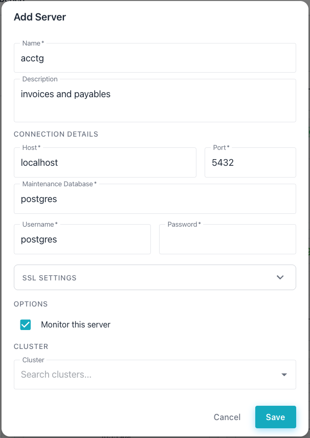

# Docker Deployment

Docker provides a straightforward way to deploy all four services of the
pgEdge AI DBA Workbench using pre-built container images for production or
built from source for development.

## Prerequisites

Install the following software before continuing.

- [Docker Engine](https://docs.docker.com/engine/install/) version 24.0
  or later is required.
- The [Docker Compose v2](https://docs.docker.com/compose/install/)
  plugin must be available as a Docker CLI plugin.
- [Git](https://git-scm.com/book/en/v2/Getting-Started-Installing-Git)
  is required to clone the repository in the installation steps.
- [OpenSSL](https://www.openssl.org/source/) is required to generate the
  shared secret file; OpenSSL is pre-installed on most Linux and macOS
  systems.

Access to the GitHub Container Registry is required for pulling
pre-built production images.


## Installing Workbench with Docker

The quickest way to deploy uses pre-built images from the GitHub
Container Registry.

1. Clone the repository to obtain the configuration files.

    In the following example, the `git clone` command retrieves the
    project repository; the `cd` command then enters the project
    directory.

    ```bash
    git clone \
      https://github.com/pgEdge/ai-dba-workbench.git
    cd ai-dba-workbench
    ```

2. Generate the required secret files for the server and the database.

    In the following example, the `openssl` command creates a random
    secret key and writes the PostgreSQL password to a secret file.

    ```bash
    mkdir -p docker/secret
    openssl rand -base64 32 > docker/secret/ai-dba.secret
    echo '1safePassword!' > docker/secret/pg-password
    ```

3. Set the database password in the `POSTGRES_PASSWORD` environment
   variable.

    In the following example, the `export` command sets the database
    password used by the Workbench.

    ```bash
    export POSTGRES_PASSWORD=1safePassword!
    ```

4. Update the password in the `ai-dba-server.yaml` configuration file
   to match the PostgreSQL password set in the previous step.

    In the following example, the `sed` command replaces the default
    password value in the server configuration file.

    ```bash
    sed -i 's/password: postgres/password: 1safePassword!/' \
      docker/config/ai-dba-server.yaml
    ```

5. Start all of the services using the production Compose file.

    In the following example, the `docker compose` command starts the
    services in detached mode.

    ```bash
    docker compose \
      -f examples/docker-compose.production.yml up -d
    ```

    The output from a healthy cluster resembles the following.

    ```text
    [+] up 8/8
 ✔ Network examples_ai-dba-network Created                                                                  0.0s
 ✔ Volume examples_pgdata          Created                                                                  0.0s
 ✔ Volume examples_server-data     Created                                                                  0.0s
 ✔ Container examples-postgres-1   Healthy                                                                  5.7s
 ✔ Container examples-alerter-1    Started                                                                  5.8s
 ✔ Container examples-collector-1  Started                                                                  5.8s
 ✔ Container examples-server-1     Healthy                                                                 11.3s
 ✔ Container examples-client-1     Started                                                                 11.3s
    ```

6. Verify that all services are running. The following `ps` subcommand lists
   running containers and their status.

    ```bash
    docker compose \
      -f examples/docker-compose.production.yml ps
    ```

    The output from a healthy cluster resembles the following.

    ```text
    NAME                   IMAGE                                               COMMAND                  SERVICE     CREATED          STATUS                     PORTS
    examples-alerter-1     ghcr.io/pgedge/ai-dba-alerter:latest                "/usr/local/bin/ai-d…"   alerter     13 minutes ago   Up 13 minutes              
    examples-client-1      ghcr.io/pgedge/ai-dba-client:latest                 "/docker-entrypoint.…"   client      13 minutes ago   Up 3 minutes (unhealthy)   0.0.0.0:3000->8080/tcp, [::]:3000->8080/tcp
    examples-collector-1   ghcr.io/pgedge/ai-dba-collector:latest              "/usr/local/bin/ai-d…"   collector   13 minutes ago   Up 13 minutes              
    examples-postgres-1    ghcr.io/pgedge/pgedge-postgres:18-spock5-standard   "/usr/local/bin/dock…"   postgres    13 minutes ago   Up 13 minutes (healthy)    0.0.0.0:5432->5432/tcp, [::]:5432->5432/tcp
    examples-server-1      ghcr.io/pgedge/ai-dba-server:latest                 "/usr/local/bin/ai-d…"   server      13 minutes ago   Up 10 minutes (healthy)    0.0.0.0:8080->8080/tcp, [::]:8080->8080/tcp
    ```

7. Create a user account for the Workbench. The password must be at
   least 12 characters long.

    In the following example, the `exec` subcommand creates a user
    named `admin` inside the server container.

    ```bash
    echo '1safePassword!' > /tmp/pw.txt
    docker compose \
        -f examples/docker-compose.production.yml exec \
        -T server sh -c 'cat > /tmp/pw.txt' < /tmp/pw.txt
    docker compose \
        -f examples/docker-compose.production.yml exec \
        server /usr/local/bin/ai-dba-server \
        -config /etc/pgedge/ai-dba-server.yaml \
        -add-user -username admin \
        -password-file /tmp/pw.txt \
        -full-name "Admin User" \
        -email "admin@example.com"
    docker compose \
        -f examples/docker-compose.production.yml exec \
        server /usr/local/bin/ai-dba-server \
        -config /etc/pgedge/ai-dba-server.yaml \
        -set-superuser -username admin
    docker compose \
        -f examples/docker-compose.production.yml exec \
        server rm /tmp/pw.txt
    rm /tmp/pw.txt
    ```

    The server prompts for optional notes and then confirms the user
    creation. The confirmation output resembles the following.

    ```text
    Auth store: /data/auth.db
    Enter notes for this user (optional):

    ======================================================================
    User created successfully!
    ======================================================================

    Username:  admin
    Full Name: Admin User
    Email:    admin@example.com
    Status:   Enabled
    ======================================================================
    ```

8. Open a browser and navigate to `http://localhost:3000` to access
   the web client. Select the `+` icon to the right of the DATABASE
   SERVERS label; then add the connection details for the PostgreSQL
   database you wish to monitor.




## Docker Image Variants

Pre-built images are published to the GitHub Container Registry for each
release and for each push to the `main` branch. The following table
lists the available images and their tags.

| Image | Tags | Description |
|-------|------|-------------|
| `ghcr.io/pgedge/ai-dba-server` | `latest`, `x.y.z`, `x.y`, `edge` | The MCP server component. |
| `ghcr.io/pgedge/ai-dba-collector` | `latest`, `x.y.z`, `x.y`, `edge` | The metrics collector. |
| `ghcr.io/pgedge/ai-dba-alerter` | `latest`, `x.y.z`, `x.y`, `edge` | The alert monitoring service. |
| `ghcr.io/pgedge/ai-dba-client` | `latest`, `x.y.z`, `x.y`, `edge` | The React web client. |

Each image also receives a `sha-<hash>` tag that provides an immutable
reference to a specific commit. The publishing workflow produces the following
tag types:

- The `latest` tag points to the most recent stable release; the registry
  updates this tag only on version tag pushes.
- The `edge` tag tracks the `main` branch and may contain unstable changes.
- The `x.y` tag pins to a minor version and receives automatic patch updates.
- The `x.y.z` tag pins to an exact release and never changes.

Select a tag by setting the `VERSION` environment variable before running
`docker compose`.

In the following example, the `VERSION` variable pins the deployment to
an exact release.

```bash
VERSION=1.2.3 docker compose \
  -f examples/docker-compose.production.yml up -d
```

In the following example, the `VERSION` variable pins to a minor version
and receives automatic patch updates.

```bash
VERSION=1.2 docker compose \
  -f examples/docker-compose.production.yml up -d
```

In the following example, the `VERSION` variable selects the latest
main-branch build.

```bash
VERSION=edge docker compose \
  -f examples/docker-compose.production.yml up -d
```

## Configuration

The `docker/config/` directory contains configuration files for each service.

- The `ai-dba-server.yaml` file configures the MCP server; see
  [Server Configuration](configuration/server.md) for details.
- The `ai-dba-collector.yaml` file configures the metrics collector; see
  [Collector Configuration](configuration/collector.md) for details.
- The `ai-dba-alerter.yaml` file configures the alert monitoring service;
  see [Alerter Configuration](configuration/alerter.md) for details.
- The `nginx.conf` file configures the reverse proxy for the web client.

The production Compose file mounts these configuration files into the
containers at runtime. The files in `docker/config/` can be edited to
customize the deployment.

The Compose files support the following environment variables.

| Variable | Required | Default | Description |
|----------|----------|---------|-------------|
| `POSTGRES_PASSWORD` | Yes | None | The password for the PostgreSQL database. |
| `POSTGRES_PORT` | No | `5432` | The host port mapped to PostgreSQL. |
| `SERVER_PORT` | No | `8080` | The host port mapped to the server. |
| `CLIENT_PORT` | No | `3000` | The host port mapped to the web client. |
| `VERSION` | No | `latest` | The image tag to pull from the registry. |

## Development Deployment

The root `docker-compose.yml` file builds all images from source and is
suited for local development and testing.

In the following example, the `docker compose` command builds and starts all
services from source.

```bash
docker compose up -d
```

The command builds each Dockerfile in the project and starts the containers.
Changes to the source code require a rebuild of the affected images.

In the following example, the `--build` flag forces a rebuild of all images.

```bash
docker compose up -d --build
```

## Health Checks

The `postgres`, `server`, and `client` services include health checks that
Docker monitors automatically. The following commands verify the deployment
status.

The `ps` subcommand displays the health status of each container:

```bash
docker compose \
  -f examples/docker-compose.production.yml ps
```

The server exposes a health endpoint for external monitoring. In the
following example, the `curl` command checks the server health:

```bash
curl http://localhost:8080/health
```

Streaming the logs of a specific service helps diagnose issues. Use the `logs`
subcommand to stream the server output:

```bash
docker compose \
  -f examples/docker-compose.production.yml \
  logs -f server
```

## Troubleshooting Docker Deployments

This section covers common deployment issues and their solutions.

### PostgreSQL Fails to Start

The PostgreSQL container may fail to start if the data directory has
incorrect permissions; the container logs contain error details.

In the following example, the `logs` subcommand displays the PostgreSQL
container output.

```bash
docker compose \
  -f examples/docker-compose.production.yml \
  logs postgres
```

The `POSTGRES_PASSWORD` environment variable must be set before starting
the services. The PostgreSQL container requires this variable on first
initialization.

### Port Already in Use

The PostgreSQL container binds to port 5432 on the host by default.
The container fails to start if another service already occupies that
port; the error message includes the text "port is already allocated."

Setting the `POSTGRES_PORT` environment variable selects a different host
port. In the following example, the datastore binds to port 5433.

```bash
export POSTGRES_PORT=5433
docker compose \
  -f examples/docker-compose.production.yml up -d
```

The container port inside Docker remains 5432; only the host-side mapping
changes. The collector, server, and alerter services connect to the container
by service name, so they are unaffected by this change.

### Server Cannot Connect to the Database

The server may fail to connect if the database has not finished
initializing. The server container depends on the PostgreSQL health
check, but network issues can still cause connection delays.

In the following example, the `restart` subcommand restarts the server
container.

```bash
docker compose \
  -f examples/docker-compose.production.yml \
  restart server
```

The database credentials in the server configuration must match the
PostgreSQL password. The `docker/config/ai-dba-server.yaml` file and
the `docker/secret/pg-password` file must contain consistent values.

### Viewing Logs for All Services

Viewing logs for all services simultaneously helps identify the source
of a problem.

In the following example, the `logs` subcommand streams output from all
containers.

```bash
docker compose \
  -f examples/docker-compose.production.yml \
  logs -f
```

