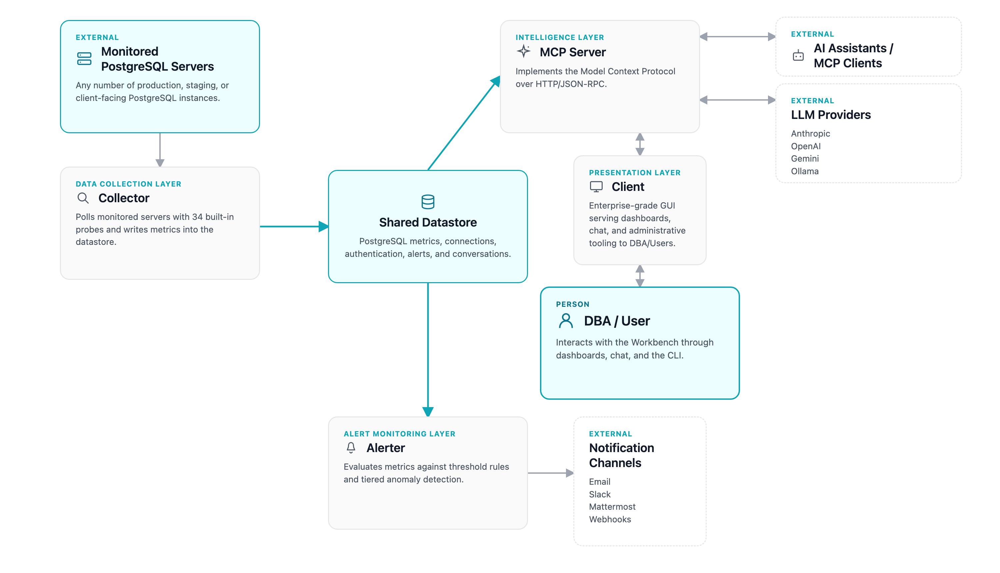

# pgEdge AI DBA Workbench Architecture Overview

The pgEdge AI DBA Workbench is an AI-powered environment for monitoring,
managing, and troubleshooting PostgreSQL systems. The Workbench combines a
Model Context Protocol (MCP) server with a web-based user interface, a data
collector, and an alert monitoring service. The Workbench enables you to query,
analyze, and manage distributed PostgreSQL clusters using natural language and
intelligent automation, exposing pgEdge tools and data sources to both
cloud-connected and locally hosted language models; this design ensures full
functionality in air-gapped or secure environments.

The AI DBA Workbench consists of four components that work together to provide
monitoring, alerting, and AI-powered database management.

## Data Collection Layer 

The Collector continuously monitors PostgreSQL servers and collects metrics
into a centralized datastore. The Collector provides the following features:

- The Collector supports multi-server monitoring with independent connection
  pools.
- The Collector includes 34 built-in probes that cover PostgreSQL system views.
- The Collector automates data management for partitioning and retention
  policies.
- The Collector secures connections with encryption and SSL/TLS support.

## Intelligence Layer 

The MCP Server implements the Model Context Protocol and provides AI assistants
with standardized access to PostgreSQL systems. The MCP Server provides the
following features:

- The server uses HTTP/HTTPS transport with JSON-RPC 2.0.
- SQLite-based authentication supports users and tokens.
- Role-based access control manages groups and privileges.
- Database tools enable queries, schema introspection, and analysis.
- The LLM proxy supports Anthropic, OpenAI, Gemini, and Ollama providers.
- The server preserves chat context through conversation history management.

## Alert Monitoring Layer 

The Alerter evaluates collected metrics against thresholds and uses AI-powered
anomaly detection to generate alerts. The Alerter provides the following
features:

- The Alerter supports threshold-based alerting with configurable rules.
- Tiered anomaly detection uses statistical analysis, embeddings, and LLM
  classification.
- The Alerter supports blackout scheduling for maintenance windows.
- The Alerter delivers notifications via email, Slack, Mattermost, and
  webhooks.

## Presentation Layer 

The Client provides a web-based user interface for cluster monitoring and
management. The Client provides the following features:

- Hierarchical dashboards display estate, cluster, and server metrics.
- The Client visualizes cluster topology including replication edges.
- The AI-powered chat interface supports natural language queries.
- The administration panel manages users, groups, and tokens.

## Where to Start

The following sections provide starting points based on role and goals.

- [Choose an installation type](getting-started/installation_overview.md) for
  details about setting up the Workbench for the first time.
- The [Using the Workbench](user-guide/index.md) guide covers dashboards,
  alerts, and AI features for day-to-day usage.
- The [Administrator's Guide](admin-guide/index.md) explains authentication,
  connections, and system configuration.
- The [Developer's Guide](developer-guide/index.md) provides architecture
  details and contribution guidelines for each component.

## License

Copyright (c) 2025 - 2026, pgEdge, Inc.

This software is released under the [PostgreSQL License](LICENSE.md).
