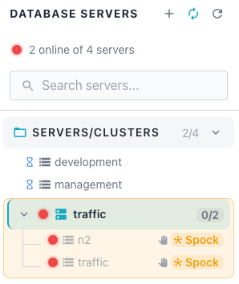

# Servers Show Offline or Stale Status

The cluster navigator sometimes reports servers as offline or shows sample data
that no longer updates. This page describes two related scenarios and explains
how to tell them apart. The first scenario is a transient display glitch that
clears on its own; the second is a real collector outage that requires
investigation.

Use the scenario descriptions below to decide which situation applies to you. A
transient status glitch self-resolves within 30 to 60 seconds, while a stopped
collector leaves sample data stale across many servers until you intervene.

## Transient Initialising Status

The Workbench occasionally marks servers offline while the collector finishes
establishing its monitoring connection. This status is incorrect, and it clears
on its own within about a minute.

### Symptom

The Database Servers panel shows a reduced online count, such as "2 online of 4
servers"; an affected cluster appears entirely offline. In the observed case, a
cluster named "traffic" containing the member servers "n2" and "traffic"
displayed "0/2" with a red status indicator. Both member servers showed red
status dots.

The AI Overview panel for the cluster reported both servers offline with no
connectivity. The panel flagged active warning-level alerts and stated that the
situation needed immediate attention. No blackout was active, and no recent
events explained the reported outage.

### Diagnosis

The displayed offline status is often incorrect; the database connections
behind the panel are frequently still healthy. You can confirm this by asking
the Ask Ellie assistant to query each server connection directly. For details
on the assistant, see [Ask Ellie](../user-guide/ai/ask-ellie.md).

In the observed case, Ask Ellie tested all four server connections directly by
port and host. The assistant found that each connection was connected and
executing queries successfully. This result confirmed that the reported outage
was a display problem rather than a real database failure.



Ellie explained the discrepancy between the panel and the live connections. The
Workbench's displayed status can get stuck in an "initialising" state while the
collector establishes its monitoring connection, performs initial metric
collection, or builds baseline statistics. This is a transient collector-side
status problem, not an actual database outage.

Ellie suggested several first steps before taking further action:

- Refresh the console to reload the current server status.
- Check the collector logs for connection errors.
- Wait 30 to 60 seconds for the probes to start collecting, since
  initialization can take that long.

### Resolution

When the stale offline status does not clear on its own, restart the Workbench
backend services in the following order. Restart each service and allow it to
finish starting before moving to the next one.

1. Restart the Collector.
2. Restart the Alerter.
3. Restart the Server.

After restarting the services, confirm that the status of each affected server
has updated to reflect its actual online state. The Database Servers panel
should then show the correct online count.

## Collector Stopped Collecting Metrics

The collector sometimes stops gathering metrics from every monitored server
while the databases themselves stay online. This scenario does not
self-resolve; the sample data grows stale until you restart the collector.
Unlike the transient status glitch above, the sample ages climb steadily and
never recover on their own.

### Recognising This Scenario

The clearest signal is stale sample data across many or all servers rather than
a single one. When every server reports the same large gap since its last
sample, the collector has likely stopped for all of them at once. A problem
affecting only one server usually points to that server, not to the collector.

The databases in this scenario remain online and continue accepting
connections. Because they are healthy, direct connection tests still succeed,
which can make the estate look fine at first glance.

### Diagnosis

Ask the Ask Ellie assistant to check sample freshness across your servers.
Request the time since the last sample and the sample count for each server; a
consistent, large gap across servers is the key diagnostic signal. For details
on the assistant, see [Ask Ellie](../user-guide/ai/ask-ellie.md).

In the observed case, Ellie returned a table of servers with their port, time
since the last sample, and sample count. The "management" server on port 5433
showed a last sample "23 hours ago" with 40 samples. The "traffic" server on
port 5434 and the "n2" server on port 5435 each showed "23 hours ago" with 20
samples.

Ellie identified the underlying problem from this table. The collector had
stopped gathering metrics from all servers around 12:10 PM the previous day,
even though the databases remained online and reachable. The consistent
last-sample time across every server pointed to a single collector-wide failure
rather than a per-server outage.

Watch for a misleading detail in this scenario. Some connections can still look
"fine" in the UI because they hold more historical samples, or because the UI
shows cached data. This appearance can mask the fact that collection has
actually stopped everywhere.

### Resolution

This scenario is almost certainly a collector crash or hang, so start by
restarting the collector service. Perform the following steps in order and
confirm the outcome of each before moving on.

1. Restart the collector service to recover from a crash or hang.

In the following example, the `systemctl restart` command restarts the
collector service:

   ```bash
   sudo systemctl restart pgedge-ai-dba-collector
   ```

2. Check the collector logs for errors around the time collection stopped.

In the following example, the `journalctl` command shows the collector logs;
filter by time with the `--since` and `--until` options to narrow the output
around the observed stall time:

   ```bash
   sudo journalctl -u pgedge-ai-dba-collector \
       --since "2026-07-01 12:00" --until "2026-07-01 12:30"
   ```

3. Verify that the collector is running after the restart.

In the following example, the `systemctl status` command confirms that the
collector service is active:

   ```bash
   sudo systemctl status pgedge-ai-dba-collector
   ```

After the collector restarts, ask Ask Ellie to check sample freshness again.
The time since the last sample should drop to a small value as new metrics
arrive for each server.
