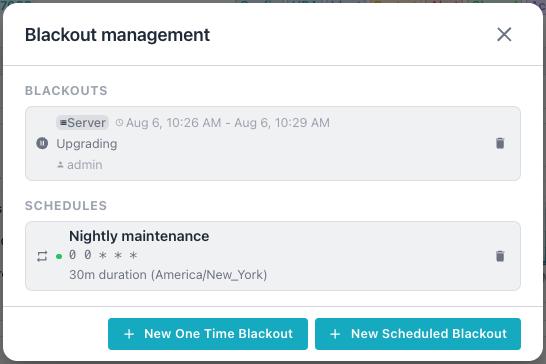
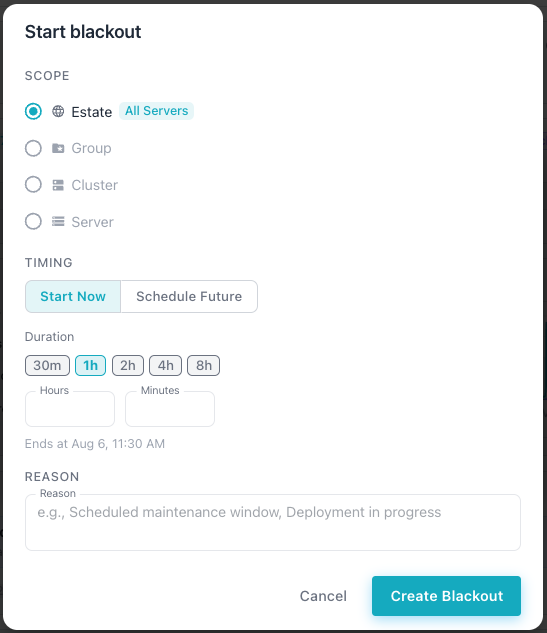
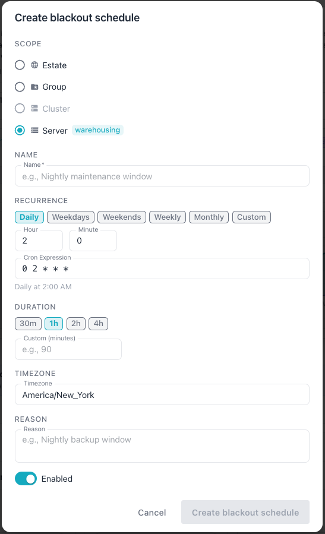
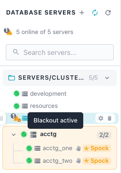

# Managing Blackouts

Blackouts suppress alert notifications during planned maintenance windows.
Administrators create blackouts to prevent false alerts while performing
database upgrades, schema changes, or infrastructure work. The AI DBA Workbench
supports both one-time blackouts and recurring blackout schedules.

Blackouts operate at four hierarchical levels. A blackout at any level
suppresses alerts for everything beneath the blackout in the hierarchy.

The following table describes the available blackout scopes:

| Scope | Target | Description |
|-------|--------|-------------|
| Estate | Entire installation | Suppresses alerts for all servers across all groups and clusters. |
| Group | Cluster group | Suppresses alerts for all clusters and servers within the group. |
| Cluster | Single cluster | Suppresses alerts for all servers within the cluster. |
| Server | Individual server | Suppresses alerts for only the specified server. |

The system enforces scope validation when creating or updating a blackout:

- Estate blackouts must not reference any group, cluster, or server. 
- Group blackouts require a group identifier.
- Cluster blackouts require a cluster identifier.
- Server blackouts require a connection identifier.

Users with the `manage_blackouts` permission can create, update, delete, and
stop blackouts. All authenticated users can view active blackouts regardless of
their permissions. For more details about creating privileged users, visit

## Managing Blackouts

Administrative users can create one-time blackouts from the status panel, or
via the REST API. The header pane (across the top of the main console), which
shows the selected server, cluster, or estate name, displays a halting-hand
icon on the right side of the header. 

Click the icon to open the `Blackout Management` dialog.

The `Blackout management` dialog displays current blackouts and currently
scheduled blackouts. The dialog also has buttons that allow you to create a
blackout in one of two modes; you can:

- Start a `New One Time Blackout` immediately. 
- Create a `New Scheduled Blackout` with a specified start time. 

### Starting a Blackout Immediately

Select `New One Time Blackout` from the `Blackout management` popup to specify
the details for a blackup that starts immediately:

The `Start blackout` dialog lets you configure a one-time blackout for the
selected scope.
  
The `SCOPE` section lists four options: `Estate`, `Group`, `Cluster`, and
`Server`. Select a scope to suppress alerts at that level; the dialog
displays the target entity next to the selected option, such as the server
name for a `Server` scope.
  
The `TIMING` section offers two modes: `Start Now` and `Schedule Future`.

Selecting `Start Now` reveals a `Duration` section with five presets: 
`30m`, `1h`, `2h`, `4h`, and `8h`. Enter a custom duration in the `Hours` and
`Minutes` fields instead of a preset. The dialog displays the computed end
time below the duration controls, such as `Ends at Aug 6, 08:20 AM`.

Enter a reason for the blackout in the `REASON` field, such as "Scheduled
maintenance window" or "Deployment in progress".

Select the `Create Blackout` icon to start the blackout, or `Cancel` to close the
dialog without creating one.

### Scheduling a Blackout

Select `New One Time Blackout` from the `Blackout management` popup to specify
the details for a blackup that starts immediately:

The `Create blackout schedule` dialog lets you configure a recurring
blackout for the selected scope.

The `SCOPE` section offers the same four options as the one-time blackout
dialog: `Estate`, `Group`, `Cluster`, and `Server`.
  
Enter a descriptive name for the schedule in the `Name` field, such as
"Nightly maintenance window". This field is required.

The `RECURRENCE` section offers six presets: `Daily`, `Weekdays`,
`Weekends`, `Weekly`, `Monthly`, and `Custom`. Selecting a preset populates
the `Hour` and `Minute` fields and the `Cron Expression` field
automatically. The dialog displays the resulting schedule in plain
language below the cron expression, such as `Daily at 2:00 AM`.

The `DURATION` section offers four presets: `30m`, `1h`, `2h`, and `4h` that
specify the length of the blackout. Optionally, enter a custom duration in
minutes in the `Custom (Minutes)` field instead of using a predefined
duration.

Enter the IANA timezone for cron evaluation in the `TIMEZONE` field, such
as `America/New_York`.

Enter a reason for the schedule in the `REASON` field, such as "Nightly
backup window".

Use the `Enabled` toggle to activate or deactivate the schedule. 

When you've defined the blackout, select `Create blackout schedule` to save
the schedule, or `Cancel` to close the dialog without creating one.

## Navigator Indicators

The Cluster Navigator displays blackout status on affected nodes in the
navigation tree. A red pause icon appears on servers, clusters, and groups
that have an active blackout; hover over the icon to review a tooltip
confirming the  blackout.

The icon appears at full opacity for direct blackouts. The icon appears at
reduced opacity for inherited blackouts. Hovering over the icon shows whether
the blackout applies directly or through inheritance from a parent scope.

## Alert Suppression

The alerter checks for active blackouts before firing any alert. The following
steps describe the suppression process:

1. The alerter identifies the target server for the alert.
2. The alerter checks for an active blackout at the server scope.
3. The alerter walks up the hierarchy through cluster, group, and estate
   scopes.
4. If any active blackout matches at any level, the alerter suppresses the
   alert.
5. Suppressed alerts do not fire and do not generate notifications.
6. When the blackout ends, normal alert evaluation resumes.

