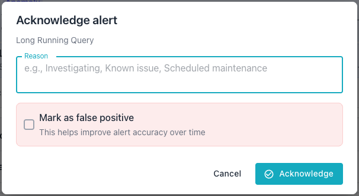

# Monitoring Alerts

The alert system monitors PostgreSQL metrics and notifies users when a metric
exceeds its threshold or the alerter detects an anomaly. This guide explains
how alerts appear in the web interface and how to manage the alert lifecycle.

## Viewing Alerts

The status panel displays active alerts for the scope selected in the cluster
navigator. Alerts appear grouped by severity and category. Each alert shows the
rule name, current metric value, threshold, and the server where the alert
originated.

Selecting a different node in the cluster navigator updates the alert list to
reflect that scope. Estate-wide alerts appear when you don't select a
specific node.

Each dashboard identifies its alert list with a bell icon and an
`Active Alerts` label; a count badge shows the number of current alerts. Use
the chevron on the right side of the heading to expand or collapse the list.
When no alerts are active, the panel displays a green banner with the message
`No active alerts`.

## Severity Levels

Alerts use three severity levels to indicate urgency:

- A critical alert indicates a severe issue that requires immediate attention.
- A warning alert indicates a potential problem that needs prompt
  investigation.
- An info alert indicates a noteworthy condition for general awareness.

The severity level determines the visual styling of each alert in the status
panel. Critical alerts appear with red indicators; warning alerts appear with
amber indicators; info alerts appear with blue indicators.

## Alert Lifecycle

Each alert progresses through a defined set of states from creation to
resolution.

### Active

The alerter creates an alert with active status when a metric violates a
threshold. The alert remains active until the condition resolves or an operator
takes action. The system updates the metric value on each evaluation cycle
while the alert stays active.

### Acknowledged

An operator can acknowledge an active alert to indicate that the issue is under
investigation. Acknowledged alerts remain visible in the status panel but move
to a separate section. Acknowledging an alert does not resolve the underlying
condition.

### Cleared

The alerter automatically clears an alert when the triggering condition returns
to normal. The alert cleaner runs every 30 seconds and re-evaluates active
alerts. When a metric value no longer violates the threshold, the system marks
the alert as cleared and records the timestamp.

### False Positive

An operator can mark an alert as a false positive to indicate that the alert
does not represent a real issue. The false positive designation helps refine
alert accuracy over time.

## Acknowledging Alerts

Click the acknowledge icon, a green checkmark, on an active alert to open the
Acknowledge Alert dialog. The alert moves to the acknowledged section of the
status panel once you confirm.

Enter a reason for the acknowledgment in the Reason field, such as
"Investigating" or "Known issue." Check "Mark as false positive" if the alert
does not represent a real issue. The system records the operator, the reason,
the false positive flag, and the timestamp.

Acknowledging an alert signals to other operators that someone is investigating
the issue; it does not resolve the underlying condition.

### Viewing Acknowledgment Reasons

The status panel displays the acknowledgment reason beneath each acknowledged
alert. The entry shows the operator's name followed by the reason text; a False
Positive label appears next to alerts that an operator flagged as false
positives.

The Event Timeline also displays this information. Expand an alert's
acknowledgment event in the timeline to view the operator, the reason, and the
false positive flag.

## Reviewing Past Alerts

Use the Event Timeline on any dashboard to review alerts that are no longer
active, such as an alert that occurred last week. Set the time range selector
to `7d` or `30d` to include alerts from further back; the selector also offers
a `24h` option for recent history.

Enable the `Alert`, `Cleared`, and `Acked` buttons in the Event Timeline to
display triggered, resolved, and acknowledged alert events within the selected
range. Select an event icon to view its details, including the triggering
threshold and, for acknowledged alerts, the operator, reason, and false
positive flag.

See [Event Timeline](../dashboards/index.md#using-the-event-timeline) for the
full range of trackable event types and how the timeline groups simultaneous
events.

## AI-Powered Analysis

Each alert in the status panel displays a brain icon that triggers an
AI-powered analysis. The analysis examines the alert context, historical
patterns, and server configuration to produce actionable remediation guidance.
See [AI Alert Analysis](../ai/ai-analysis.md) for details on this feature.

## Editing Alert Thresholds

Users can edit alert thresholds directly from an alert instance. The edit
button on an alert opens the Edit Override dialog for the associated rule and
scope. The dialog allows adjustments to the threshold, operator, severity, and
enabled state.

The scope dropdown displays the available override levels: server, cluster, and
group. The dialog pre-selects the scope that matches the originating context of
the alert.

## Blackout Interaction

During an active blackout period, the alerter suppresses new alerts for the
affected connection or database. Existing active alerts remain visible during a
blackout; the blackout only prevents the alerter from creating new alerts. See
[Managing Blackouts](blackouts.md) for details on maintenance windows.

## Related Documentation

- [Alert Rule Reference](rule-reference.md) lists all built-in alert rules and
  their default thresholds.
- [AI Alert Analysis](../ai/ai-analysis.md) describes the AI-powered analysis feature
  for alerts.
