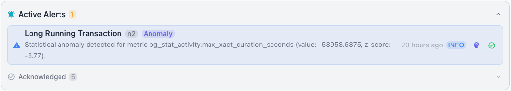
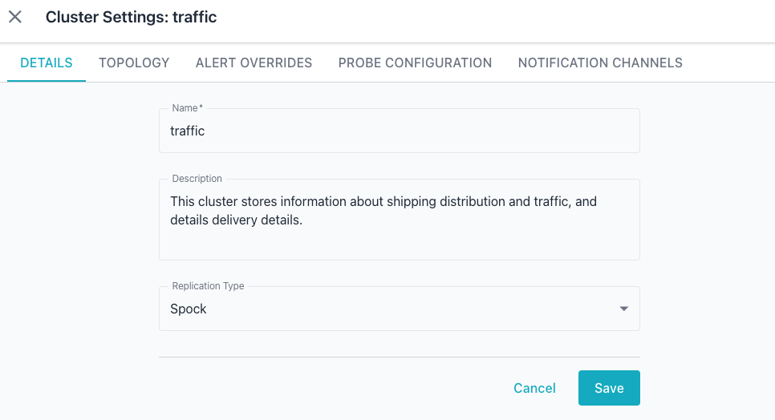
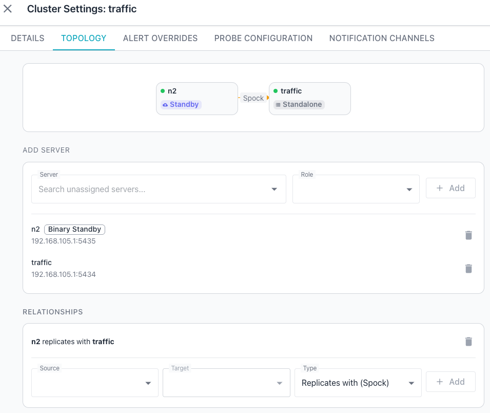
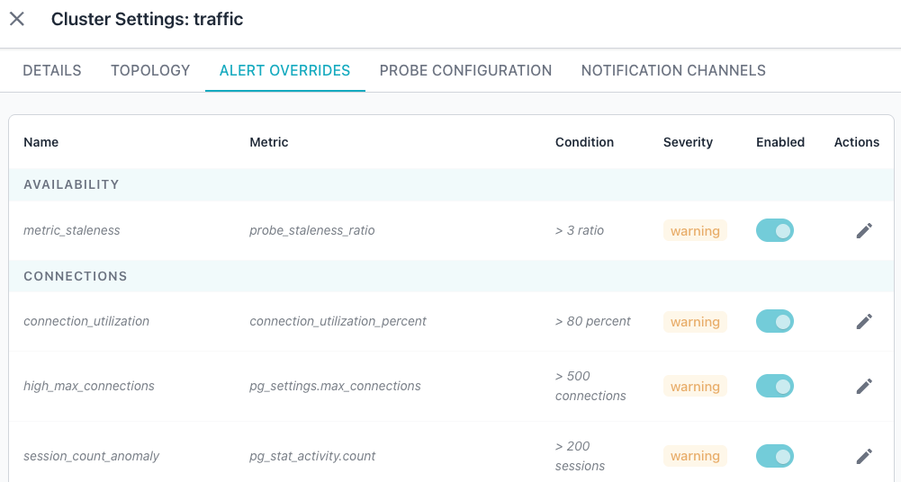
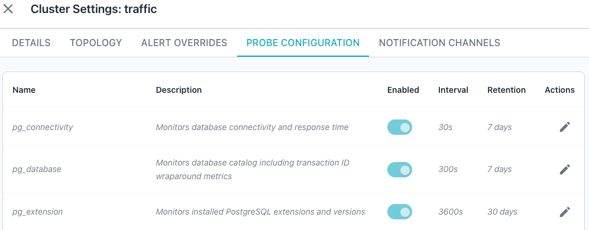
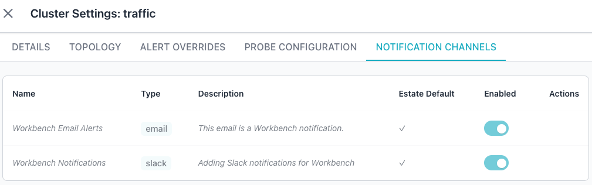

# Cluster Dashboard

The CLUSTER dashboard focuses on replication health and comparative performance
across cluster members. To view the cluster dashboard, select a cluster name in
the [cluster navigator](index.md#using-the-cluster-navigator).

## Event Timeline

The `Event Timeline` pane displays monitored events for the servers in the
cluster. See [Event Timeline](../event-timeline.md) for details on the time
range selector, event type filters, and reviewing event details.

## Key Performance Indicators

The `Key Performance Indicator` tiles sit below the event timeline and
summarize cluster-wide metrics. Each tile presents a single value and displays
`No data` when no data is available.

The Workbench displays the following tiles:

- The `XID AGE` tile shows the transaction ID age for the cluster.
- The `CACHE HIT RATIO` tile shows the buffer cache hit ratio across the
  cluster.
- The `TRANSACTIONS` tile shows the transaction rate for the cluster.
- The `CHECKPOINTS` tile shows the checkpoint activity for the cluster.

## Active Alerts

The `Active Alerts` pane shows the alerts that are currently active across the
cluster.

See [Using Alerts](../alerts/index.md) for details on reviewing, acknowledging,
and analyzing alerts, and for how to find an alert's acknowledgment reason or a
past alert from the Event Timeline.

## Topology

The `Topology` pane renders an interactive diagram showing servers as nodes
with color-coded replication edges. Each edge represents a replication
relationship between two servers.

A colored dot on each node indicates server status; a green dot marks an online
server. Each node tile displays a label that identifies the server.

The diagram uses the following color scheme for edges:

- Physical and streaming replication edges display in blue.
- Spock replication edges display in orange.
- Logical replication edges display in green.

Edge labels display the replication type so you can distinguish between
different replication methods at a glance.

## Monitoring

The `Monitoring` pane presents replication health and comparative performance
data for the cluster. See [Dashboard Conventions](index.md#time-range-selector)
for details on the time range selector and expanding or collapsing panes.

### Replication Lag

The `Replication Lag` tile tracks replication lag over the selected time range
for the replication relationships in the cluster. The tile presents the current
lag values alongside a time-series chart.

When the Workbench detects no primary server, the tile displays the message
`No primary server detected in this cluster.`

### Comparative Metrics

The `Comparative Metrics` tile presents side-by-side metrics for all servers in
the cluster. Use the tile to identify performance disparities between cluster
members. Click a server entry to navigate to the [server dashboard](server.md)
for that server.

## Cluster Settings

Each cluster in the cluster navigator displays a gear icon when you hover
over the cluster name; click the gear icon to open the `Cluster Settings`
dialog. The dialog organizes its settings into a horizontal tab bar, and
`Cancel` and `Save` buttons at the bottom discard or retain your changes.

### DETAILS Tab

The `DETAILS` tab presents a form that identifies the cluster and defines its
replication behavior. The tab includes the following fields:

- The `Name` field displays or modifies the display name for the cluster.
- The `Description` field is a multi-line text area that holds optional notes
  about the cluster.
- The `Replication Type` dropdown specifies the replication technology used
  for the cluster.

### TOPOLOGY Tab

The `TOPOLOGY` tab presents a visual diagram of the cluster members and lets
you assign servers and define replication relationships. The diagram displays
each member node as a tile with a status dot and a role badge that identifies
the node's role in the cluster.

Use the `ADD SERVER` section to add a new node to the cluster:

- Use the `Server` dropdown to search for and select an unassigned server.
- Use the `Role` dropdown to set the role the server will hold in the cluster.
- Use the `+ Add` button to add the selected server to the cluster.

A list of currently assigned servers appears below the `ADD SERVER` section.
Server details display the server name, a role badge, its host and port, and a
`Delete` (trash) icon. Select the `Delete` icon to remove the server from the
cluster.

The `RELATIONSHIPS` section at the bottom of the tab shows the replication
relationships the topology diagram presents. Use the section's controls to
define a new relationship between two cluster members:

- Use the `Source` dropdown to select the source node for the relationship.
- Use the `Target` dropdown to select the target node for the relationship.
- Use the `Type` dropdown to select the replication type, such as "Replicates
  with (Spock)".
- Click `+ Add` to create the relationship between the selected nodes.

### ALERT OVERRIDES Tab

The `ALERT OVERRIDES` tab lets you tailor the alert rules for the selected
cluster. A table lists the current rules and settings; each row describes one
alert rule and its threshold. The table contains the following columns:

- `Name` identifies the alert rule.
- `Metric` names the metric the rule monitors.
- `Condition` specifies the threshold that triggers the alert.
- `Severity` indicates the alert level, such as "warning".
- `Enabled` provides a toggle that activates or deactivates the rule for the
  selected cluster.
- `Actions` provides an edit (pencil) icon that opens the rule for adjustment.

The Workbench groups the rows under category headers such as `AVAILABILITY`,
`CONNECTIONS`, and `LOCKS`; additional categories appear as you scroll through
the table. See [Alert Rules](../../admin-guide/alert-rules.md) for the full
list of built-in rules and their default thresholds.

### PROBE CONFIGURATION Tab

The `PROBE CONFIGURATION` tab controls the probes that collect metrics for the
selected cluster. A table lists the current probes and their settings; each
row describes one probe and its configuration. The table contains the
following columns:

- `Name` identifies the probe.
- `Description` explains what the probe monitors.
- `Enabled` provides a toggle that activates or deactivates the probe for the
  selected cluster.
- `Interval` specifies how often the probe collects data, in seconds.
- `Retention` specifies how long the Workbench retains the probe's collected
  data.
- `Actions` provides an edit (pencil) icon that opens the probe for adjustment.

The table scrolls to reveal additional probes below the visible rows. See
[Probe Management](../../admin-guide/probes.md) for the full list of built-in
probes and their scopes.

### NOTIFICATION CHANNELS Tab

The `NOTIFICATION CHANNELS` tab manages the channels that deliver alert
notifications for the selected cluster. A table lists the available channels
and their settings; each row describes one channel and its current override
state. The table contains the following columns:

- `Name` identifies the notification channel.
- `Type` shows the channel type, such as email, Slack, Mattermost, or webhook.
- `Description` shows the channel's optional description.
- `Estate Default` indicates whether the channel applies to all servers or
  clusters by default.
- `Enabled` provides a toggle that activates or deactivates the channel for
  the selected cluster, overriding the estate default.
- `Actions` provides controls for managing the channel's override for the
  selected cluster.

If you have not configured any notification channels, the tab displays the
empty state "No notification channels found." See
[Notification Channels](../../admin-guide/notification-channels.md) for the
full list of supported channel types and how to configure them.

