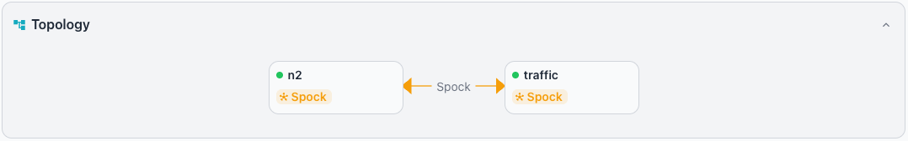

# Cluster Dashboard

The CLUSTER dashboard focuses on replication health and comparative
performance across cluster members. To view the cluster dashboard, select a
cluster name in the navigation pane.

## Event Timeline

The `Event Timeline` pane displays monitored events for the servers in the
cluster across the selected time range. Filter buttons and a time range
selector control which events the pane displays.

When no events fall within the selected range, the pane displays the message
`No events in this time range`. The pane suggests that you try expanding the
time range or adjusting the filters.

## Key Performance Indicators

The `Key Performance Indicator` tiles sit below the event timeline and
summarize cluster-wide metrics. Each tile presents a single value and
displays `No data` when no data is available.

The Workbench displays the following tiles:

- The `XID AGE` tile shows the transaction ID age for the cluster.
- The `CACHE HIT RATIO` tile shows the buffer cache hit ratio across the
  cluster.
- The `TRANSACTIONS` tile shows the transaction rate for the cluster.
- The `CHECKPOINTS` tile shows the checkpoint activity for the cluster.

## Active Alerts

The `Active Alerts` pane summarizes the alerts that are currently active
across the cluster. A bell icon and an `Active Alerts` label identify the
pane; a count badge displays the number of active alerts. Use the chevron on
the right side of the pane heading to expand or collapse the pane.

When no alerts are active, the pane displays a light green banner with a
green checkmark and the message `No active alerts`.

## Topology

The `Topology` pane renders an interactive diagram showing servers as nodes
with color-coded replication edges. Each edge represents a replication
relationship between two servers. Use the chevron on the right side of the
pane heading to expand or collapse the pane.

A colored dot on each node indicates server status; a green dot marks an
online server. Each node tile displays a label that identifies the server.

The diagram uses the following color scheme for edges:

- Physical and streaming replication edges display in blue.
- Spock replication edges display in orange.
- Logical replication edges display in green.

Edge labels display the replication type so you can distinguish between
different replication methods at a glance.

## Monitoring

The `Monitoring` pane presents replication health and comparative performance
data for the cluster. The time range selector lets you choose the period
for the displayed metrics; the available ranges are `1h`, `6h`, `24h`,
`7d`, and `30d`. Use the chevron on the right side of the pane heading to
expand or collapse the pane.

### Replication Lag

The `Replication Lag` tile tracks replication lag over the selected time
range for the replication relationships in the cluster. The tile presents the
current lag values alongside a time-series chart.

When the Workbench detects no primary server, the tile displays the message
`No primary server detected in this cluster.`

### Comparative Metrics

The `Comparative Metrics` tile presents side-by-side metrics for all servers
in the cluster. Use the tile to identify performance disparities between
cluster members. Click a server entry to navigate to the
[server dashboard](server.md) for that server.
