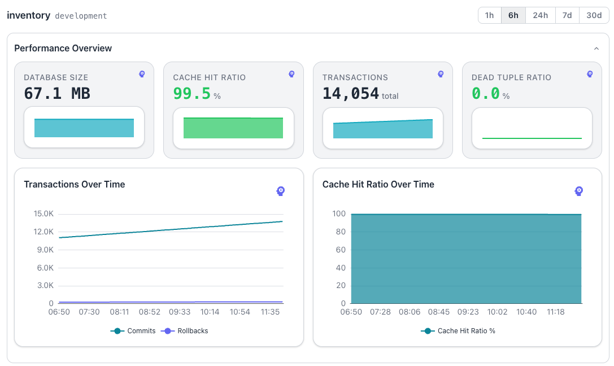
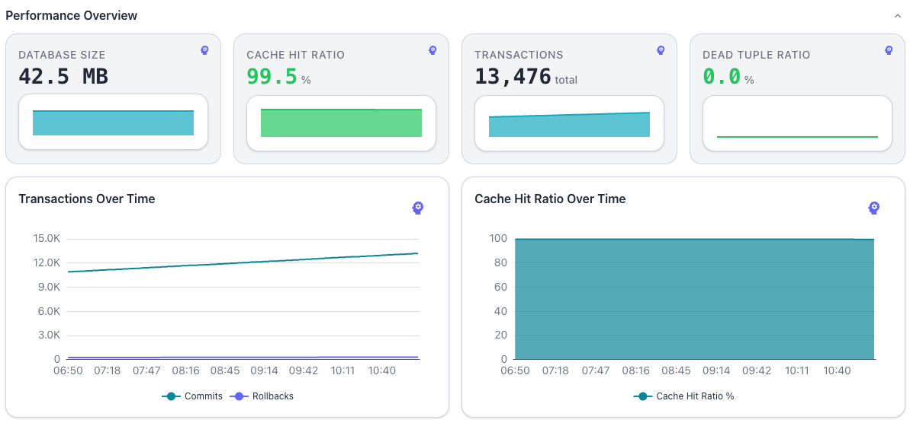
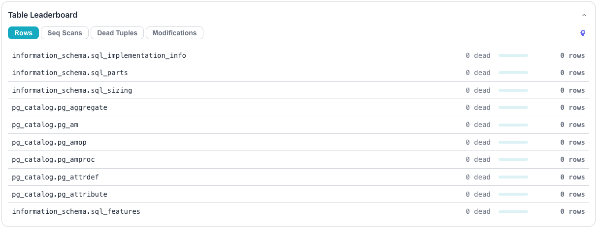
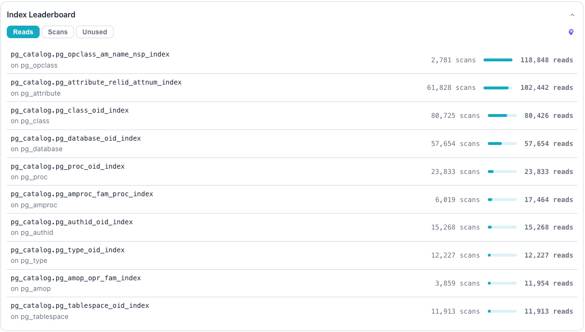
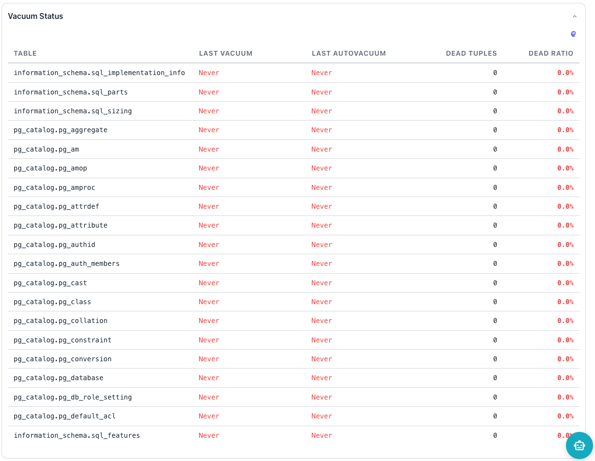

# Reviewing Database Details

The database dashboard presents detailed metrics for a single database. Select
a database in the [cluster navigator](index.md#using-the-cluster-navigator) or
click a database entry in the server dashboard summary tiles to open the
dashboard.

The header displays the database name and the server name; use the `X` in the
upper-right corner to close the dashboard.

## Performance Overview

The `Performance Overview` pane summarizes database activity and current
health. The pane displays the following tiles:

- The `DATABASE SIZE` tile shows the total size of the database in a
  human-readable format.
- The `CACHE HIT RATIO` tile shows the buffer cache hit ratio as a percentage.
- The `TRANSACTIONS` tile shows the total combined commit and rollback count.
- The `DEAD TUPLE RATIO` tile shows the dead tuple percentage across all
  tables.

The pane also displays the following time-series charts:

- The `Transactions Over Time` chart plots commits and rollbacks as separate
  lines over the selected range.
- The `Cache Hit Ratio Over Time` chart tracks the cache hit ratio over the
  selected range.

Each tile and each chart displays a brain icon that opens an
[AI analysis](../ai/index.md#chart-and-kpi-tile-analysis) of the displayed
data.

## Table Leaderboard

The `Table Leaderboard` pane ranks tables using selectable sort criteria.

The pane provides the following sort buttons:

- The `Rows` button sorts tables by live row count; the Workbench selects it by
  default.
- The `Seq Scans` button sorts tables by sequential scan count.
- The `Dead Tuples` button sorts tables by dead tuple count.
- The `Modifications` button sorts tables by total inserts, updates, and
  deletes.

Each row shows the fully qualified table name, a dead tuple count, a relative
bar indicator, and a row count. Click a table entry to navigate to the
[object dashboard](object.md) for that table.

An [AI Analysis](../ai/index.md#chart-and-kpi-tile-analysis) button with a
brain icon sits beside the sort buttons. The analysis covers data across all
sort categories for the listed tables.

## Index Leaderboard

The `Index Leaderboard` pane ranks indexes using selectable sort criteria.

The pane provides the following sort buttons:

- The `Reads` button sorts indexes by tuples read count; the Workbench selects
  it by default.
- The `Scans` button sorts indexes by index scan count.
- The `Unused` button surfaces indexes with the lowest scan counts.

Each row shows the index name, the parent table name on a second line, a scan
count, a relative bar indicator, and a read count. Click an index entry to
navigate to the [object dashboard](object.md) for that index.

An [AI Analysis](../ai/index.md#chart-and-kpi-tile-analysis) button with a
brain icon sits beside the sort buttons. The analysis covers data across all
index metrics for the listed indexes.

## Vacuum Status

The `Vacuum Status` pane displays a sortable table of all tables sorted by dead
tuple ratio in descending order.

The table includes the following columns:

- The `TABLE` column identifies each entry.
- The `LAST VACUUM` column shows the most recent manual vacuum timestamp.
- The `LAST AUTOVACUUM` column shows the most recent autovacuum timestamp.
- The `DEAD TUPLES` column shows the raw dead tuple count.
- The `DEAD RATIO` column shows the dead tuple percentage.

The pane displays aging timestamps in amber and red to indicate stale vacuum
activity. The pane displays `Never` in red when vacuum has never run for a
table; high `DEAD RATIO` values appear in bold red.

An [AI Analysis](../ai/index.md#chart-and-kpi-tile-analysis) button with a
brain icon provides vacuum recommendations.
