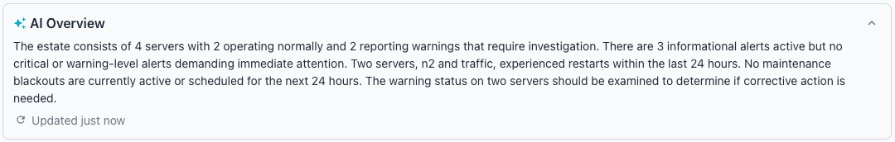
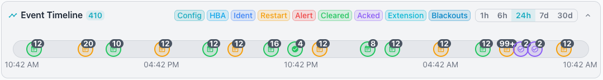
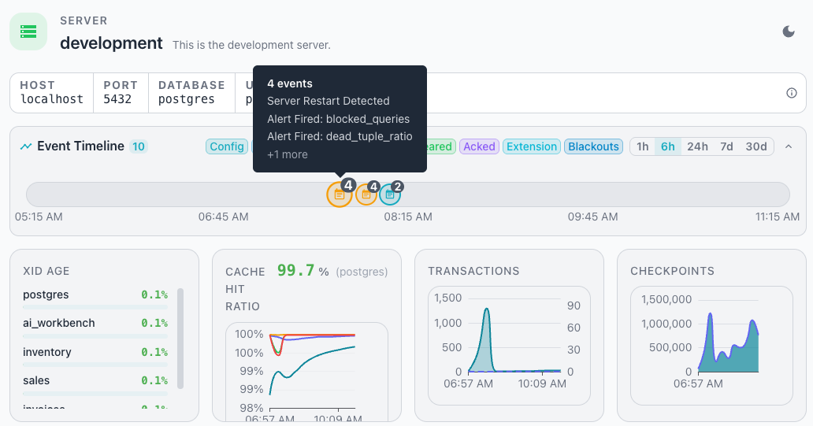

# ESTATE OVERVIEW Dashboard

The `ESTATE OVERVIEW` presents a fleet-wide health assessment at a glance. To
view the `ESTATE OVERVIEW`, select the top-level estate node in the cluster
navigator.

If you have configured AI for your Workbench, the `ESTATE Overview` displays
the [AI Overview](../ai/overview.md). The Overview provides a concise,
AI-powered summary of your database estate with notes about history and
recommended actions to maintain system health.

Tiles below the heading of the ESTATE OVERVIEW provide an at-a-glance overview
of the state of your servers:

- The `OK` tile (green) shows the count of servers that conform to all
  configured alert thresholds.
- The `WARNING` tile (orange) shows the count of servers with one or more
  active threshold violations.
- The `OFFLINE` tile (red) shows the count of servers that the collector
  cannot reach.
- The `CLUSTERS` tile shows the total number of clusters across the estate.
- The `GROUPS` tile shows the total number of groups in the estate.

The `Event Timeline` displays a timeline with indicators that show monitored
events that have occurred withing the time selected across the monitored
servers. 

The time range selector in the `Event Timeline` pane specifies the length of
time for which events are displayed. The selector is displayed as a toggle
button group with the following options:

- 1h displays the last one hour of data.
- 6h displays the last six hours of data.
- 24h displays the last twenty-four hours of data.
- 7d displays the last seven days of data.
- 30d displays the last thirty days of data.

The selected time range persists across dashboard navigation. All time-series
charts and KPI sparklines update when you change the time range.

You can use the event timeline to track the following event types by selecting
or deselecting the colored buttons between the `Event Timeline` label and the
time range selector:

| Button | Description |
|------------|------------------------------------------------------|
| Config | Shows configuration change events for PostgreSQL settings. |
| HBA | Shows changes to the host-based authentication file (`pg_hba.conf`). |
| Ident | Shows changes to the ident authentication configuration (`pg_ident.conf`). |
| Restart | Shows server restart and recovery events. |
| Alert | Shows active alert events that have been triggered. |
| Cleared | Shows alert events that have been resolved and cleared. |
| Acked | Shows alert events that have been acknowledged by an operator. |
| Extension | Shows extension installation and upgrade events. |
| Blackouts | Shows scheduled maintenance blackout periods. |

The Event Timeline refreshes in sync with the cluster navigator refresh cycle.
You can filter events by server and event type. When multiple events occur at
the same point in time, the timeline stacks them into a single icon with a
badge showing the event count; hovering over the icon displays a tooltip that
lists individual event names and a "+N more" indicator when the group contains
more than three events.

The performance summary tiles below the event timeline provide a quick glance
into the performance of your estate, selected server, or cluster.  Hover over
a chart or graph to review detailed information about a specific point in time
for the selected metric. 

Select an event icon to review a list detailing the events associated with the
alert; when applicable, the details include the threshold values that caused
the alert.

Below the Event Timeline, a set of charts and graphs display estate-wide
health and performance data.

The section includes the following panels:

- The `XID Age` panel lists database and user pairs with their XID age
  percentage, color-coded to indicate health.
- The `Cache Hit Ratio` panel displays a headline worst-case ratio and a
  line chart tracking the ratio across the selected time range.
- The `Transactions` panel displays a dual-line time-series chart showing
  commit and rollback activity across the estate.
- The `Checkpoints` panel displays a chart showing checkpoint activity
  across the selected time range.

## Active Alerts

The `Active Alerts` pane summarizes the alerts that are currently active
across the estate. A bell icon and an `Active Alerts` label identify the
panel; a count badge displays the number of current alerts. Use the down-arrow
on the right side of the panel heading to expand or collapse the panel.

When no alerts are active, the panel displays a light green banner with a
green checkmark and the message `No active alerts`.

## Monitoring

Panes within the `Monitoring` panel presents an overview of the estate. Use
the `Monitoring` time range selector to choose the period for the
displayed conditions; the chevron on the right side of each pane opens and
closes the selected pane.

### Health Overview

The `Health Overview` pane summarizes server status and alert distribution
across the estate. The left tile displays a donut chart labeled `Server
Status` that groups servers by health category. The chart legend identifies
the `OK` category in green, the `Warning` category in orange, and the
`Offline` category in red.

The right tile displays an `Alert Distribution` chart that breaks down active
alerts. When no alerts are active, the panel displays `No active alerts`. A
brain icon in the top-right corner of the tile opens an AI chart analysis of
the displayed data.

### Key Performance Indicators

The `Key Performance Indicators` pane displays four tiles that summarize
estate-wide metrics. Each tile presents a single aggregate value across all
monitored servers.

The pane includes the following tiles:

- The `TOTAL SERVERS` tile shows the total number of monitored servers across
  the estate.
- The `TOTAL CONNECTIONS` tile shows the total number of active database
  connections across all servers.
- The `TRANSACTION RATE` tile shows the aggregate transactions per second
  (tx/s) across the estate.
- The `ACTIVE ALERTS` tile shows the total number of currently active alerts
  across all servers.

### Clusters

The `Clusters` pane displays one tile for each cluster in the estate. Click a
cluster tile to navigate to the [cluster dashboard](cluster.md) for that
cluster.

Each cluster tile displays the following details:

- The cluster name identifies the cluster; example names include
  `development`, `management`, and `traffic`.
- The server count shows the number of servers in the cluster, such as
  `1 server` or `2 servers`.
- Colored dots indicate the online and warning counts; a green dot marks
  online servers, and an orange dot marks servers in a warning state.
- Role tags display as chips that show each role and its count, such as
  `primary: 1`, `binary_standby: 1`, and `spock: 1`.
- An orange badge displays the active alert count when the cluster has active
  alerts.

