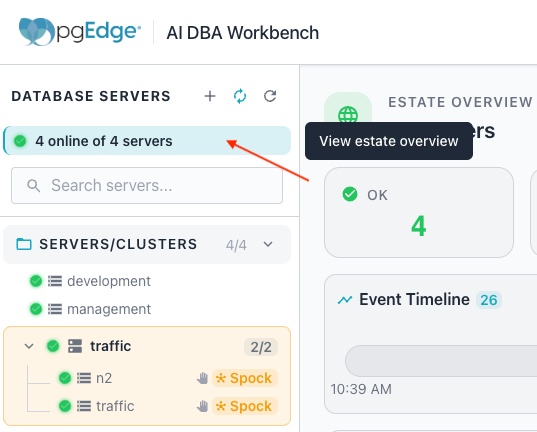
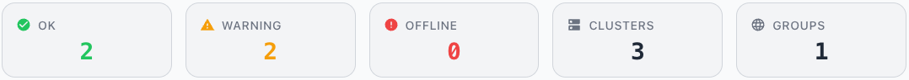
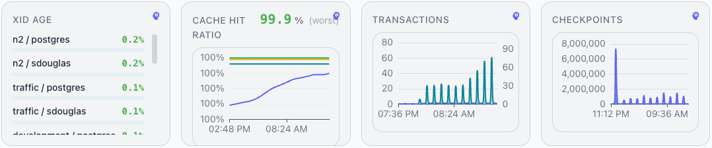
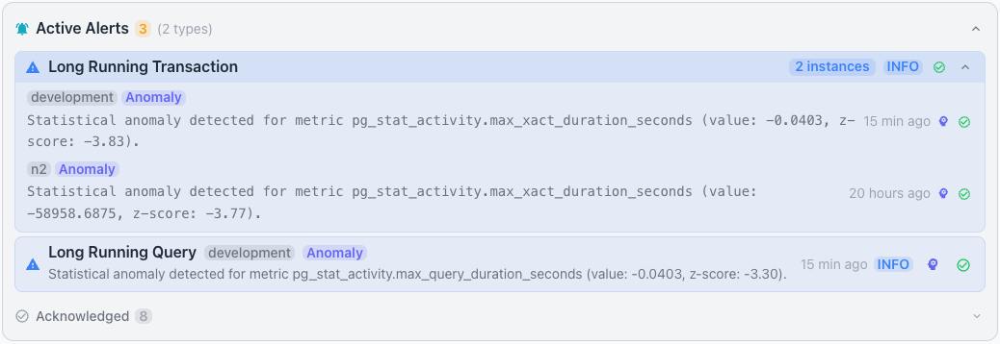
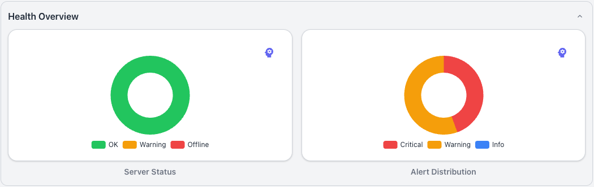
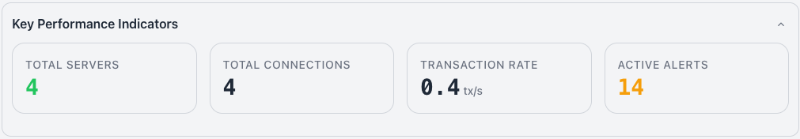
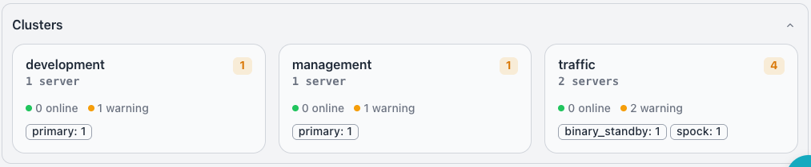

# Estate Dashboard

The `ESTATE OVERVIEW` presents a fleet-wide health assessment at a glance. To
view the `ESTATE OVERVIEW`, select the top-level estate node in the
[cluster navigator](index.md#using-the-cluster-navigator).

If you have configured AI for your Workbench, the `ESTATE Overview` displays
the [AI Overview](../ai/index.md) just below the header. The Overview provides
a concise, AI-powered summary of your database estate with notes about history
and recommended actions to maintain system health.

Tiles below the heading of the ESTATE OVERVIEW provide an at-a-glance overview
of the state of your servers:

- The `OK` tile (green) shows the count of servers that conform to all
  configured alert thresholds.
- The `WARNING` tile (orange) shows the count of servers with one or more
  active threshold violations.
- The `OFFLINE` tile (red) shows the count of servers that the collector cannot
  reach.
- The `CLUSTERS` tile shows the total number of clusters across the estate.
- The `GROUPS` tile shows the total number of groups in the estate.

Below the status tiles, the `Event Timeline` displays a timeline with
indicators that show monitored events that have occurred across the monitored
servers. See [Event Timeline](../event-timeline.md) for details about using
the time range selector, event type filters, and reviewing event details.

Tiles below the event timeline provide a quick glance into the performance of
your selected estate, server, or cluster. Hover over a chart or graph to
review detailed information about a specific point in time for the selected
metric.

The section includes the following charts and graphs:

- The `XID Age` chart lists database and user pairs with their XID age
  percentage, color-coded to indicate health.
- The `Cache Hit Ratio` graph displays a headline worst-case ratio and a line
  chart tracking the ratio across the selected time range.
- The `Transactions` graph displays a dual-line time-series chart showing
  commit and rollback activity across the estate.
- The `Checkpoints` graph displays a chart showing checkpoint activity across
  the selected time range.

## Active Alerts

The `Active Alerts` pane shows the alerts that are currently active across the
estate.

!!! hint

    If you've enabled AI in your cluster, you can use the `Analyze with AI`
    icon located at the right of each alert icon to open an AI session with
    Ellie that will help resolve the alert.

See [Using Alerts](../alerts/index.md) for details on reviewing, acknowledging,
and analyzing alerts, and for how to find an alert's acknowledgment reason or a
past alert from the `Event Timeline`.

## Monitoring

Panes within the `Monitoring` panel present an overview of the estate. See
the [Time Range Selector](index.md#time-range-selector) section for details
on rescoping data and expanding or collapsing panes.

### Health Overview

The `Health Overview` pane summarizes server status and alert distribution
across the estate. The left tile displays a donut chart labeled `Server Status`
that groups servers by health category. The chart legend identifies the
following categories:

- The `OK` category appears in green.
- The `Warning` category appears in orange.
- The `Offline` category appears in red.

The right tile displays an `Alert Distribution` chart that breaks down active
alerts. When no alerts are active, the panel displays `No active alerts`. The
brain icon in the top-right corner of the tile opens an
[AI chart analysis](../ai/index.md#chart-and-kpi-tile-analysis) of the
displayed data.

### Key Performance Indicators

The `Key Performance Indicators` pane displays four tiles that summarize
estate-wide metrics. Each tile presents a single aggregate value across all
monitored servers.

The pane includes the following tiles:

- The `TOTAL SERVERS` tile shows the total number of monitored servers across
  the estate.
- The `TOTAL CONNECTIONS` tile shows the total number of active database
  connections across all servers.
- The `TRANSACTION RATE` tile shows the aggregate transactions per second
  (tx/s) across the estate.
- The `ACTIVE ALERTS` tile shows the total number of currently active alerts
  across all servers.

### Clusters

The `Clusters` pane displays one tile for each cluster in the estate. Click a
cluster tile to navigate to the [cluster dashboard](cluster.md) for that
cluster.

Each cluster tile displays the following details:

- The cluster name identifies the cluster; for example,  `development`,
  `management`, and `traffic`.
- The server count shows the number of servers in the cluster, such as
  `1 server` or `2 servers`.
- Colored dots indicate the online and warning counts; a green dot marks online
  servers, and an orange dot marks servers in a warning state.
- Role tags display as chips that show each role and its count, such as
  `primary: 1`, `binary_standby: 1`, and `spock: 1`.
- An orange badge displays the active alert count when the cluster has active
  alerts.

