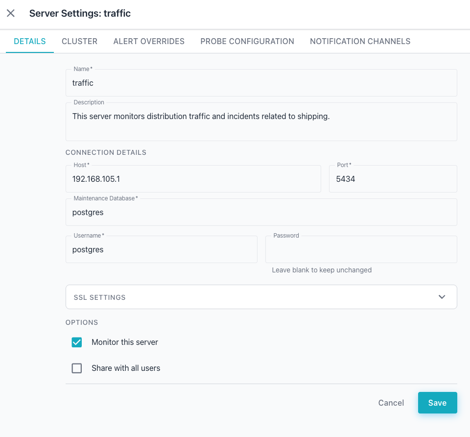
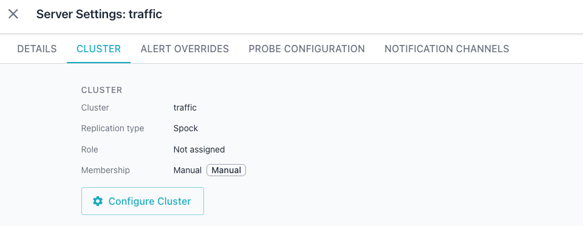
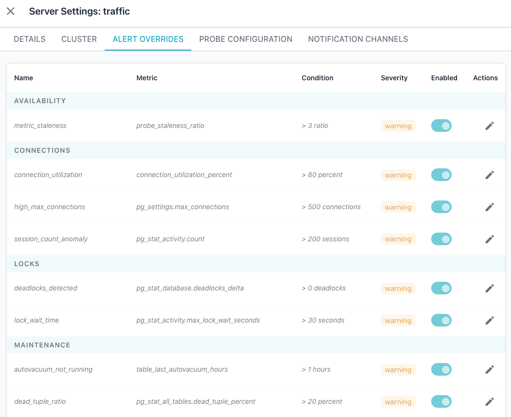
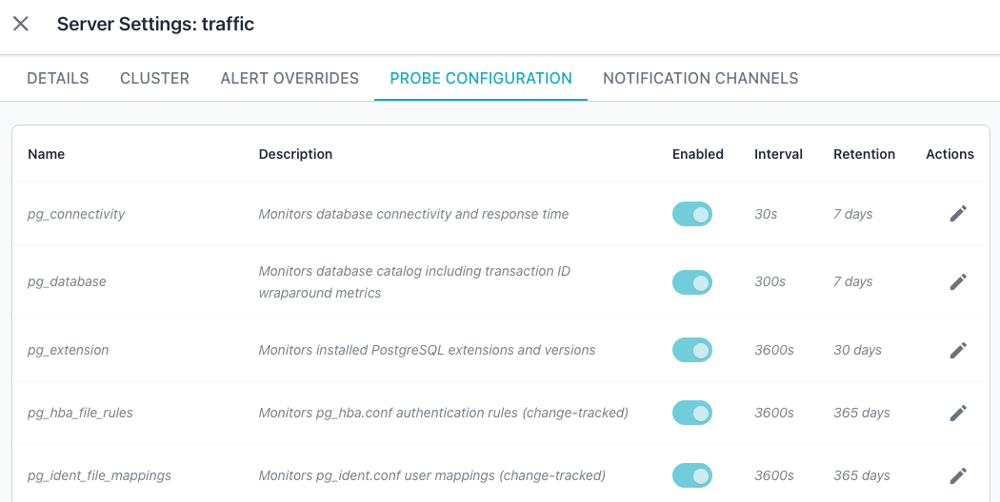
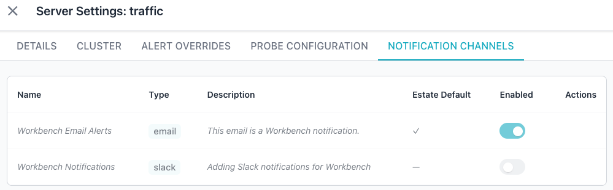

# Dashboards

Monitoring dashboards provide a hierarchical view of PostgreSQL database
health and performance. You can navigate through five levels of detail, from
a fleet-wide estate overview down to individual database objects.

## Dashboard Hierarchy

The dashboard system organizes metrics into five levels that progress from
broad to specific. Select items in the cluster navigator or click drillable
elements within each dashboard to move between levels. The cluster navigator
tree in the Workbench's left pane reflects the estate, cluster, server, and
database hierarchy.

- The [ESTATE DASHBOARD](estate.md) shows fleet-wide health across all
  monitored servers.
- The [CLUSTER DASHBOARD](cluster.md) focuses on replication topology and
  comparative metrics across cluster members.
- The [SERVER DASHBOARD](server.md) displays system resources and
  PostgreSQL performance for a single server.
- The [DATABASE DASHBOARD](database.md) presents table and index
  leaderboards with vacuum status for one database.
- The [OBJECT DASHBOARD](object.md) provides detailed metrics for a
  specific table, index, or query.

## Using the Workbench with an AI Provider

If you have enabled an [AI provider](../../getting-started/configuration/enable_ai_mode.md),
the Workbench displays an informational analysis (the `AI Overview`) of each
dashboard that you visit. The overview includes recommended actions to help
ensure that management issues receive attention as needed.


Select the `Ask Ellie` icon (located in the lower-right corner of the console)
to open an interactive chat with Ellie.  Ellie uses your AI provider to
provide help resolving issues with your servers, querying your database,
understanding the console metrics, and more.


You can easily resize Ellie's pane within the Workbench console to make the
view more usable; when you're done with Ellie, just click the `X` in the
upper-right corner to close the pane.

For a full rundown on what Ellie can help with, just ask Ellie:

```
What can Ask Ellie help with?
```


## Using the Cluster Navigator

The cluster navigator on the left side of the console provides tree-based
navigation across groups, clusters, and individual servers. Select a node in
the navigator to view dashboards, alerts, and AI insights for the selected
resource.

## Reviewing Server Settings

Each server node in the cluster navigator displays a gear icon when you hover
over the node. Click the gear icon to open the `Server Settings` dialog for
that server. The dialog header reads `Server Settings: <server name>`, and a
close (`X`) icon in the header dismisses the dialog without saving changes.

The dialog organizes server configuration into five tabs along a horizontal
tab bar. The Workbench underlines and highlights the active tab.

### Using the DETAILS Tab

The `DETAILS` tab presents a form that defines how the Workbench identifies
and connects to the server. The Name field is required and sets the display
name for the server. The Description field is a multi-line text area that
holds optional notes about the server.

The `CONNECTION DETAILS` subsection specifies how the collector reaches the
database. The subsection includes the following fields:

- The `Host`, `Port`, `Maintenance Database`, and `Username` fields specify
  the connection values for the selected server; all values are required.
- The `Password` is optional; leave the field blank to keep the stored
  password unchanged, or enter a new password to replace it.

A collapsible `SSL SETTINGS` section appears below the connection fields and
remains collapsed by default. Expand this section to configure encrypted
connection options.

The `OPTIONS` subsection includes two checkboxes:

- The `Monitor this server` checkbox controls whether the collector gathers
  metrics from the server.
- The `Share with all users` checkbox makes the server visible to every user
  of the Workbench.

Use the `Cancel` and `Save` buttons at the bottom of the dialog to discard or
retain your changes.



### Using the CLUSTER Tab

The `CLUSTER` tab shows the server's current cluster assignment and role.
The tab displays the following fields:

- The `Cluster` field shows the name of the cluster the server belongs to,
  such as "traffic".
- The `Replication Type` field shows the replication technology used by
  the cluster, such as "Spock".
- The `Role` field shows the server's role within the cluster, or
  "Not assigned" when the server has no assigned role.
- The `Membership` field shows how the server joined the cluster, such as
  "Manual", alongside a badge that repeats the membership type.

Click the `Configure Cluster` button to open the cluster configuration
dialog and manage the server's cluster membership.



### Using the ALERT OVERRIDES Tab

The `ALERT OVERRIDES` tab lets you tailor the alert rules for the selected
server. A table lists the current rules and settings; each row describes one
alert rule and its threshold. The table contains the following columns:

- `Name` identifies the alert rule.
- `Metric` names the metric the rule monitors.
- `Condition` specifies the threshold that triggers the alert.
- `Severity` indicates the alert level, such as "warning".
- `Enabled` provides a toggle that activates or deactivates the rule for this
  server.
- `Actions` provides an edit (pencil) icon that opens the rule for adjustment.

The Workbench groups the rows under category headers such as `AVAILABILITY`,
`CONNECTIONS`, and `LOCKS`; additional categories appear as you scroll through
the table.

The following screen capture shows some of the representative rows you might
find within each category on an `ALERT OVERRIDES` tab.



### Using the PROBE CONFIGURATION Tab

The `PROBE CONFIGURATION` tab controls the probes that collect metrics from
the server. A table lists the current probes and their settings; each row
describes one probe and its configuration. The table contains the following
columns:

- `Name` identifies the probe.
- `Description` explains what the probe monitors.
- `Enabled` provides a toggle that activates or deactivates the probe for
  this server.
- `Interval` specifies how often the probe collects data, in seconds.
- `Retention` specifies how long the Workbench retains the probe's
  collected data.
- `Actions` provides an edit (pencil) icon that opens the probe for
  adjustment.

The table scrolls to reveal additional probes below the visible rows.

The following screen capture shows some of the representative probes and
their default settings.



### Using the NOTIFICATION CHANNELS Tab

The `NOTIFICATION CHANNELS` tab manages the channels that deliver alert
notifications for the server. A table lists the available channels and
their settings; each row describes one channel and its current override
state. The table contains the following columns:

- `Name` identifies the notification channel.
- `Type` shows the channel type, such as email, Slack, Mattermost, or
  webhook.
- `Description` shows the channel's optional description.
- `Estate Default` indicates whether the channel applies to all servers by
  default.
- `Enabled` provides a toggle that activates or deactivates the channel for
  this server, overriding the estate default.
- `Actions` provides controls for managing the channel's override for this
  server.

If you have not configured any notification channels, the tab displays the
empty state "No notification channels found."



## Reviewing Cluster Settings

Each cluster in the cluster navigator displays a gear icon when you hover
over the cluster name. Click the gear icon to open the `Cluster Settings`
dialog for that cluster. The dialog header reads
`Cluster Settings: <cluster name>`, and a close (X) icon dismisses the
dialog without saving changes. The Workbench underlines and highlights the
active tab.

### Using the DETAILS Tab

The `DETAILS` tab presents a form that identifies the cluster and defines its
replication behavior. The tab includes the following fields:

- The `Name` field displays or modifies the display name for the cluster.
- The `Description` field is a multi-line text area that holds optional notes
  about the cluster.
- The `Replication Type` dropdown specifies the replication technology used
  for the cluster.

Use the `Cancel` and `Save` buttons at the bottom of the dialog to discard
or save your changes.


### Using the TOPOLOGY Tab

The `TOPOLOGY` tab presents a visual diagram of the cluster members and lets
you assign servers and define replication relationships. The diagram displays
each member node as a tile with a status dot and a role badge that identifies
the node's role in the cluster.

Use the `ADD SERVER` section to add a new node to the cluster:

- Use the `Server` dropdown to search for and select an unassigned server.
- Use the `Role` dropdown to set the role the server will hold in the cluster.
- Use the `+ Add` button to add the selected server to the cluster.

A list of currently assigned servers appears below the `ADD SERVER` section.
Server details display the server name, a role badge, its host and port, and a
`Delete` (trash) icon. Select the `Delete` icon to remove the server from
the cluster.

The `RELATIONSHIPS` section at the bottom of the tab shows the replication
relationships the topology diagram presents. Use the section's controls
to define a new relationship between two cluster members:

- Use the `Source` dropdown to select the source node for the relationship.
- Use the `Target` dropdown to select the target node for the relationship.
- Use the `Type` dropdown to select the replication type, such as
  "Replicates with (Spock)".
- Click `+ Add` to create the relationship between the selected nodes.


### Using the ALERT OVERRIDES Tab

The `ALERT OVERRIDES` tab lets you tailor the alert rules for the selected
cluster. A table lists the current rules and settings; each row describes one
alert rule and its threshold. The table contains the following columns:

- `Name` identifies the alert rule.
- `Metric` names the metric the rule monitors.
- `Condition` specifies the threshold that triggers the alert.
- `Severity` indicates the alert level, such as "warning".
- `Enabled` provides a toggle that activates or deactivates the rule for this
  cluster.
- `Actions` provides an edit (pencil) icon that opens the rule for adjustment.

The Workbench groups the rows under category headers such as `AVAILABILITY`,
`CONNECTIONS`, and `LOCKS`; additional categories appear as you scroll through
the table.

The following screen capture shows some of the representative rows you might
find within each category on an `ALERT OVERRIDES` tab.


### Using the PROBE CONFIGURATION Tab

The `PROBE CONFIGURATION` tab controls the probes that collect metrics across
the cluster. A table lists the current probes and their settings; each row
describes one probe and its configuration. The table contains the following
columns:

- `Name` identifies the probe.
- `Description` explains what the probe monitors.
- `Enabled` provides a toggle that activates or deactivates the probe for
  this cluster.
- `Interval` specifies how often the probe collects data, in seconds.
- `Retention` specifies how long the Workbench retains the probe's
  collected data.
- `Actions` provides an edit (pencil) icon that opens the probe for
  adjustment.

The table scrolls to reveal additional probes.

The following screen capture shows some of the representative probes and
their default settings.


### Using the NOTIFICATION CHANNELS Tab

The `NOTIFICATION CHANNELS` tab manages the channels that deliver alert
notifications for the cluster. A table lists the available channels and
their settings; each row describes one channel and its current override
state. The table contains the following columns:

- `Name` identifies the notification channel.
- `Type` shows the channel type, such as email, Slack, Mattermost, or
  webhook.
- `Description` shows the channel's optional description.
- `Estate Default` indicates whether the channel applies to all clusters by
  default.
- `Enabled` provides a toggle that activates or deactivates the channel for
  this cluster, overriding the estate default.
- `Actions` provides controls for managing the channel's override for this
  cluster.

If you have not configured any notification channels, the tab displays the
empty state "No notification channels found."


