# Object Dashboard

The object dashboard provides the most detailed description of a single
database object. Select a database tile from the
[`Database Summaries` section](server.md#database-summaries) of a server's
dashboard to open the database dashboard, then select a table, index, or query
from one of the leaderboards to open the object dashboard for the selected
object.

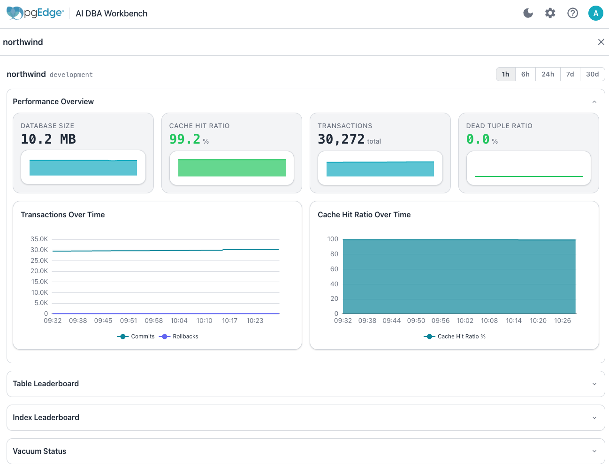

## Reviewing Table Details

When you select a table name from the `Table Leaderboard`, the console
displays details about that tables size, performance, and maintenance history.
The dashboard summarizes the table using the latest `pg_stat_all_tables`
snapshot and a set of time-series charts.

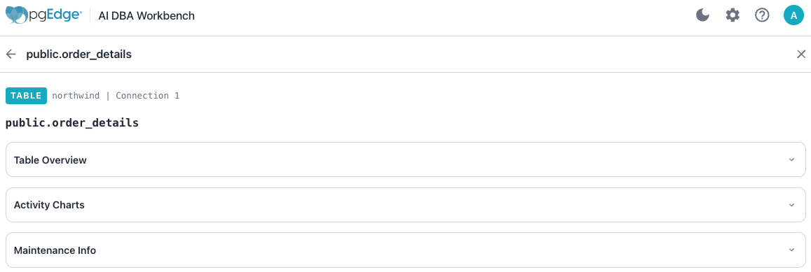

The header shows the fully qualified `schema.table` name above three
sections; the `Table Overview`, `Activity Charts`, and `Maintenance Info`. Use
the arrow at the right side of each section to open or close that section.

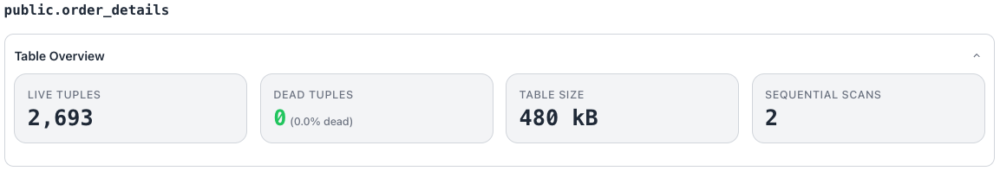

The `Table Overview` section presents four key statistics for the table:

- The `Live Tuples` tile shows the estimated number of live rows,
  formatted with thousands separators.
- The `Dead Tuples` tile shows dead rows with a `% dead` qualifier
  computed as dead tuples divided by live plus dead tuples. The dead tuple
  percentage is color-coded, marking values at or below
  5% good, values through 20% warning, and higher values critical.
- The `Table Size` tile shows the on-disk table size in a
  human-readable form (for example, `480 kB`).
- The `Sequential Scans` tile shows the cumulative sequential scan
  count for the table.

A statistic without a recorded value displays `--` in place of a
number.

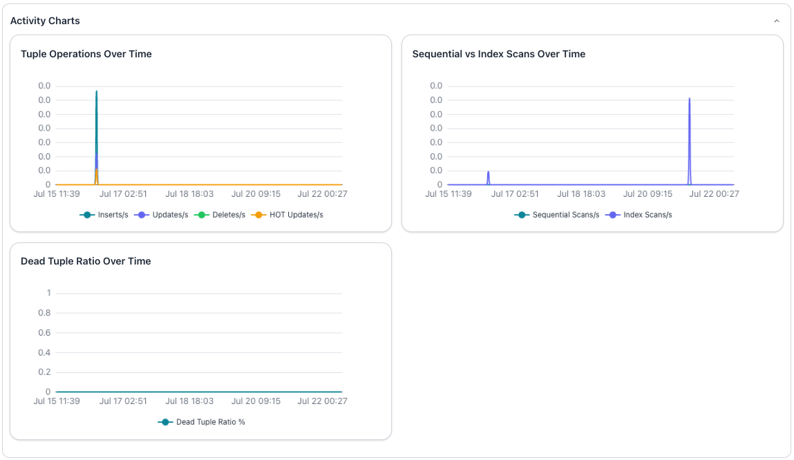

The `Activity Charts` section renders three line charts that conform to the
dashboard time-range selection and refresh with the dashboard:

- The `Tuple Operations Over Time` chart plots per-second rates for
  inserts, updates, deletes, and HOT updates.
- The `Sequential vs Index Scans Over Time` chart compares the
  per-second sequential scan rate against the index scan rate.
- The `Dead Tuple Ratio Over Time` chart plots the dead tuple
  percentage as a shaded area to highlight vacuum effectiveness.

Each chart shows a message such as "No tuple operation data available"
when the selected time range contains no samples.

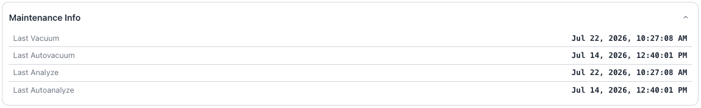

The `Maintenance Info` panel reports the four maintenance timestamps that
PostgreSQL records for the table:

- The `Last Vacuum` field shows the time of the last manual `VACUUM`.
- The `Last Autovacuum` field shows the time of the last scheduled autovacuum
  run.
- The `Last Analyze` field shows the time of the last manual `ANALYZE`.
- The `Last Autoanalyze` field shows the time of the last scheduled
  autoanalyze run.

A field displays `Never` when the corresponding operation has not run
since statistics were last reset.

## Reviewing Index Details

When you select an index name from the `Index Leaderboard`, the console
displays details about the indexes size and usage. The index detail summarizes
a single index using the latest `pg_stat_all_indexes` snapshot and a
time-series chart. 

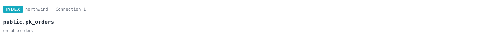

The header shows the fully qualified `schema.index` name, followed by a
line naming the table that the index serves. Two sections follow:
`Index Overview` and `Scan Activity`.

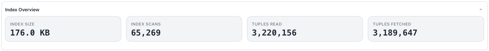

The `Index Overview` section presents four key statistics for the index:

- The `Index Size` tile shows the on-disk index size in a
  human-readable form, such as `176 kB`.
- The `Index Scans` tile shows the cumulative number of scans started
  on the index, formatted with thousands separators.
- The `Tuples Read` tile shows `idx_tup_read`, the number of index
  entries returned by scans of the index.
- The `Tuples Fetched` tile shows `idx_tup_fetch`, the number of live
  table rows fetched by simple index scans that use the index.
- The fetched count usually trails the read count, because index-only
  scans and bitmap scans avoid fetching individual table rows.

A statistic without a recorded value displays `--` in place of a
number.

The `Scan Activity` section renders a line chart that follows the index
activity for the duration of the database dashboard's time-range selection:

- The `Index Scan Activity Over Time` chart plots the per-second index scan
  rate as the `Index Scans/s` series.

The chart displays the message `No index scan data available` when the
selected time range contains no samples.

## Reviewing Query Details

When you select a query from the `Top Queries` section of a server dashboard,
the console displays details about query execution. The query detail dashboard
summarizes a single query using the latest `pg_stat_statements` data and a set
of time-series charts. 

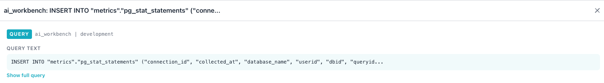

The header includes the database name, the server name, and the text of the
query. If you have configured AI in the Workbench, an AI Overview panel
evaluates the query. See [AI Query Analysis](../ai/index.md#query-analysis)
for details on the summary panel, the analysis report, and running
suggested SQL from the report.

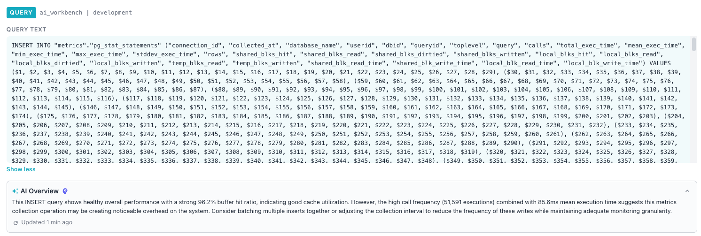

The header normalizes the query onto a single line, collapsing runs of
whitespace into single spaces for a compact preview. Select the 
`Show full query` toggle to display a query that exceeds 120 characters; the
preview ends with an ellipsis.

When you're finished, you can use the `Show less` toggle to restore the
compact preview.

The `Query Plan` section displays a graphical interpretation of the PostgreSQL
query plan:

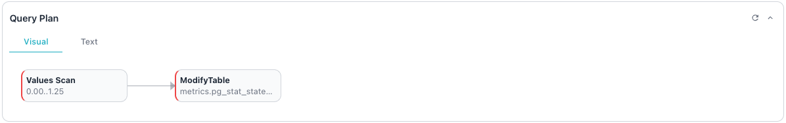

Select the Text tab to display the execution plan with costs:

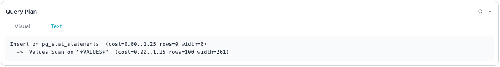

The `Query Statistics` section presents four key statistics drawn from
the latest `pg_stat_statements` snapshot for the query.

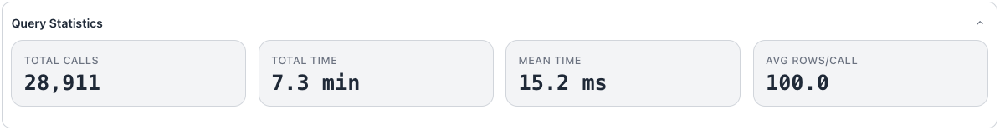

Four tiles provide statistics about the query:

- The `Total Calls` tile shows the cumulative execution count,
  formatted with thousands separators.
- The `Total Time` tile shows the total execution time across all
  calls, scaled to a readable unit such as microseconds, milliseconds,
  seconds, or minutes.
- The `Mean Time` tile shows the average execution time per call, using
  the same automatic unit scaling as `Total Time`.
- The `Avg Rows/Call` tile shows the total rows divided by the call
  count, formatted to one decimal place. The `Avg Rows/Call` tile displays
  `--` when the query has recorded no calls, because the average is undefined.

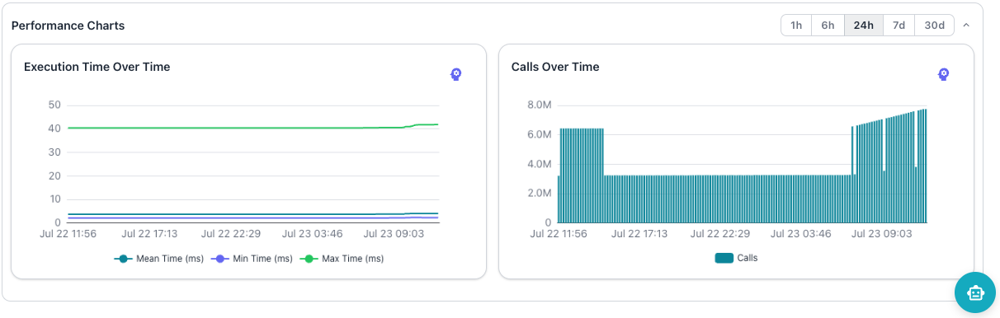

The `Performance Charts` section renders two charts and a time-range
selector in the section header. The selector offers `1h`, `6h`, `24h`,
`7d`, and `30d` ranges that both charts share:

- The `Execution Time Over Time` line chart plots the `Mean Time (ms)`,
  `Min Time (ms)`, and `Max Time (ms)` series across the range.
- The `Calls Over Time` bar chart plots the number of calls recorded in
  each interval as the `Calls` series.

The execution time chart shows "No execution time data available", and
the calls chart shows "No call frequency data available", when the
selected time range contains no samples.

