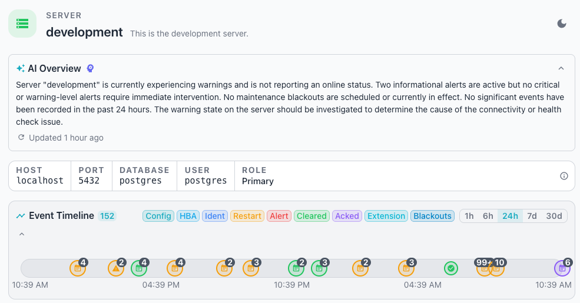
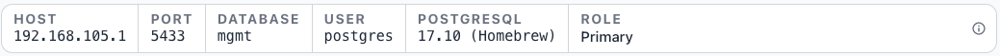
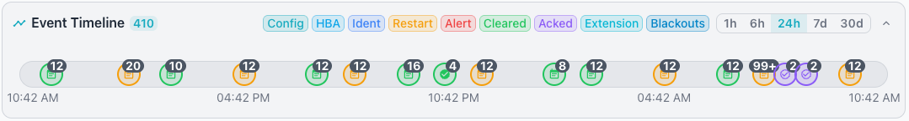
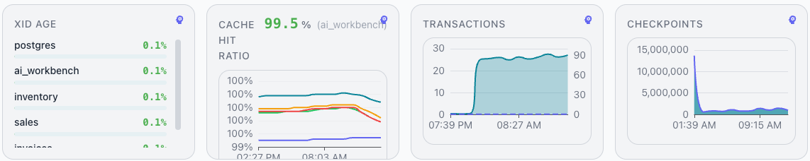
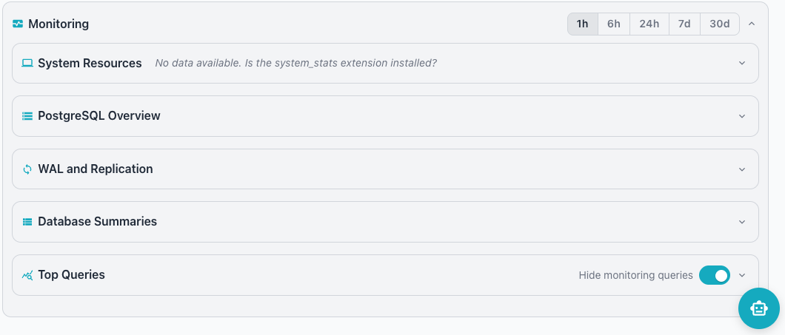
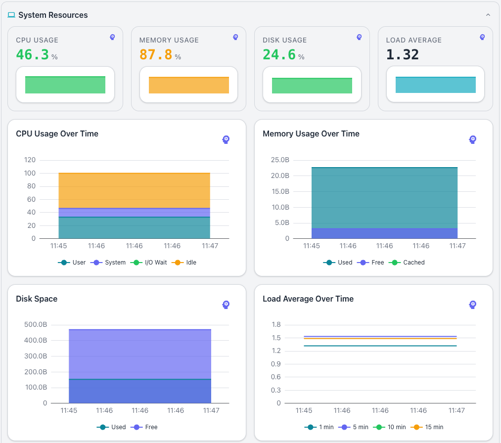
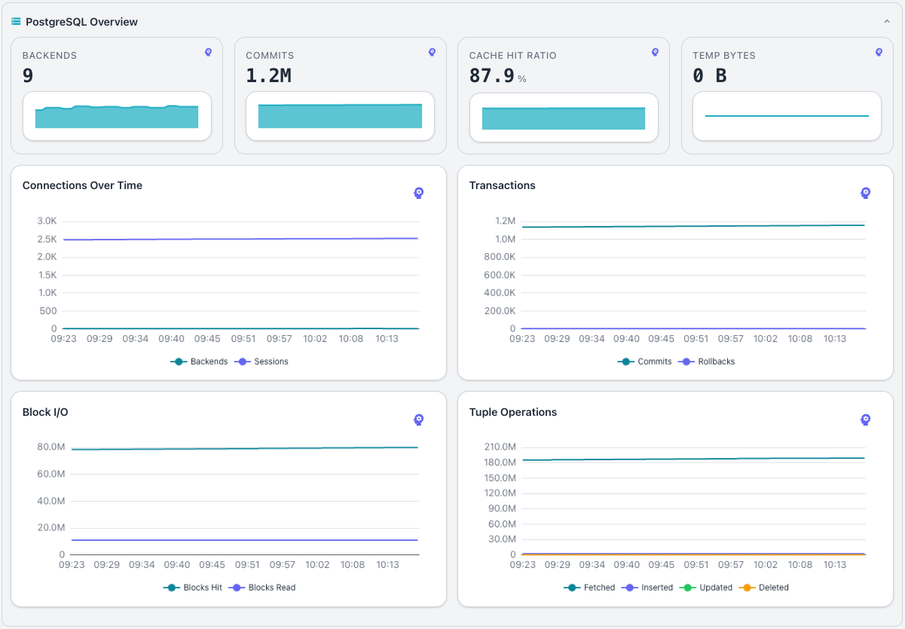
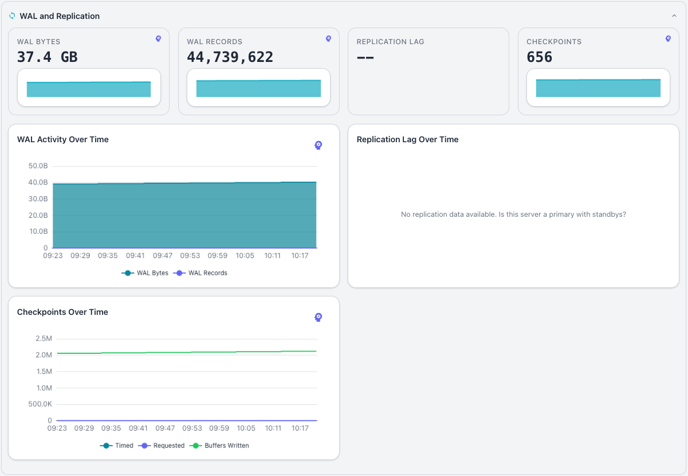
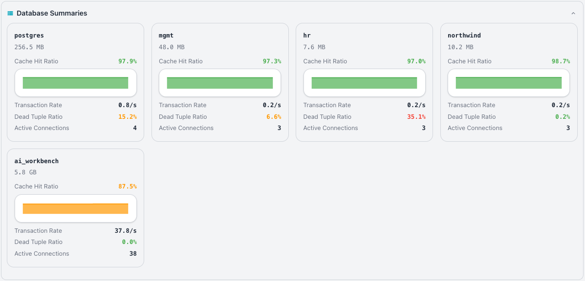
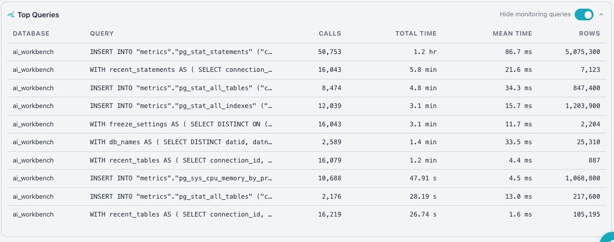

# Server Dashboard

The SERVER dashboard provides detailed metrics for a single PostgreSQL server.
Select a server node in the cluster navigator to open the dashboard.

If you have configured AI for your Workbench, the dashboard displays the
[AI Overview](../ai/index.md) just below the header. The overview provides a
concise, AI-powered summary of your server's health, with notes about history
and recommended actions to maintain system health.

Below the AI Overview, a bar displays the connection properties used to connect
to the server:

The bar displays the following connection details:

- The `HOST` field shows the network address of the server.
- The `PORT` field shows the port on which the server listens.
- The `DATABASE` field shows the database used for the connection.
- The `USER` field shows the user account used for the connection.
- The `ROLE` field shows the server's replication role, such as `Primary`.

Select the `info` icon (the small `i` at the right of the pane) to open an
expanded information pane that details:

- The header includes the server name after the `Server Information:` heading.
- The `POSTGRESQL` section includes:

    - The PostgreSQL version.
    - The `data` directory location.
    - The values currently assigned to the `max_connections`,
      `max_wal_senders`, and `max_replication_slots` parameters.

- The `DATABASES` section includes details about each database that resides on
  the server; the information includes the database name, size, and the
  installed extensions and versions.

- The `CONFIGURATION` section provides the current settings of a number of
  parameters commonly used when tuning a database.

Below the status tiles, the `Event Timeline` displays a timeline with
indicators that show monitored events that have occurred across the monitored
servers. See [Event Timeline](index.md#using-the-event-timeline) for details
about using the time range selector, event type filters, and reviewing event
details.

Hover over an event on the timeline to retrieve details about a point-in-time
on the bar.

The `Key Performance Indicator` tiles sit below the event timeline and
summarize performance metrics for the selected server in charts and graphs.

The Workbench displays the following tiles:

- The `XID AGE` tile shows the transaction ID age for the server.
- The `CACHE HIT RATIO` tile shows the buffer cache hit ratio for the server.
- The `TRANSACTIONS` tile shows the transaction rate for the server.
- The `CHECKPOINTS` tile shows the checkpoint activity for the server.

Highlight a point in time on a graph to display the graphed metrics at the
selected time in a tooltip, or select the brain icon to perform an analysis of
the graph.

## The Active Alerts Pane

The `Active Alerts` pane shows the alerts that are currently active for the
server.

See [Using Alerts](../alerts/index.md) for details on reviewing, acknowledging,
and analyzing alerts, and for how to find an alert's acknowledgment reason or a
past alert from the Event Timeline.

## The Monitoring Pane

The `Monitoring` pane presents detailed performance data for the selected
server; collapsible sub-panes group related metrics.

### Reviewing System Resources

The `System Resources` pane displays operating-system metrics for the host that
runs the server. Four tiles summarize current resource usage, and each tile
displays `--` when no data is available.

The pane includes the following tiles:

- The `CPU USAGE` tile shows the current processor utilization as a percentage.
- The `MEMORY USAGE` tile shows the current memory utilization as a percentage.
- The `DISK USAGE` tile shows the current disk utilization as a percentage.
- The `LOAD AVERAGE` tile shows the current system load average.

Highlight a point on a bar graph for detailed metric about the point-in-time,
or select the brain icon to perform an in-depth analysis.

The pane also displays the following time-series charts and graphs:

- The `CPU Usage Over Time` chart tracks processor utilization over the
  selected range.
- The `Memory Usage Over Time` chart tracks memory utilization over the
  selected range.
- The `Disk Space` chart tracks disk consumption over the selected range.
- The `Load Average Over Time` chart tracks the system load average over the
  selected range.
- The `Network I/O` chart tracks network throughput over the selected range.

When no data is available, each chart displays a message such as
`No CPU data available. Is the system_stats extension installed?` The charts
require the `system_stats` extension to collect operating-system metrics.

### Reviewing the PostgreSQL Overview

The `PostgreSQL Overview` pane displays server-level database metrics. Four
tiles summarize current database activity, and each tile displays `--` when no
data is available.

The pane includes the following tiles:

- The `BACKENDS` tile shows the number of active backend connections.
- The `COMMITS` tile shows the transaction commit rate for the server.
- The `CACHE HIT RATIO` tile shows the buffer cache hit ratio for the server.
- The `TEMP BYTES` tile shows the volume of temporary file data written.

The pane also displays the following time-series charts:

- The `Connections Over Time` chart tracks active connections over the selected
  range.
- The `Transactions` chart tracks the transaction rate over the selected range.
- The `Block I/O` chart tracks block read and write activity over the selected
  range.
- The `Tuple Operations` chart tracks tuple-level activity over the selected
  range.

When no data is available, each chart displays a message such as
`No connection data available`, `No transaction data available`,
`No block I/O data available`, or `No tuple operation data available`.

### Reviewing WAL and Replication Activity

The `WAL and Replication` pane displays write-ahead log activity and
replication status for the server. Four tiles summarize current WAL and
replication activity, and each tile displays `--` when no data is available.

The pane includes the following tiles:

- The `WAL BYTES` tile shows the volume of write-ahead log data generated.
- The `WAL RECORDS` tile shows the number of write-ahead log records generated.
- The `REPLICATION LAG` tile shows the current replication lag for the server.
- The `CHECKPOINTS` tile shows the checkpoint activity for the server.

The pane also displays the following time-series charts:

- The `WAL Activity Over Time` chart tracks write-ahead log generation over the
  selected range.
- The `Replication Lag Over Time` chart tracks replication lag over the
  selected range.
- The `Checkpoints Over Time` chart tracks checkpoint activity over the
  selected range.

When no data is available, each chart displays a message such as
`No WAL data available`,
`No replication data available. Is this server a primary with standbys?`, or
`No checkpoint data available`.

## Reviewing Database Summaries

The `Database Summaries` pane lists all databases on the server with high-level
metrics for each database. Click a database tile to navigate to the
[database dashboard](database.md) for that database.

## Top Queries

The `Top Queries` pane ranks queries by resource consumption. The pane displays
execution time, call count, rows returned, and source database for the most
active queries.

The `Database` column resolves each query's source database from the `dbid`
field in `pg_stat_statements` using `pg_stat_activity`. Because
`pg_stat_statements` collects data cluster-wide, the pane deduplicates queries
so each entry reflects a single database context.

The `Hide monitoring queries` toggle filters out the Workbench's own monitoring
queries from the list. The toggle is on by default to focus on application
queries.

## Reviewing Server Settings

Each server node in the cluster navigator displays a gear icon when you hover
over the node; click the gear icon to open the `Server Settings` dialog. The
dialog organizes its settings into a horizontal tab bar, and `Cancel` and
`Save` buttons at the bottom discard or retain your changes.

### DETAILS Tab

The `DETAILS` tab presents a form that defines how the Workbench identifies and
connects to the server. The Name field is required and sets the display name
for the server. The Description field is a multi-line text area that holds
optional notes about the server.

The `CONNECTION DETAILS` subsection specifies how the collector reaches the
database. The subsection includes the following fields:

- The `Host`, `Port`, `Maintenance Database`, and `Username` fields specify the
  connection values for the selected server; all values are required.
- The `Password` is optional; leave the field blank to keep the stored password
  unchanged, or enter a new password to replace it.

A collapsible `SSL SETTINGS` section appears below the connection fields and
remains collapsed by default. Expand this section to configure encrypted
connection options.

The `OPTIONS` subsection includes two checkboxes:

- The `Monitor this server` checkbox controls whether the collector gathers
  metrics from the server.
- The `Share with all users` checkbox makes the server visible to every user of
  the Workbench.

### CLUSTER Tab

The `CLUSTER` tab shows the server's current cluster assignment and role. The
tab displays the following fields:

- The `Cluster` field shows the name of the cluster the server belongs to, such
  as "traffic".
- The `Replication Type` field shows the replication technology used by the
  cluster, such as "Spock".
- The `Role` field shows the server's role within the cluster, or "Not
  assigned" when the server has no assigned role.
- The `Membership` field shows how the server joined the cluster, such as
  "Manual", alongside a badge that repeats the membership type.

Click the `Configure Cluster` button to open the cluster configuration dialog
and manage the server's cluster membership.

### ALERT OVERRIDES Tab

The `ALERT OVERRIDES` tab lets you tailor the alert rules for the selected
server. A table lists the current rules and settings; each row describes one
alert rule and its threshold. The table contains the following columns:

- `Name` identifies the alert rule.
- `Metric` names the metric the rule monitors.
- `Condition` specifies the threshold that triggers the alert.
- `Severity` indicates the alert level, such as "warning".
- `Enabled` provides a toggle that activates or deactivates the rule for the
  selected server.
- `Actions` provides an edit (pencil) icon that opens the rule for adjustment.

The Workbench groups the rows under category headers such as `AVAILABILITY`,
`CONNECTIONS`, and `LOCKS`; additional categories appear as you scroll through
the table. See [Alert Rules](../../admin-guide/alert-rules.md) for the full
list of built-in rules and their default thresholds.

### PROBE CONFIGURATION Tab

The `PROBE CONFIGURATION` tab controls the probes that collect metrics for the
selected server. A table lists the current probes and their settings; each row
describes one probe and its configuration. The table contains the following
columns:

- `Name` identifies the probe.
- `Description` explains what the probe monitors.
- `Enabled` provides a toggle that activates or deactivates the probe for the
  selected server.
- `Interval` specifies how often the probe collects data, in seconds.
- `Retention` specifies how long the Workbench retains the probe's collected
  data.
- `Actions` provides an edit (pencil) icon that opens the probe for adjustment.

The table scrolls to reveal additional probes below the visible rows. See
[Probe Management](../../admin-guide/probes.md) for the full list of built-in
probes and their scopes.

### NOTIFICATION CHANNELS Tab

The `NOTIFICATION CHANNELS` tab manages the channels that deliver alert
notifications for the selected server. A table lists the available channels and
their settings; each row describes one channel and its current override state.
The table contains the following columns:

- `Name` identifies the notification channel.
- `Type` shows the channel type, such as email, Slack, Mattermost, or webhook.
- `Description` shows the channel's optional description.
- `Estate Default` indicates whether the channel applies to all servers or
  clusters by default.
- `Enabled` provides a toggle that activates or deactivates the channel for the
  selected server, overriding the estate default.
- `Actions` provides controls for managing the channel's override for the
  selected server.

If you have not configured any notification channels, the tab displays the
empty state "No notification channels found." See
[Notification Channels](../../admin-guide/notification-channels.md) for the
full list of supported channel types and how to configure them.

