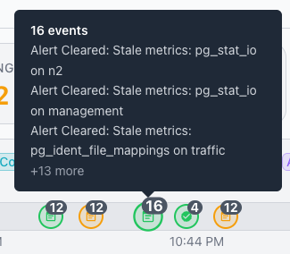

# Using the Event Timeline

The Event Timeline displays a timeline with indicators that show monitored
events that have occurred within the selected time range. The Event Timeline
appears on the estate, cluster, and server dashboards, scoped to the servers
monitored at that level.

## Time Range Selector

The time range selector in the `Event Timeline` pane specifies how far back
the pane displays events. The selector appears as a toggle button group with
the following options:

- 1h displays the last one hour of data.
- 6h displays the last six hours of data.
- 24h displays the last twenty-four hours of data.
- 7d displays the last seven days of data.
- 30d displays the last thirty days of data.

The selected time range persists across dashboard navigation. All time-series
charts and KPI sparklines update when you change the time range.

## Event Types

You can use the event timeline to track the following event types by selecting
or deselecting the colored buttons between the `Event Timeline` label and the
time range selector:

| Button | Description |
|------------|------------------------------------------------------|
| Config | Shows configuration change events for PostgreSQL settings. |
| HBA | Shows changes to the host-based authentication file (`pg_hba.conf`). |
| Ident | Shows changes to the ident authentication configuration (`pg_ident.conf`). |
| Restart | Shows server restart and recovery events. |
| Alert | Shows active alert events that have triggered. |
| Cleared | Shows alert events that have resolved and cleared. |
| Acked | Shows alert events that an operator has acknowledged. |
| Extension | Shows extension installation and upgrade events. |
| Blackouts | Shows scheduled maintenance blackout periods. |

## Filtering and Stacking

The Event Timeline refreshes in sync with the cluster navigator refresh cycle.
You can filter events by server and event type. When multiple events occur at
the same point in time, the timeline stacks them into a single icon with a
badge showing the event count; hovering over the icon displays a tooltip that
lists individual event names and a "+N more" indicator when the group contains
more than three events.

## Viewing Event Details

Select an event icon to review a list of the alert's events; when
applicable, the details include the threshold values that caused the alert.

## Empty State

When no events fall within the selected range, the pane displays the message
`No events in this time range`. The pane suggests that you try expanding the
time range or adjusting the filters.
