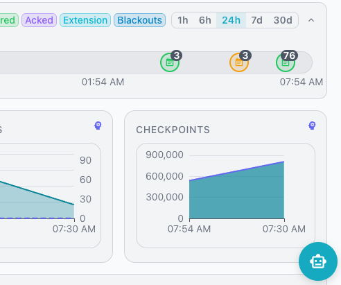

# User Guide

The pgEdge AI DBA Workbench provides a browser-based
interface for monitoring and managing PostgreSQL database
estates. This guide covers the features available to
users of the web client.

## What This Guide Covers

The User Guide is organized into the following sections:

- [Dashboards](dashboards/index.md) describes the
  monitoring dashboard hierarchy and the metrics each
  level displays.
- [Alerts](alerts/index.md) explains how to view,
  acknowledge, and manage alerts in the web interface.
- [AI Features](ai/overview.md) covers AI-powered
  summaries, analysis, and the Ask Ellie assistant.
- [MCP Tools](mcp-tools.md) lists the Model Context
  Protocol tools and resources available to compatible
  AI clients.
- [Blackouts](blackouts.md) describes how maintenance
  windows suppress alerts for servers, clusters, and
  groups.

## Getting Started

The web client connects to an MCP server instance. Open
a browser and navigate to the server address to access
the workbench. Log in with your user credentials to
begin monitoring your PostgreSQL estate.

## Using Ask Ellie

Ask Ellie is an AI-powered database assistant built into the
Workbench. Ellie answers questions about your PostgreSQL
databases, analyzes performance metrics, and searches the
pgEdge knowledge base on your behalf.

The Workbench's AI features are available only when the server is
configured with a valid LLM provider. See
[Enabling AI Mode](../getting-started/configuration/enable_ai_mode.md)
for configuration details.

Click the chat button in the bottom-right corner of the Workbench
to open the Ask Ellie panel. The panel appears alongside the
current view without replacing existing content. Type a question
in the input field and press Enter to send it.

Ellie uses a large language model with access to monitoring
tools. The assistant can perform the following actions on your
behalf:

- Ellie executes read-only SQL queries against monitored database
  connections.
- Ellie queries historical metrics with time-based aggregation.
- Ellie inspects database schemas across monitored connections.
- Ellie searches the pgEdge knowledge base for relevant
  documentation.
- Ellie reviews alert history, alert rules, and the unified event
  timeline.

The assistant processes your question and may execute one or more
tools before responding. A status indicator shows active tool
execution while Ellie works.

The Workbench stores each conversation in the PostgreSQL datastore
and associates the conversation with your user account. Click the
history button in the panel header to load, rename, or delete
previous conversations.

!!! hint

    Ellie can store and recall persistent memories across
    conversations. Ask Ellie to remember a preference or fact, and
    the assistant recalls that memory in future sessions.

For full details on tools, conversation management, and chat
memory, see [Ask Ellie](ai/ask-ellie.md).

## Using the AI Overview

The AI Overview presents a concise, AI-generated summary of database
health at the top of the status panel. The summary describes server
health, active alerts that need attention, and any ongoing or upcoming
blackouts. When everything is healthy, the overview states so briefly.

The Workbench's AI features are available only when the server is
configured with a valid LLM provider. See
[Enabling AI Mode](../getting-started/configuration/enable_ai_mode.md)
for configuration details.

The AI overview adapts to your current selection in the cluster navigator.
The summary reflects one of the following scopes:

- The estate scope summarizes health across all monitored servers.
- The cluster scope summarizes the servers that belong to one cluster.
- The server scope summarizes a single selected server.

A sparkle icon and the "AI Overview" label mark the panel. The body
displays the summary text and a relative timestamp, such as "Updated 5
min ago", that shows when the Workbench last generated the summary.

Click the expand or collapse icon on the right of the header to hide or
show the summary body. The header remains visible when the panel is
collapsed. The Workbench remembers your choice across sessions.

The server regenerates the AI overview when the estate state changes
significantly. The Workbench receives these updates in real time and
refreshes the panel without any action from you.

A "(stale)" badge appears next to the label when the current summary
has aged past its freshness window. Click the refresh icon beside the
timestamp to request a new summary immediately.

While the server prepares the first summary, the panel displays a
loading placeholder followed by a "Generating overview..." message.

!!! hint

    If a Workbench feature displays a purple brain icon in the
    object's header, you can select that icon to generate a detailed
    analysis of the selected object or metrics.

    If a feature displays an amber brain icon, a cached analysis is
    available for review.

## Using the AI Chart Analysis Feature

The AI chart analysis feature provides LLM-powered insights for any chart or
KPI tile in the monitoring dashboards. The analysis examines data trends,
identifies anomalies, and generates actionable recommendations.

The Workbench's AI features are available only when the server is
configured with a valid LLM provider. See
[Enabling AI Mode](../getting-started/configuration/enable_ai_mode.md)
for configuration details.

Charts, KPI tiles, leaderboards, and the vacuum status section each display a
brain icon in the upper-right icon. Click the icon to open an analysis dialog
and start the LLM analysis.

The analysis follows these steps:

1. The Workbench checks for a cached analysis result.
2. The Workbench fetches server context from the connection.
3. The Workbench fetches timeline events for the time range.
4. The Workbench serializes the chart data and sends it to the LLM.
5. The LLM returns a structured analysis report.

The dialog displays a loading skeleton while the analysis runs. The final
report renders as formatted markdown.

### Analysis Reports

Each chart analysis report contains a structured assessment that includes:

- The `Summary` section describes the alert and its impact on the monitored
  service.
- The `Analysis` section examines the alert pattern, historical context, and
  root cause.
- The `Remediation Steps` section provides step-by-step instructions for
  resolving the issue.
- The `Threshold Tuning` section recommends adjustments to alert thresholds
  where applicable.
- The `Recommendation` section suggests long-term improvements to prevent
  recurrence.

### Timeline Event Correlation

The analysis includes timeline events from the chart's time range to identify
correlations between metric changes and system events. The LLM considers the
following event types:

- Configuration changes to PostgreSQL settings.
- Alert activations and resolutions.
- Server restarts and recovery events.
- Extension installations and upgrades.
- Blackout periods and maintenance windows.

### Running SQL Queries

SQL code blocks in analysis reports include a play button in the upper right
corner. Click the play button to execute the query against the chart's
associated database server. Results appear inline below the code block.

Write statements such as `ALTER SYSTEM` prompt a confirmation dialog before
executing. Read-only queries execute immediately.

### Caching

The Workbench caches chart analysis results on the client side to avoid
redundant LLM calls.

- An amber brain icon indicates that a cached analysis exists for the chart.
- The cache uses stable identifiers as the cache key; these include the metric
  description, connection, database, and time range.
- The cache expires after 30 minutes.
- Click an amber brain icon to open the cached report instantly.

### Downloading Reports

The dialog footer includes a `Download` button that saves the analysis as a
markdown file. The downloaded file includes the chart details, the full
analysis report, and a generation timestamp.
