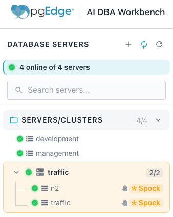
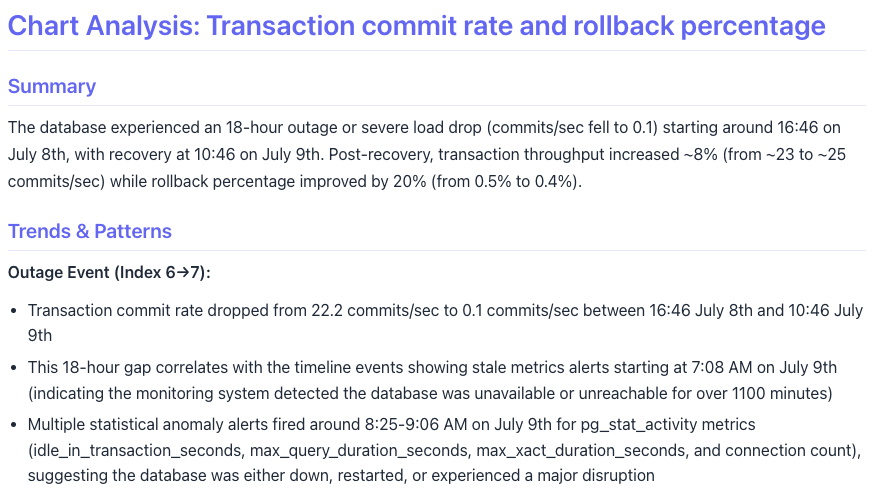
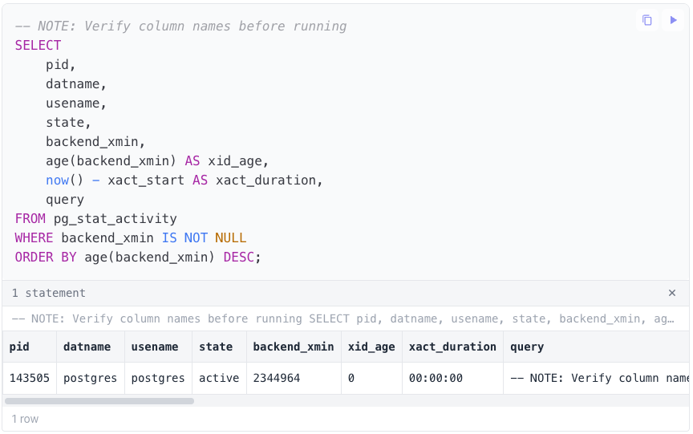

# Using the Workbench

The pgEdge AI DBA Workbench provides a browser-based interface for
monitoring and managing PostgreSQL database estates. This section of the
guide covers the features available to users of the web client.

- [Reviewing the Monitoring Dashboards](dashboards/index.md) describes
  the monitoring dashboard hierarchy and the metrics each level
  displays.
- [Monitoring Alerts](alerts/index.md) explains how to view,
  acknowledge, and manage alerts in the web interface.
- [Using AI Features](ai/index.md) covers AI-powered summaries,
  analysis, and the Ask Ellie assistant.
- [Using Workbench with MCP Tools](ai/mcp-tools.md) lists the Model
  Context Protocol tools and resources available to compatible AI
  clients.
- [Managing Blackouts](alerts/blackouts.md) describes how maintenance
  windows suppress alerts for servers, clusters, and groups.

The Workbench client connects to an MCP server instance in your web browser.
To connect, open a browser and navigate to the server address. When prompted,
log in with the user credentials provided during installation to begin
monitoring your PostgreSQL estate.

## Using Workbench Features

The Workbench incorporates a number of features that simplify management of
your database estate. Consistent and intuitive tooling make it easy to
navigate through detailed metrics and alerts, resolving issues that may arise.

The cluster navigator occupies the left side of the console and provides
tree-based navigation across groups, clusters, servers, and databases.
Select a node in the navigator to review or update the dashboards, alerts, and
AI insights for that scope. 

Hover over a server or cluster name to reveal a
gear icon that opens the `Settings` dialog for the selected object, allowing
you to review or modify connection details, cluster topology, alert overrides,
probe configuration, and notification channels.

Several panes, including the `Navigation Pane`, the `Event Timeline`, the
`Query Plan`, and the `AI Overview`, include a refresh icon. Use the
refresh icon to force an immediate update instead of waiting for the pane's
scheduled refresh.

The Workbench console's graphic set includes the following additional
interactive features:

- Time range selectors, offering 1h, 6h, 24h, 7d, and 30d options,
  appear on some panes to rescope the displayed data.
- Drillable elements let you navigate between dashboard levels; for
  example, clicking a database entry in Database Summaries opens the
  database dashboard, and clicking a server entry in Comparative Metrics
  opens the server dashboard.
- The Hide monitoring queries toggle on the `Top Queries` pane filters out
  the Workbench's own monitoring queries.
- Clicking a tile in the visual query plan diagram opens a popover with
  cost, row estimate, and filter details for that node.

!!! hint

    If you have enabled AI in the Workbench, a purple brain icon appears on
    charts, KPI tiles, leaderboards, and queries. Click the icon to access
    an AI analysis dialog. The analysis uses an agentic LLM loop that
    gathers context and produces actionable recommendations. A purple brain
    icon indicates no analysis has run yet; an amber brain icon indicates a
    cached analysis is available for instant review.

## Using the AI Chart Analysis Feature

The AI chart analysis feature provides LLM-powered insights for any chart or
KPI tile in the monitoring dashboards. The analysis examines data trends,
identifies anomalies, and generates actionable recommendations.

!!! note

    The Workbench's AI features are available only when the server has a
    configured LLM provider. See [Enabling AI Mode](ai/index.md#enabling-ai-mode)
    for configuration details.

Charts, KPI tiles, leaderboards, and the vacuum status panes each display a
brain icon in the upper-right icon. Click the icon to open an analysis dialog
and start the LLM analysis.

The analysis follows these steps:

1. The Workbench checks for a cached analysis result.
2. The Workbench fetches server context from the connection.
3. The Workbench fetches timeline events for the time range.
4. The Workbench serializes the chart data and sends it to the LLM.
5. The LLM returns a structured analysis report.

The AI analysis renders as formatted markdown. Each chart analysis report contains a
structured assessment that includes a summary and detailed recommendations.
Trends and patterns for the metrics that are used to generate the graph or
chart are also included in the report.

Use the download icon in the upper-right corner of the dialog to download the
analysis. The downloaded file is in markdown format, and includes the chart
details, the full analysis report, and a generation timestamp.

The analysis includes events in the currently selected timeline to identify
correlations between metric changes and system events. The LLM considers the
following event types:

- Configuration changes to PostgreSQL settings.
- Alert activations and resolutions.
- Server restarts and recovery events.
- Extension installations and upgrades.
- Blackout periods and maintenance windows.

SQL code blocks included in the analysis report include a play button in the
upper-right corner. Click the play button to execute the query against the
chart's associated database server. Results appear inline below the code block.

Write statements such as `ALTER SYSTEM` prompt a confirmation dialog before
executing. Read-only queries execute immediately.

The Workbench caches chart analysis results on the client side to avoid
redundant LLM calls.

- An amber brain icon indicates that a cached analysis exists for the chart.
- The cache uses stable identifiers as the cache key; these include the metric
  description, connection, database, and time range.
- The cache expires after 30 minutes.
- Click an amber brain icon to open the cached report instantly.

